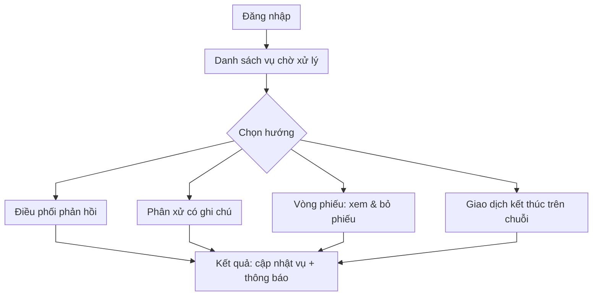
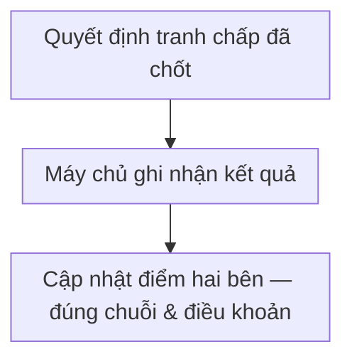

# Trọng tài / chuyên gia tranh chấp

**Vấn đề:** Khi chủ tin và người nhận việc **bất đồng sau khi làm việc**, cần bên **trung lập** giúp **điều phối chứng cứ, phân xử hoặc bỏ phiếu**; nếu ai cũng tự quyết, mâu thuẫn **kéo dài**, **thiệt hại hai bên** và **uy tín nền tảng**.

**Cách xử lý:** Vai **trọng tài / chuyên gia** chỉ xuất hiện trong **luồng tranh chấp**: vào danh sách vụ, chọn hướng xử lý (yêu cầu phản hồi, phân xử, phiếu nhiều vòng, giao dịch kết thúc trên chuỗi khi có). **Không** gồm quản trị chung (danh sách tài khoản, bật tắt người dùng) hay **hết hạn công việc thường** — những việc đó thuộc **máy tự động** và [system.md](system.md).

---

## Việc cần làm

| Hạng mục | Mô tả bằng tiếng Việt |
| -------- | --------------------- |
| Tiếp nhận vụ việc | Xem các vụ tranh chấp đang chờ, nắm bối cảnh tin tuyển và chứng cứ hai bên |
| Điều phối phản hồi | Yêu cầu người nhận việc trả lời / bổ sung chứng cứ trong thời hạn |
| Phân xử | Quyết định bên nào có lý (người thuê hay người nhận việc) khi luồng cho phép |
| Nhiều vòng | Khi tranh chấp có nhiều vòng: xem phiếu chờ, bỏ phiếu, ký **mã giao dịch** trên chuỗi khối nếu cần |
| Kết thúc trên chuỗi | Xác nhận hoàn tất phân xử bằng giao dịch trên **chuỗi khối** (khi hệ thống có bước này) |

---

## Sơ đồ: Luồng giải quyết tranh chấp

**Các bước luồng nghiệp vụ**

1. Trọng tài đăng nhập và mở danh sách vụ tranh chấp đang chờ xử lý.  
2. Đọc hồ sơ: nội dung tranh chấp, tin tuyển liên quan, chứng cứ hai bên (nếu đã có).  
3. Chọn hướng xử lý phù hợp luật nội bộ / quy trình:  
   - **Yêu cầu phản hồi:** giao cho người nhận việc trả lời hoặc bổ sung chứng cứ trong thời hạn.  
   - **Phân xử trực tiếp:** ghi nhận bên thắng thua (người thuê hoặc người nhận việc) kèm lý do.  
   - **Nhiều vòng:** xem phiếu bỏ phiếu chờ mình, thực hiện bỏ phiếu và ký giao dịch nếu quy định yêu cầu.  
   - **Kết thúc trên chuỗi:** xác nhận phán quyết bằng giao dịch trên chuỗi khối khi bước này có trong quy trình.  
4. Hệ thống cập nhật trạng thái vụ tranh chấp và gửi thông báo cho các bên liên quan.

---

## Điểm uy tín sau tranh chấp

Kết quả tranh chấp (bên **thắng / thua**) là **sự kiện nghiệp vụ** dùng để cập nhật **UT / KUT** — trọng tài **không nhập điểm tay**; sau khi phán quyết / bỏ phiếu / kết thúc trên chuỗi, **hợp đồng và máy chủ** áp quy tắc (đồng thời với điều khoản trên ứng dụng), ví dụ:

| Kết quả | Người thắng | Người thua |
| --- | --- | --- |
| Theo bảng điểm uy tín (mẫu) | +5 UT | −10 UT, +20 KUT |

**Các bước luồng nghiệp vụ**

1. Trọng tài hoàn tất bước **nghiệp vụ tranh chấp** (phân xử, phiếu, giao dịch chuỗi nếu có).  
2. Hệ thống xác định **bên thắng** và áp **cộng trừ điểm** theo điều khoản.  
3. Chi tiết **từng loại vi phạm / cộng điểm** khác (quá hạn nộp chứng cứ, v.v.) nằm trong [poster.md](poster.md) (chủ tin) và [freelancer.md](freelancer.md) (người nhận việc).  
4. **Hết hạn chứng cứ** do **máy quét** xử lý có thể dẫn tới **thắng mặc định** một bên và cùng logic cập nhật uy tín — xem [system.md](system.md) và [blockchain.md](blockchain.md).
