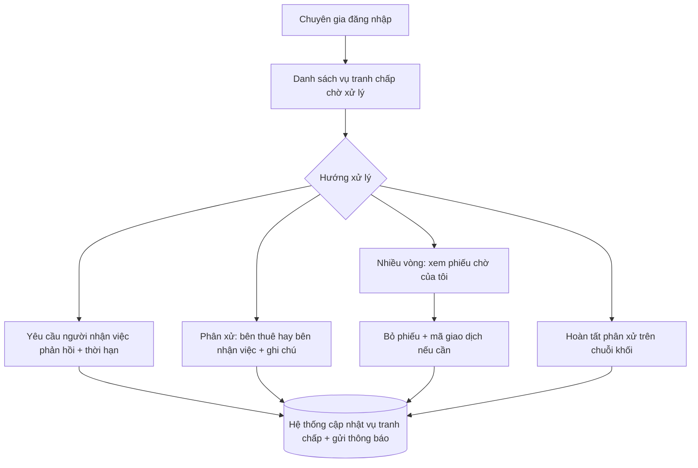
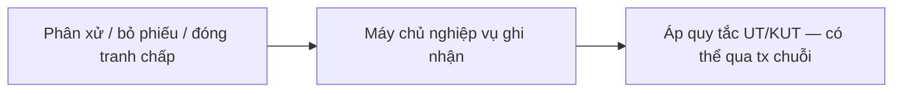

# Trọng tài / chuyên gia tranh chấp (vai trò `ROLE_ADMIN`)

**Vấn đề:** Khi hai bên **mâu thuẫn sau bàn giao**, cần **bên thứ ba trung lập** có quy trình minh bạch; nếu thiếu vai này, tranh chấp **kéo dài** và ảnh hưởng **ký quỹ** và **điểm uy tín**.

**Cách xử lý:** Định danh **`ROLE_ADMIN`** chỉ tham gia **luồng trạng thái tranh chấp**: tiếp nhận vụ, điều phối chứng cứ, phân xử hoặc **bỏ phiếu** đa vòng, **đóng vụ bằng giao dịch trên chuỗi** khi quy trình yêu cầu. **Không** gồm **quản trị nền tảng** (danh sách tài khoản, đình chỉ người dùng) hay **quét hạn tin / hợp đồng** — thuộc **job định kỳ** trong [system.md](system.md).

---

## Việc cần làm

| Hạng mục | Diễn giải nghiệp vụ |
| -------- | ------------------- |
| Tiếp nhận vụ việc | Xem các vụ tranh chấp đang chờ, nắm bối cảnh tin tuyển và chứng cứ hai bên |
| Điều phối phản hồi | Yêu cầu người nhận việc trả lời / bổ sung chứng cứ trong thời hạn |
| Phân xử | Quyết định bên nào có lý (người thuê hay người nhận việc) khi luồng cho phép |
| Nhiều vòng | Khi tranh chấp có nhiều vòng: xem phiếu chờ, bỏ phiếu, ký **mã giao dịch** trên chuỗi khối nếu cần |
| Kết thúc trên chuỗi | Xác nhận hoàn tất phân xử bằng **giao dịch trên chuỗi khối** (khi quy trình có bước này) |

---

## Sơ đồ: Luồng giải quyết tranh chấp

**Các bước luồng nghiệp vụ**

1. Trọng tài đăng nhập và mở danh sách vụ tranh chấp đang chờ xử lý.  
2. Đọc hồ sơ: nội dung tranh chấp, tin tuyển liên quan, chứng cứ hai bên (nếu đã có).  
3. Chọn hướng xử lý phù hợp luật nội bộ / quy trình:  
   - **Yêu cầu phản hồi:** giao cho người nhận việc trả lời hoặc bổ sung chứng cứ trong thời hạn.  
   - **Phân xử trực tiếp:** ghi nhận bên thắng thua (người thuê hoặc người nhận việc) kèm lý do.  
   - **Nhiều vòng:** xem phiếu bỏ phiếu chờ mình, thực hiện bỏ phiếu và ký giao dịch nếu quy định yêu cầu.  
   - **Kết thúc trên chuỗi:** xác nhận phán quyết bằng giao dịch trên chuỗi khối khi bước này có trong quy trình.  
4. Hệ thống cập nhật trạng thái vụ tranh chấp và gửi thông báo cho các bên liên quan.

---

## Điểm uy tín sau tranh chấp

Kết quả tranh chấp (bên **thắng / thua**) là **sự kiện nghiệp vụ** dùng để cập nhật **UT / KUT** — trọng tài **không nhập điểm thủ công**; sau khi phán quyết / **bỏ phiếu** / **khép vụ trên chuỗi**, **máy chủ** áp quy tắc (tham chiếu điều khoản `SystemTermsDisplay`), ví dụ:

| Kết quả | Người thắng | Người thua |
| --- | --- | --- |
| Theo bảng điểm uy tín (mẫu) | +5 UT | −10 UT, +20 KUT |

**Các bước luồng nghiệp vụ**

1. Trọng tài hoàn tất bước **nghiệp vụ tranh chấp** (phân xử, phiếu, giao dịch chuỗi nếu có).  
2. Hệ thống xác định **bên thắng** và áp **cộng trừ điểm** theo điều khoản.  
3. Chi tiết **từng loại vi phạm / cộng điểm** khác (quá hạn nộp chứng cứ, v.v.) nằm trong **`poster.md`** (chủ tin) và **`freelancer.md`** (người nhận việc).  
4. **Hết hạn chứng cứ** do **máy quét** xử lý có thể dẫn tới **thắng mặc định** một bên và cùng logic cập nhật uy tín — xem `system.md` và `blockchain.md`.
