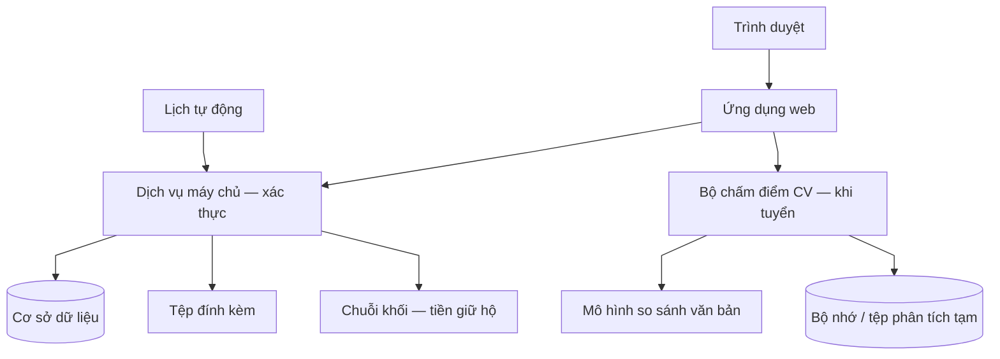
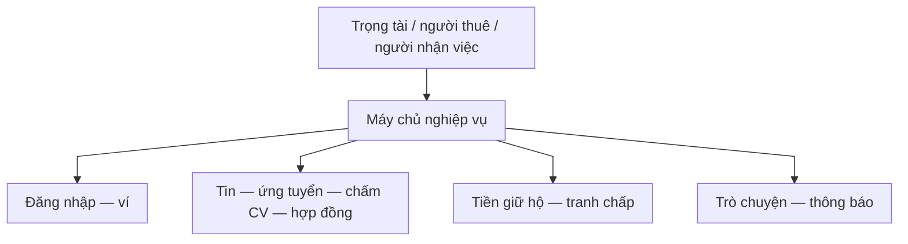
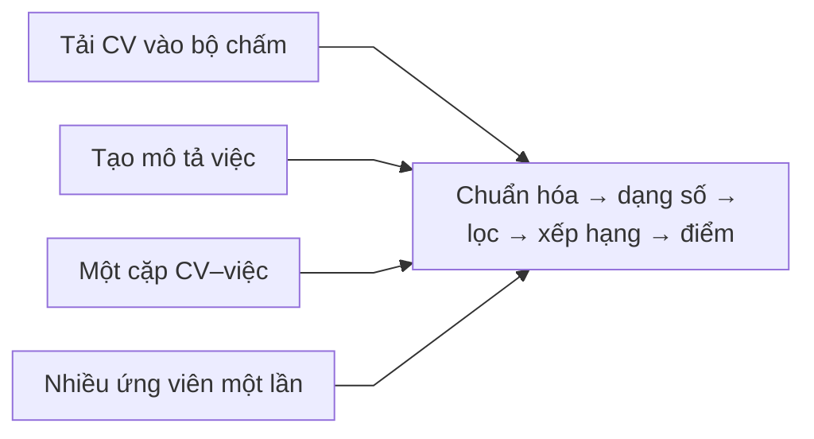

# Kiến trúc tổng thể hệ thống

---

## 1. Các khối chính

**Các bước luồng nghiệp vụ (toàn hệ thống)**

1. Người dùng mở **trình duyệt** → vào **ứng dụng web** (đăng nhập, xem tin, ứng tuyển).  
2. Thao tác **tài khoản, tin việc, CV lưu hệ thống, ký quỹ** đi qua **máy chủ nghiệp vụ**: **cơ sở dữ liệu**, **tệp**, **chuỗi khối**.  
3. **Trong bước tuyển**, cùng một giao diện gọi **bộ chấm điểm CV** để tính độ khớp CV–mô tả việc — **một phần cố định của luồng tuyển**; tách **tiến trình** chỉ vì cần môi trường riêng cho mô hình học máy, không phải sản phẩm ngoài nền tảng.  
4. **Lịch tự động**: kiểm tra hạn, cập nhật trạng thái, gọi chuỗi khi cần.

---

## 2. Nghiệp vụ chính trên nền tảng

**Các bước luồng nghiệp vụ**

1. Ba loại người (**trọng tài**, **người thuê**, **người nhận việc**) cùng dùng chung một nền tảng qua máy chủ.  
2. **Đăng nhập / ví:** xác thực danh tính và ví chuỗi khối nếu cần cho hợp đồng và tiền.  
3. **Tin việc — ứng tuyển — chấm điểm CV — hợp đồng:** từ đăng tin, sàng CV, chọn người, đến hoàn thành.  
4. **Tiền giữ hộ — tranh chấp — rút:** xử lý tiền an toàn và khiếu nại.  
5. **Trò chuyện — thông báo:** trao đổi và nhận tin từ nền tảng.  
6. **Điểm uy tín (UT/KUT):** **quy tắc cộng trừ** nằm trong **hợp đồng lưu uy tín trên chuỗi**, được **bước giữ tiền hộ** kích hoạt — chi tiết [chuỗi khối, mục 4](blockchain.md); hiển thị qua máy chủ (có thể có bản sao trong cơ sở dữ liệu). Theo vai: [người đăng việc](poster.md), [người nhận việc](freelancer.md), [trọng tài](admin.md), [máy tự động](system.md) (mục 4).

---

## 3. Chấm điểm CV (cùng luồng tuyển dụng)

**Các bước luồng nghiệp vụ (bộ chấm điểm)**

1. **Người nhận việc** hoặc **người đăng việc** ở màn **ứng tuyển** / **danh sách ứng viên** → web gửi CV (thường tệp PDF) và chữ mô tả việc sang bộ chấm điểm.  
2. **Chuẩn hóa** → **đưa về dạng số** → **xếp hạng lại** → **điểm cuối** và nhận xét mức khớp.  
3. Màn **ứng tuyển** dùng **phân tích từng cặp** sau khi tải CV; **bảng ứng viên** lặp từng người để có điểm và sắp thứ tự.  
4. **Một lần gọi xếp hạng nhiều người** là **cùng ý tưởng**, tiện khi cần trả về top ứng viên trong một vòng; giao diện hiện tại có thể vẫn dùng vòng lặp phân tích từng cặp — **luồng nghiệp vụ tuyển dụng không đổi**.

Chi tiết màn hình: [luồng chấm điểm CV](cv-ai-scoring.md).

---

