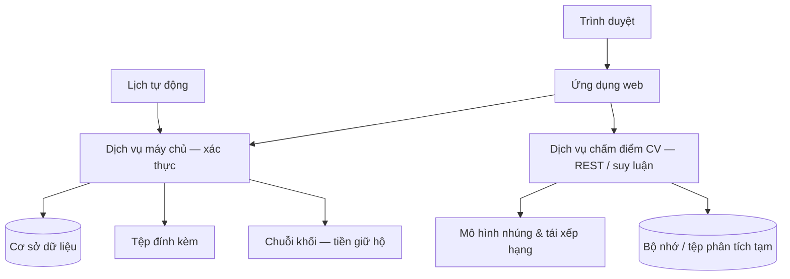
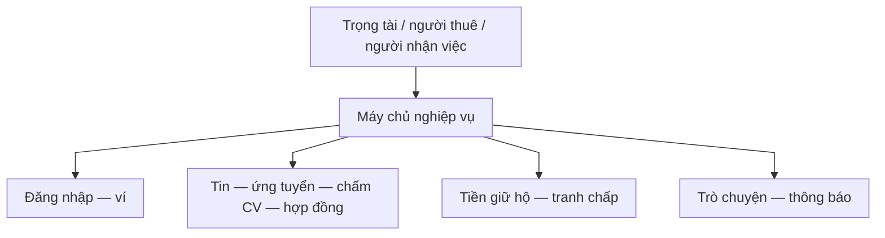
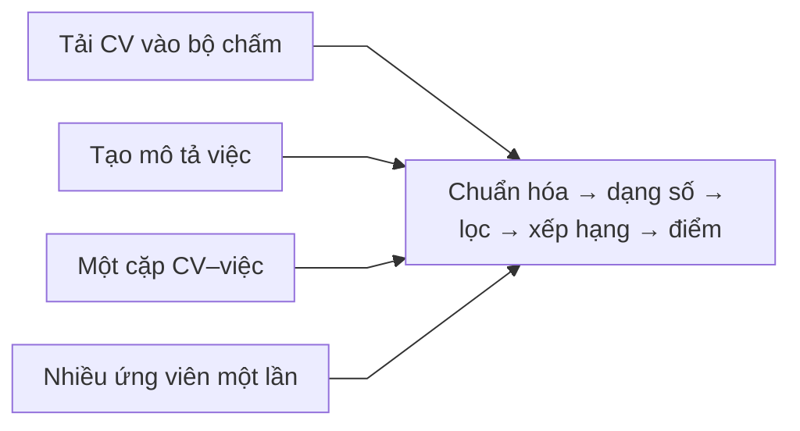

# Kiến trúc tổng thể hệ thống

Tài liệu mô tả **phân tầng ứng dụng**: giao diện người dùng, **máy chủ nghiệp vụ** (backend, REST API), **lưu trữ**, **chuỗi khối**, **dịch vụ suy luận chấm điểm CV** và **bộ lập lịch** — cách các thành phần phối hợp trong một phiên nghiệp vụ điển hình.

## Thuật ngữ dùng chung (nền tảng · kỹ thuật · chuỗi khối · AI)

| Nhóm | Thuật ngữ chính | Cách dùng trong tài liệu luồng |
| ---- | ---------------- | ------------------------------ |
| **Nghiệp vụ freelancer** | Tin đăng / **tin tuyển**, **đơn ứng tuyển**, **chủ tin** (= người đăng việc), **người nhận việc**, **ứng viên** (trong giai đoạn nhận hồ sơ), bàn giao, **nghiệm thu**, **tranh chấp** | Phân biệt *tin đang mở nhận hồ sơ* với *hợp đồng đã ký / đang thực hiện*. |
| **Phần mềm** | **Ứng dụng web** (front-end), **máy chủ nghiệp vụ** (backend), **REST API**, **CSDL**, **kho tệp** (đính kèm), **bộ lập lịch** (cron / job), **biến môi trường** (env) | Backend là **nguồn trạng thái chính**; **CV canonical** luôn qua API nghiệp vụ. |
| **Chuỗi khối** | **Chuỗi khối** (Aptos), **giao dịch trên chuỗi**, **hợp đồng thông minh** (Move), **ví**, **địa chỉ ví**, **mã giao dịch (transaction hash)**, **ký quỹ (escrow)**, **UT / KUT** | Điểm uy tín **ghi trên chuỗi**; CSDL có thể giữ **bản sao đọc** cần **đối soát** với chuỗi. |
| **AI / chấm CV** | **Suy luận (inference)**, **embedding** (vector ngữ nghĩa), **semantic similarity**, **rerank** (tái xếp hạng), **pipeline** chấm điểm, **human-in-the-loop** | Dịch vụ chấm điểm là **microservice** tách khỏi backend chính; chỉ nhận bản tạm / bản trích để tính điểm. |

Các file [flow-tổng-quan](flow-tổng-quan.md), [system](system.md), [blockchain](blockchain.md), [cv-ai-scoring](cv-ai-scoring.md) dùng cùng một bộ khái niệm trên.

## Hai trụ cột công nghệ: chuỗi khối và trí tuệ nhân tạo

**Chuỗi khối** đóng vai trò **lớp tin cậy có thể kiểm chứng** cho **ký quỹ**, **phân bổ tiền** khi đủ điều kiện nghiệp vụ, và **lịch sử điểm uy tín** gắn với **địa chỉ ví**. Nó **bổ sung**, không thay thế, **cơ sở dữ liệu nghiệp vụ**: CSDL vẫn là nơi lưu tin đăng, đơn ứng tuyển, tin nhắn, v.v. để truy vấn nhanh; chuỗi khối là nơi **các bên thứ ba** (và chính người dùng) có thể đối chiếu **giao dịch** và **trạng thái quỹ** theo quy tắc đã công bố.

**Trí tuệ nhân tạo (chấm điểm CV)** đóng vai trò **lớp gợi ý** trong **giai đoạn tuyển**: ước lượng **độ tương đồng ngữ nghĩa** giữa **hồ sơ** và **mô tả việc**, trả về **điểm và thứ tự ưu tiên đọc**. Nó **không** là **nguồn chân lý** về pháp lý hay nghiệp vụ: **chấp nhận / từ chối ứng viên** và **ghi nhận đơn** vẫn do **máy chủ nghiệp vụ** sau **quyết định người**.

Về **kiến trúc triển khai**, hai trụ này **tách tiến trình** khỏi lõi nghiệp vụ: **dịch vụ chấm điểm** cần **tài nguyên tính toán** và **chu kỳ suy luận** riêng; **tương tác chuỗi khối** cần **hàng đợi giao dịch**, **khóa ví** và **đồng bộ trạng thái**. Nhờ vậy có thể **mở rộng**, **bảo trì** và **giới hạn phạm vi hỏng** (một thành phần lỗi không nhất thiết làm tê liệt toàn bộ nền tảng). Phân tích kỹ hơn: mục **«Kiến trúc và công nghệ…»** trong [blockchain.md](blockchain.md) và [cv-ai-scoring.md](cv-ai-scoring.md).

---

## 1. Các khối chính

**Các bước luồng nghiệp vụ (toàn hệ thống)**

1. Người dùng mở **trình duyệt** → vào **ứng dụng web** (đăng nhập, xem tin, ứng tuyển).  
2. Thao tác **tài khoản, tin việc, CV lưu hệ thống, ký quỹ** đi qua **máy chủ nghiệp vụ**: **cơ sở dữ liệu**, **tệp**, **chuỗi khối**.  
3. **Trong giai đoạn tuyển**, ứng dụng web gọi **giao diện lập trình ứng dụng** của **dịch vụ chấm điểm CV** để chạy bước **suy luận** (so khớp CV–mô tả việc). Dịch vụ này triển khai **độc lập** so với máy chủ nghiệp vụ chính để **cô lập tải tính toán** và dễ **mở rộng theo chiều ngang**, vẫn thuộc **cùng sản phẩm** chứ không phải dịch vụ thuê ngoài.  
4. **Bộ lập lịch**: quét hạn (SLA tin), cập nhật trạng thái CSDL, phát **giao dịch trên chuỗi** khi luật hợp đồng cho phép.

---

## 2. Nghiệp vụ chính trên nền tảng

**Các bước luồng nghiệp vụ**

1. Ba loại người (**trọng tài**, **người thuê**, **người nhận việc**) cùng dùng chung một nền tảng qua máy chủ.  
2. **Đăng nhập / ví:** xác thực danh tính và ví chuỗi khối nếu cần cho hợp đồng và tiền.  
3. **Tin việc — ứng tuyển — chấm điểm CV — hợp đồng:** từ đăng tin, sàng CV, chọn người, đến hoàn thành.  
4. **Tiền giữ hộ — tranh chấp — rút:** xử lý tiền an toàn và khiếu nại.  
5. **Trò chuyện — thông báo:** trao đổi và nhận tin từ nền tảng.  
6. **Điểm uy tín (UT/KUT):** **quy tắc cộng trừ** nằm trong **hợp đồng lưu uy tín trên chuỗi**, được **bước giữ tiền hộ** kích hoạt — chi tiết [chuỗi khối, mục 4](blockchain.md); hiển thị qua máy chủ (có thể có bản sao trong cơ sở dữ liệu). Theo vai: [người đăng việc](poster.md), [người nhận việc](freelancer.md), [trọng tài](admin.md), [máy tự động](system.md) (mục 4).

---

## 3. Chấm điểm CV (cùng luồng tuyển dụng)

**Các bước luồng nghiệp vụ (dịch vụ chấm điểm)**

1. **Người nhận việc** hoặc **chủ tin** trên màn **ứng tuyển** / **bảng ứng viên** → client gọi API chấm điểm với CV (PDF) và **job text** ghép từ tin.  
2. **Chuẩn hóa văn bản** → **embedding** → **rerank** → **điểm tổng hợp** và nhãn / nhận xét mức khớp.  
3. Màn **ứng tuyển** dùng **phân tích từng cặp** sau khi tải CV; **bảng ứng viên** lặp từng người để có điểm và sắp thứ tự.  
4. **Một lần gọi xếp hạng nhiều người** là **cùng ý tưởng**, tiện khi cần trả về top ứng viên trong một vòng; giao diện hiện tại có thể vẫn dùng vòng lặp phân tích từng cặp — **luồng nghiệp vụ tuyển dụng không đổi**.

Chi tiết màn hình: [luồng chấm điểm CV](cv-ai-scoring.md).

---

