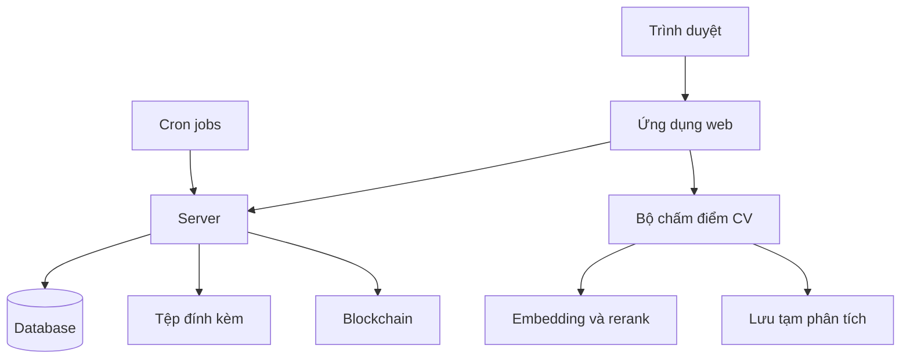
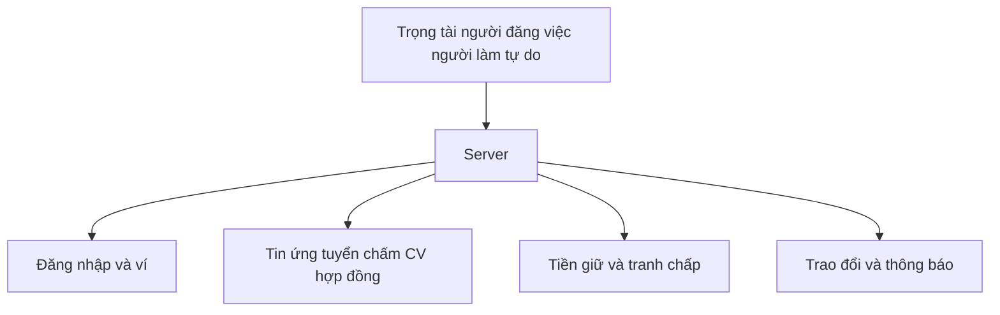
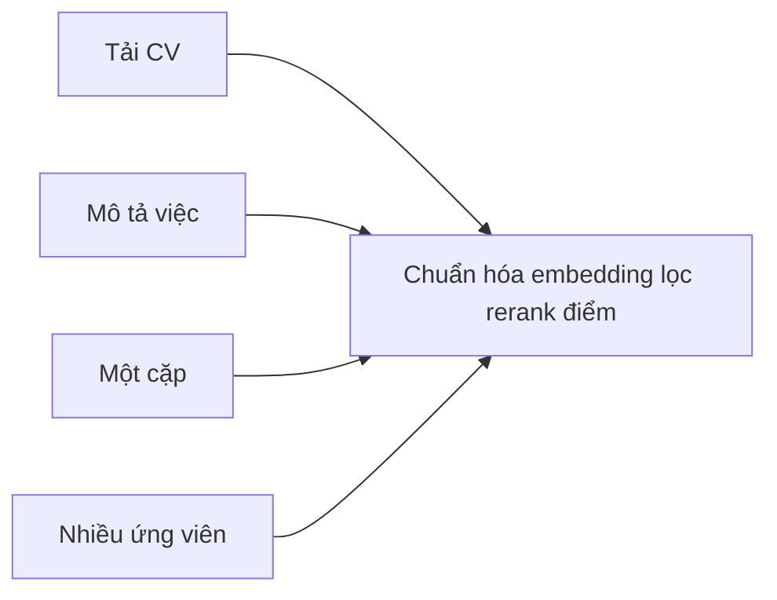

# Kiến trúc tổng thể

**Mô tả ngắn**

- [**Ứng dụng web**](thuat-ngu.md#web-app): giao diện người dùng (trình duyệt).
- [**Server**](thuat-ngu.md#server): lưu **dữ liệu** nghiệp vụ và **tệp** (CV, đính kèm); xử lý [API](thuat-ngu.md#api), phiên đăng nhập, đồng bộ với [blockchain](thuat-ngu.md#blockchain) khi cần.
- [**Blockchain**](thuat-ngu.md#blockchain): **tiền** ([ký quỹ](thuat-ngu.md#escrow), giải ngân theo [hợp đồng thông minh](thuat-ngu.md#smart-contract)) và **điểm uy tín** [on-chain](thuat-ngu.md#on-chain) theo luật đã triển khai.
- [**Bộ chấm điểm CV**](thuat-ngu.md#cv-scoring-service): chạy **riêng** (tách [runtime](thuat-ngu.md#runtime) khỏi server chính), chỉ dùng khi **đang tuyển** — so khớp CV với mô tả việc.
- [**Cron jobs**](thuat-ngu.md#cron) trên **server** (lịch do **cron expression** — cùng mục [cron](thuat-ngu.md#cron)): **quét hết hạn** tin và tranh chấp, **gửi giao dịch nền** (blockchain) khi đủ điều kiện.

**Chấm điểm bằng AI** ([embedding](thuat-ngu.md#embedding), [rerank](thuat-ngu.md#rerank), công thức điểm): [cv-ai-scoring](cv-ai-scoring.md). Thuật ngữ: [bảng thuật ngữ](thuat-ngu.md).

---

## 1. Thành phần chính

1. Người dùng vào web đăng nhập xem tin ứng tuyển.  
2. Tài khoản tin CV tiền giữ đi qua **server** kèm database tệp và blockchain.  
3. Lúc đang tuyển web gọi **bộ chấm điểm CV** để so CV với mô tả việc. Bộ chấm điểm chạy **tách** khỏi server chính để không làm nghẽn toàn hệ thống.  
4. **Cron jobs** kiểm tra hạn tin, cập nhật trạng thái và gửi giao dịch blockchain khi đủ điều kiện.

---

## 2. Ai dùng nền tảng

1. **Trọng tài chuyên môn**, **người đăng việc**, **người làm tự do** đều dùng **server** qua một cổng web.  
2. Bước ví khi liên quan hợp đồng và tiền.  
3. Vòng đời tin đến hợp đồng và chấm CV khi tuyển.  
4. Tiền giữ tranh chấp và rút tiền.  
5. Nhắn tin và thông báo.  
6. **Điểm uy tín** theo luật trên blockchain sau các mốc giữ tiền và tranh chấp xem [blockchain](blockchain.md). Chi tiết vai: [người đăng việc](poster.md), [người làm tự do](freelancer.md), [trọng tài](trong-tai.md), [hệ thống](system.md).

---

## Bộ chấm điểm CV

1. Trên màn ứng tuyển hoặc bảng ứng viên ứng dụng gửi CV và mô tả việc tới **bộ chấm điểm CV**.  
2. Bộ chấm điểm trả về điểm và nhãn.  
3. Có thể gọi **từng cặp** hoặc **cả danh sách**.

Toàn bộ công thức và bước AI: [cv-ai-scoring](cv-ai-scoring.md).
