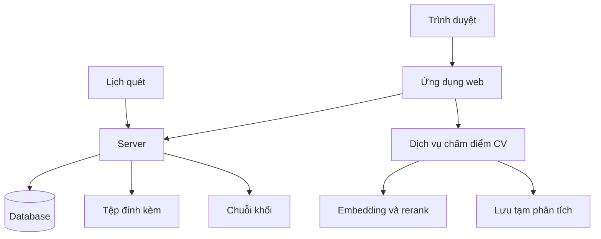
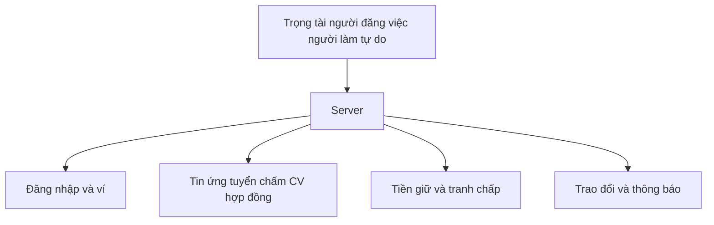
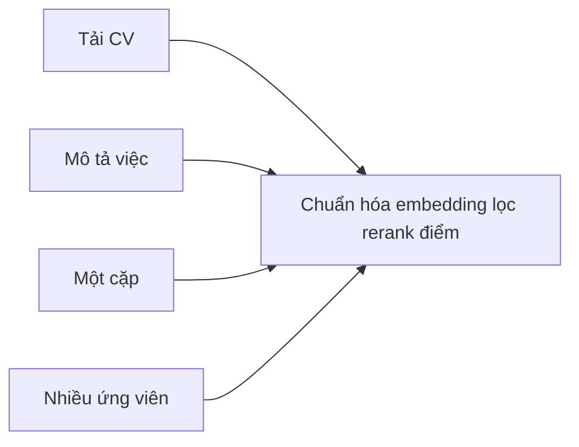

# Kiến trúc tổng thể

Ứng dụng **web**, **server** lưu dữ liệu và tệp, **chuỗi khối** giữ tiền và điểm uy tín, **dịch vụ chấm điểm CV** chạy riêng khi tuyển, **lịch quét** xử lý hết hạn phía sau. Chấm điểm bằng AI mô tả trong [cv-ai-scoring](cv-ai-scoring.md).

---

## 1. Thành phần chính

1. Người dùng vào web đăng nhập xem tin ứng tuyển.  
2. Tài khoản tin CV tiền giữ đi qua **server** kèm database tệp và chuỗi.  
3. Lúc đang tuyển web gọi **dịch vụ chấm điểm** để so CV với mô tả việc. Dịch vụ chạy **tách** khỏi server chính để không làm nghẽn toàn hệ thống.  
4. **Lịch quét** kiểm tra hạn tin cập nhật trạng thái và gửi giao dịch chuỗi khi đủ điều kiện.

---

## 2. Ai dùng nền tảng

1. **Trọng tài chuyên môn**, **người đăng việc**, **người làm tự do** đều dùng **server** qua một cổng web.  
2. Bước ví khi liên quan hợp đồng và tiền.  
3. Vòng đời tin đến hợp đồng và chấm CV khi tuyển.  
4. Tiền giữ tranh chấp và rút tiền.  
5. Nhắn tin và thông báo.  
6. **Điểm uy tín** theo luật trên chuỗi sau các mốc giữ tiền và tranh chấp xem [chuỗi khối](blockchain.md). Chi tiết vai: [người đăng việc](poster.md), [người làm tự do](freelancer.md), [trọng tài](trong-tai.md), [hệ thống](system.md).

---

## Dịch vụ chấm điểm

1. Trên màn ứng tuyển hoặc bảng ứng viên ứng dụng gửi CV và mô tả việc tới dịch vụ chấm.  
2. Dịch vụ trả điểm và nhãn.  
3. Có thể gọi **từng cặp** hoặc **cả danh sách**.

Toàn bộ công thức và bước AI: [cv-ai-scoring](cv-ai-scoring.md).
