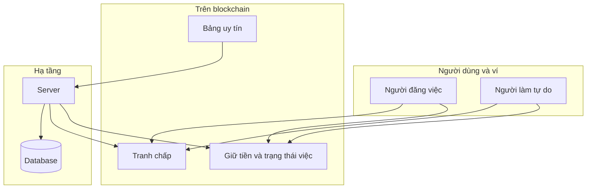
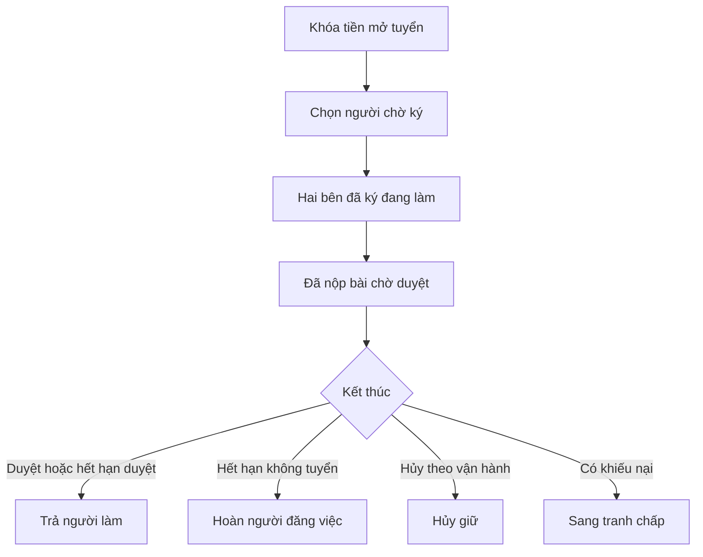

# Blockchain: tiền giữ, tranh chấp, điểm uy tín

[**Remote work**](thuat-ngu.md#remote-work) cần **chỗ giữ tiền an toàn**, **cách xử khiếu nại có thể kiểm tra**, và **điểm uy tín** lặp lại theo thời gian. [**Blockchain**](thuat-ngu.md#blockchain) ở đây là **mạng công khai**: mọi thay đổi về **tiền đã khóa**, **bước tranh chấp** và **điểm** đều ghi thành [**giao dịch**](thuat-ngu.md#transaction) có thể đối chiếu, không nằm kín trên một máy chủ. [**Server**](thuat-ngu.md#server) vẫn lưu tin đơn và tin nhắn để tra cứu nhanh; **blockchain** giữ phần đã cam kết theo quy tắc đã triển khai. Thuật ngữ: [bảng thuật ngữ](thuat-ngu.md).

---

## Blockchain và database

Blockchain **không thay** toàn bộ cơ sở dữ liệu. Tin ứng tuyển, chat và hồ sơ vẫn ở **database**. Blockchain đảm nhiệm phần **sau khi đã cam kết** khó sửa ngầm: số tiền giữ, điều kiện trả, luồng tranh chấp, cập nhật điểm.

**Quy tắc chạy trên mạng** được gọi là hợp đồng thông minh. Nền tảng dùng mạng **Aptos** và ngôn ngữ **Move**. Người đọc tài liệu luồng chỉ cần biết: mọi thay đổi tiền và điểm trên blockchain đều là **giao dịch** đã được **xác thực**.

---

## Giao dịch và ví

Một **giao dịch** là gói thao tác gửi lên mạng. **Ký bằng ví** chứng minh người đó đồng ý, ví dụ khóa tiền giữ chấp nhận nghiệm thu mở tranh chấp. **Địa chỉ ví** gắn với điểm uy tín và luồng tiền.

Một số việc **đến hạn** do **server** (request) hoặc **cron job** gọi **ví vận hành** đã được phép trong thiết kế, để tự động mà vẫn kiểm tra được trên blockchain.

---

## Ký quỹ và trạng thái việc

**Tiền giữ** nằm trong hợp đồng cho đến khi thỏa điều kiện: nghiệm thu, hoàn cho người đăng việc nếu không tuyển được, hoặc chuyển sang tranh chấp. Trạng thái **đang tuyển đang làm chờ duyệt đã đóng** phải **khớp** giữa **database** và **blockchain**. Nếu lệch, thường **blockchain** là chuẩn cho **tiền và điểm**.

---

## Điểm tin cậy và bất tin cậy

Hai chỉ số nghiệp vụ được cộng trừ khi có **sự kiện** đúng luật. Cập nhật điểm **không** tùy tiện: chỉ luồng giữ tiền và tranh chấp hợp lệ mới kích hoạp. Ai cũng có thể **đọc** bảng điểm theo địa chỉ trên mạng.

---

## Ba lớp minh họa

1. **Người đăng việc** khóa tiền khi đăng tin theo điều khoản.  
2. Theo tiến độ tiền trả cho người làm hoàn cho người đăng việc hoặc vào nhánh tranh chấp tùy trạng thái chữ ký và hạn.  
3. **Server** lưu trạng thái và mã giao dịch; có thể gửi thêm giao dịch khi hết hạn.  
4. **Điểm tin cậy và bất tin cậy** cập nhật trong hợp đồng uy tín khi các bước giữ tiền và tranh chấp **kết thúc đúng luật**. Database có thể giữ bản sao để hiển thị và cần **khớp** với blockchain.

---

## Vòng đời giữ tiền

**Hết hạn do cron job** quét chạy song song: ví dụ quá hạn ký, quá hạn nộp, quá hạn nhận hồ sơ — **hệ thống** cập nhật và có thể gửi giao dịch phù hợp. Chi tiết: [hệ thống](system.md).

---

## Tranh chấp

Sau khi mở vụ và lưu mã trên blockchain nếu cần, vụ chạy **ba vòng** theo đúng thứ tự **trọng tài ngẫu nhiên → hai bên phản hồi → phiếu**, rồi **hệ thống** chốt kết quả; hết hạn chứng cứ hoặc phiếu vẫn do **hệ thống** và luật hợp đồng xử lý song song. Sơ đồ đầy đủ: [trọng tài](trong-tai.md).

---

## Bảng cộng trừ điểm mẫu

| Tình huống | Ai bị tác động | Thay đổi |
| ---------- | -------------- | -------- |
| Hoàn việc | Người làm tự do | +10 tin cậy |
| Duyệt đúng hạn | Người đăng việc | +5 tin cậy |
| Thắng tranh chấp | Bên thắng | +5 tin cậy |
| Thua tranh chấp | Bên thua | +20 bất tin cậy −10 tin cậy không âm |
| Quá hạn nộp | Người làm tự do | +10 bất tin cậy −5 tin cậy |
| Quá hạn duyệt | Người đăng việc | +10 bất tin cậy −5 tin cậy |

Số cụ thể phải khớp phiên bản hợp đồng đang chạy.

Luồng theo vai: [người đăng việc](poster.md), [người làm tự do](freelancer.md), [trọng tài](trong-tai.md), [hệ thống](system.md).

---

## Việc hệ thống thường làm trên blockchain

| Chủ đề | Việc |
| ------ | ---- |
| Giữ tiền | Hết hạn ký bỏ người làm |
| Giữ tiền | Hết hạn nộp bỏ người làm |
| Giữ tiền | Hết hạn duyệt trả người làm |
| Giữ tiền | Hết hạn nhận hồ sơ hoàn người đăng việc |
| Giữ tiền | Hủy giữ |
| Tranh chấp | Hết hạn chứng cứ |
| Tranh chấp | Mở vòng bỏ phiếu |
| Uy tín | Thường đi cùng giao dịch giữ tiền khi luật kích hoạt |
| Uy tín | Đọc điểm để hiển thị |

Người dùng ký các bước đăng tin chọn người duyệt mở tranh chấp bằng **ví**. **Cập nhật uy tín** đi kèm giao dịch giữ tiền khi điều kiện trong hợp đồng thỏa.
