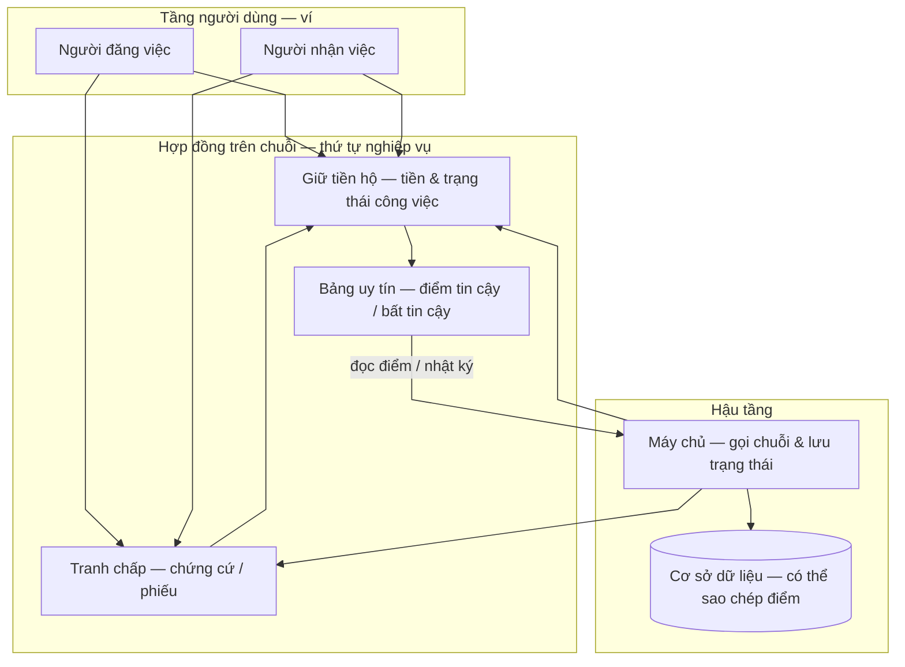
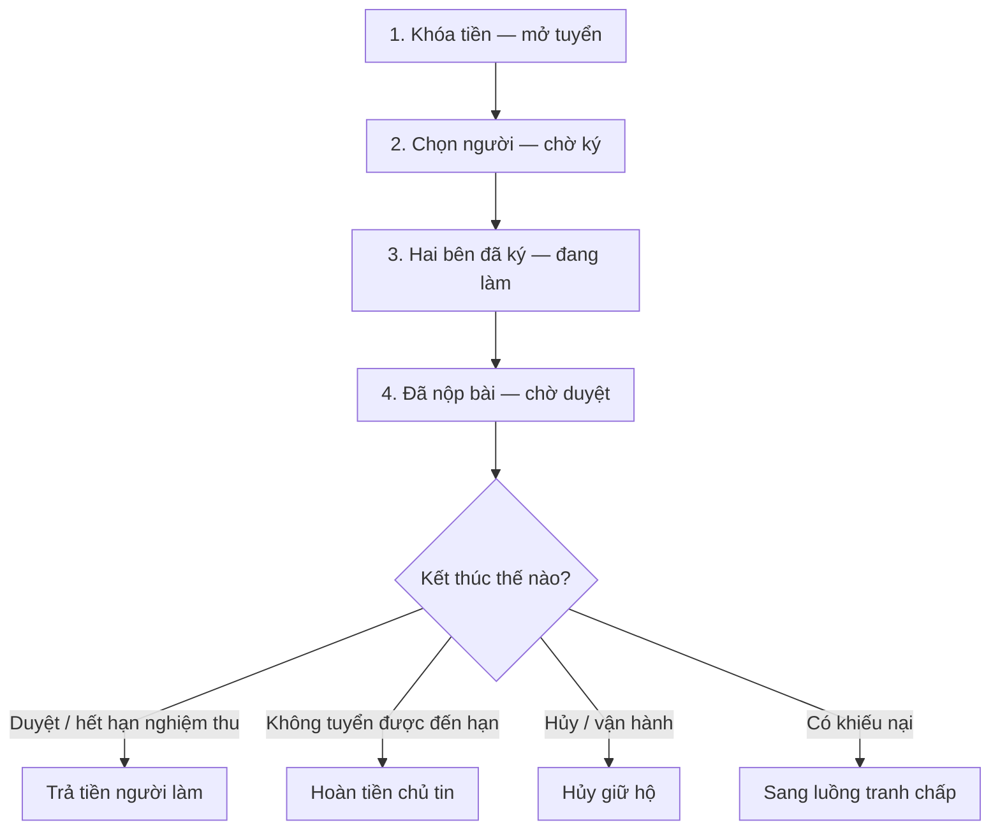
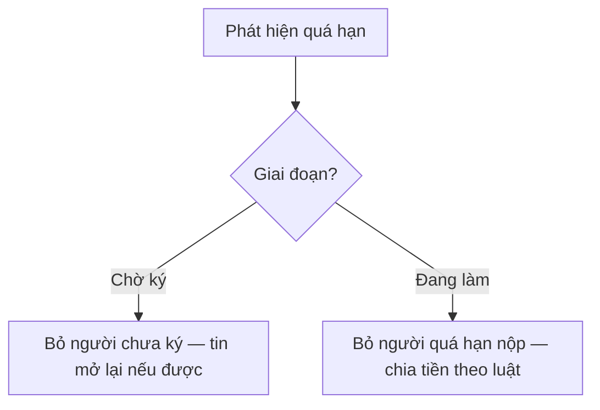
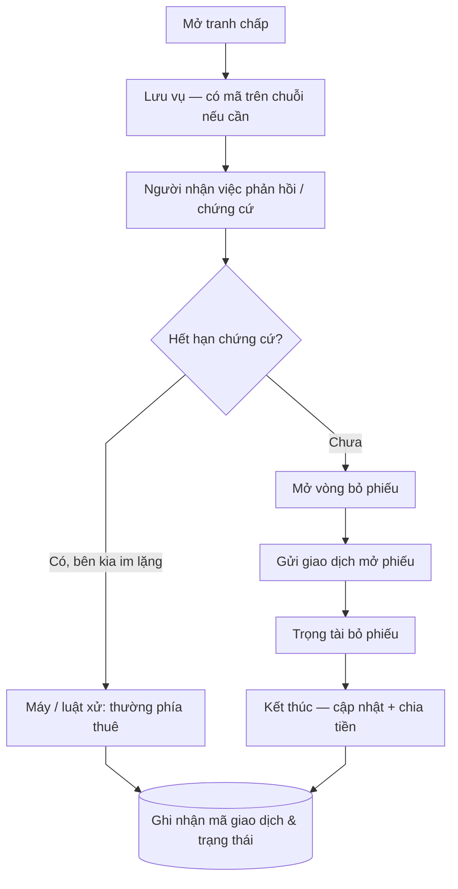
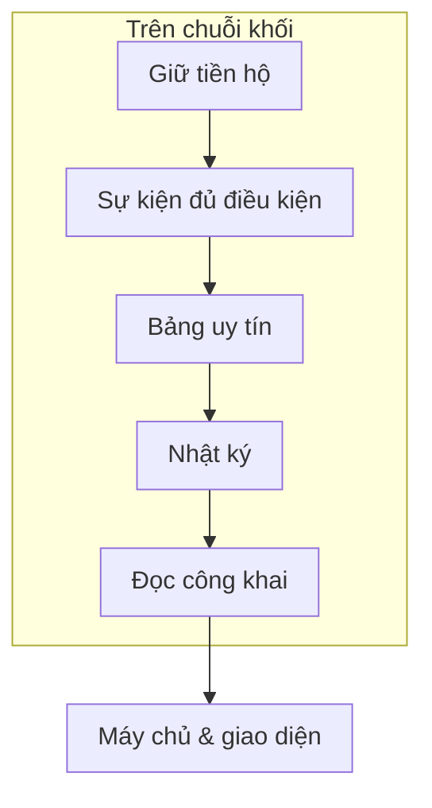

# Chuỗi khối: Tiền giữ hộ, Tranh chấp & Điểm uy tín

**Vấn đề:** Hai bên làm việc từ xa cần **tin tưởng về tiền** (ai giữ, khi nào trả, khi nào hoàn), **cách xử lý khi bất đồng** (tranh chấp có luật rõ), và **học được từ lịch sử** (điểm tin cậy / bất tin cậy để giảm rủi ro lần sau). Chỉ lưu trên máy chủ thường khiến người dùng khó kiểm chứng “ai được tiền” và “điểm có bị sửa tay hay không”.

**Cách xử lý:** Dự án dùng **chuỗi khối** để **khóa tiền trong hợp đồng giữ hộ**, chạy **luồng tranh chấp** khi có khiếu nại, và ghi **bảng uy tín** (quy tắc cộng trừ trong hợp đồng triển khai) sau các sự kiện như hoàn việc, hết hạn, kết thúc tranh chấp. **Máy chủ nghiệp vụ** đồng bộ trạng thái tin, gửi giao dịch khi cần (kể cả bước **khóa vận hành** cho hết hạn / hoàn tiền), nhận **mã giao dịch** từ người dùng (**ví**). Trên máy chủ có thể giữ **bản sao** điểm để hiển thị nhanh — cần **khớp** với chuỗi khi coi chuỗi là chuẩn.

---

## 1. Sơ đồ tổng: Ba lớp

**Các bước luồng nghiệp vụ**

1. **Người đăng việc** khóa tiền vào **hợp đồng giữ hộ** khi đăng tin (theo điều khoản và bước ký).  
2. Theo tiến độ, tiền **trả cho người làm**, **hoàn cho chủ tin**, hoặc chuyển sang **tranh chấp** — tùy trạng thái, chữ ký và **hạn tự động**.  
3. **Máy chủ** lưu trạng thái nghiệp vụ, mã khóa ký quỹ, **mã giao dịch**, mã tranh chấp trên chuỗi; có thể gửi giao dịch bổ sung khi hết hạn hoặc sau phân xử.  
4. **Điểm tin cậy / bất tin cậy (UT/KUT)** được **cập nhật trong phần hợp đồng “uy tín”** khi các giao dịch **giữ tiền hộ** (và nhánh **tranh chấp** gắn với đó) chạy xong — lưu **theo địa chỉ ví**; ai cũng có thể **đọc lại điểm** qua hàm chỉ đọc trên chuỗi. **Cơ sở dữ liệu** có thể lưu bản sao; nếu coi chuỗi là chuẩn thì bản sao phải **khớp** sau mỗi giao dịch liên quan.

---

## 2. Vòng đời ký quỹ (nghiệp vụ)

**Luồng chính (một hàng, trên xuống):**

**Hết hạn do máy quét (song song với các bước trên, không nằm trong hàng chính):**

**Các bước luồng nghiệp vụ**

1. **Mở ký quỹ:** số tiền công việc (và phí nền tảng nếu có) được **khóa** trong hợp đồng.  
2. **Trong lúc làm:** trạng thái tin thay đổi trên **cơ sở dữ liệu**; chuỗi phản ánh bước cần **chữ ký** (chọn người, ký hợp đồng, duyệt bài…).  
3. **Kết thúc tốt:** trả tiền người làm (ví dụ khi hết hạn duyệt mà hệ thống tự trả).  
4. **Hết hạn không tuyển được:** hoàn cho người đăng việc.  
5. **Quá hạn ký / quá hạn nộp:** máy chủ hoặc lịch có thể gửi giao dịch **bỏ người quá hạn ký** / **bỏ người quá hạn nộp** cho khớp nghiệp vụ.  
6. **Tranh chấp:** ký quỹ gắn vụ tranh chấp cho đến khi có kết quả.

**Bước ký thường do máy chủ gửi** (khi hết hạn nhận hồ sơ, hủy giữ hộ, bỏ người quá hạn ký/nộp, tự duyệt khi hết hạn nghiệm thu…) tương ứng các **thao tác công khai** trong phần hợp đồng giữ tiền hộ — chi tiết kỹ thuật nằm trong mã nguồn phía máy chủ và hợp đồng.

---

## 3. Tranh chấp (chuỗi và nền tảng)

**Các bước luồng nghiệp vụ**

1. **Mở tranh chấp:** kèm mô tả, chứng cứ; giao diện có thể tạo **mã tranh chấp trên chuỗi** và gửi về máy chủ.  
2. **Giai đoạn chứng cứ:** nếu hết hạn mà người nhận việc không phản hồi, hệ thống có thể gửi giao dịch **xử lý hết hạn và chia tiền** (máy chủ ký) theo luật hợp đồng.  
3. **Bỏ phiếu:** khi đủ điều kiện, máy chủ có thể gửi giao dịch **mở phiếu** trên chuỗi.  
4. **Kết thúc:** ghi nhận bên thắng, cập nhật tin và ký quỹ; có thể còn bước **nhận tiền** bổ sung tùy thiết kế hợp đồng.

Chi tiết trọng tài: [tài liệu trọng tài](admin.md). Hết hạn tự động: [hệ thống tự động](system.md).

---

## 4. Điểm uy tín trên chuỗi

**Cấu trúc nghiệp vụ:** Một **kho lưu trữ chung** trên chuỗi giữ bảng **địa chỉ ví → bản ghi uy tín** (điểm **tin cậy**, **bất tin cậy**, số việc đã làm, số việc làm chủ tin, số tranh chấp thắng/thua). Mỗi lần đổi điểm có **nhật ký sự kiện** (ai, thao tác, thay đổi điểm, điểm mới, thời điểm). Chỉ **phần giữ tiền hộ** được phép gọi **cập nhật nội bộ** trong cùng giao dịch — tránh ai tự ý sửa điểm. Vẫn có thể có **lối vào công khai** (ký riêng) cho một số tình huống vận hành nếu cấu hình cho phép.

**Quy tắc cộng trừ (theo bản hợp đồng đang triển khai)**

| Tình huống | Ai chịu tác động | Thay đổi |
| ---------- | ---------------- | -------- |
| Hoàn việc | Người nhận việc | **+10** điểm tin cậy; tăng đếm việc đã hoàn thành |
| Duyệt đúng hạn | Người đăng việc (khi nghiệm thu đúng hạn) | **+5** điểm tin cậy; tăng đếm việc làm chủ tin |
| Thắng tranh chấp | Bên thắng | **+5** điểm tin cậy |
| Thua tranh chấp | Bên thua | **+20** bất tin cậy; **−10** tin cậy (không âm) |
| Quá hạn nộp bài | Người nhận việc | **+10** bất tin cậy; **−5** tin cậy (không âm) |
| Quá hạn duyệt | Người đăng việc | **+10** bất tin cậy; **−5** tin cậy (không âm) |

**Các bước luồng nghiệp vụ**

1. **Tiền và trạng thái công việc** do **giữ tiền hộ / tranh chấp** điều phối; khi điều kiện trong hợp đồng thỏa, **điểm uy tín được cập nhật ngay trên chuỗi** trong cùng luồng giao dịch.  
2. **Trọng tài / máy chủ** không tự “nhập điểm tay” trong phần này — họ thay đổi **luồng tranh chấp và tiền**; điểm **bám theo kết quả thực thi** đã ghi trong hợp đồng.  
3. **Điều khoản trên giao diện** giải thích cho người dùng; **con số cụ thể** cần khớp bảng trên khi hệ thống dùng đúng phiên bản hợp đồng đã triển khai.

Luồng theo vai: [người đăng việc](poster.md), [người nhận việc](freelancer.md), [trọng tài](admin.md), [máy tự động](system.md) (mục 4).

---

## 5. Các thao tác máy chủ thường ký (ý nghĩa nghiệp vụ)

| Chủ đề | Việc làm (lời văn) | Ghi chú |
| ------ | ------------------ | ------- |
| Giữ hộ | Hết hạn ký — bỏ người làm | Trong phần hợp đồng giữ tiền |
| Giữ hộ | Hết hạn nộp — bỏ người làm | |
| Giữ hộ | Hết hạn duyệt — trả tiền người làm | |
| Giữ hộ | Hết hạn nhận hồ sơ — hoàn chủ tin | |
| Giữ hộ | Hủy ký quỹ (vận hành / khôi phục) | |
| Tranh chấp | Hết hạn chứng cứ / xử lý quá hạn | |
| Tranh chấp | Mở vòng bỏ phiếu | |
| Uy tín | Thường **không** gọi riêng — **đi kèm** giao dịch giữ hộ khi luật trong hợp đồng kích hoạt | Hoàn việc, hết hạn, xong tranh chấp |
| Uy tín | **Đọc** điểm để hiển thị / đối soát | Hàm chỉ đọc trên chuỗi |

Người dùng ký các bước tạo tin, chọn người, duyệt bài, mở tranh chấp… bằng **ví**; **mã giao dịch** lưu kèm tin / tranh chấp trên máy chủ. **Cập nhật uy tín** đi kèm các giao dịch **giữ tiền hộ** khi điều kiện trong hợp đồng thỏa (xem mục 4).

---

