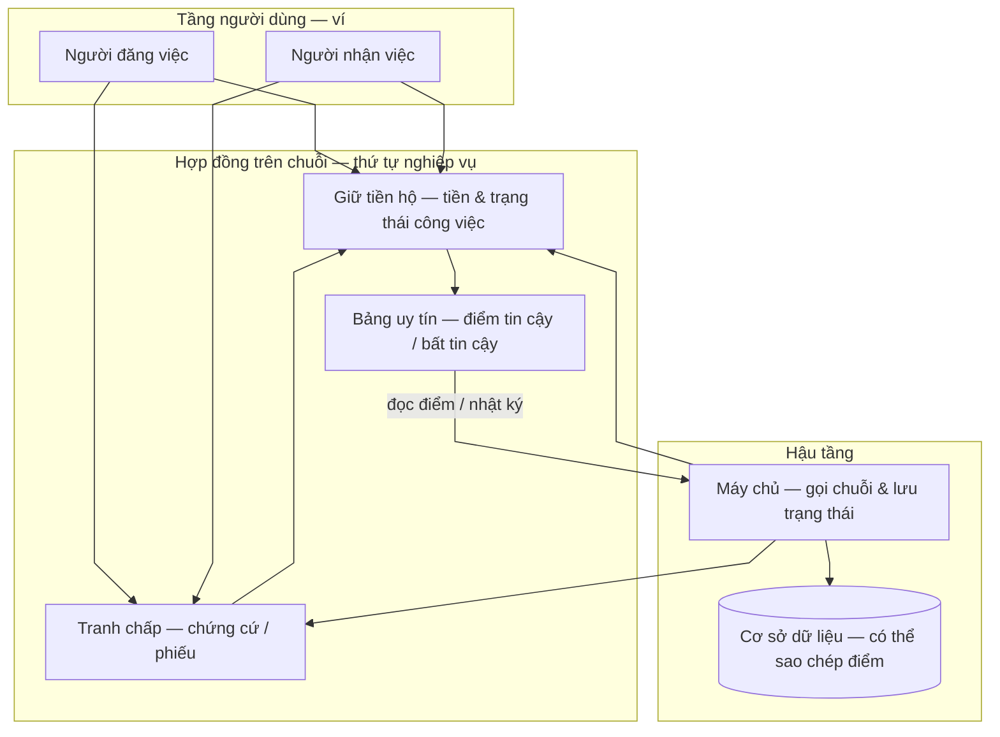
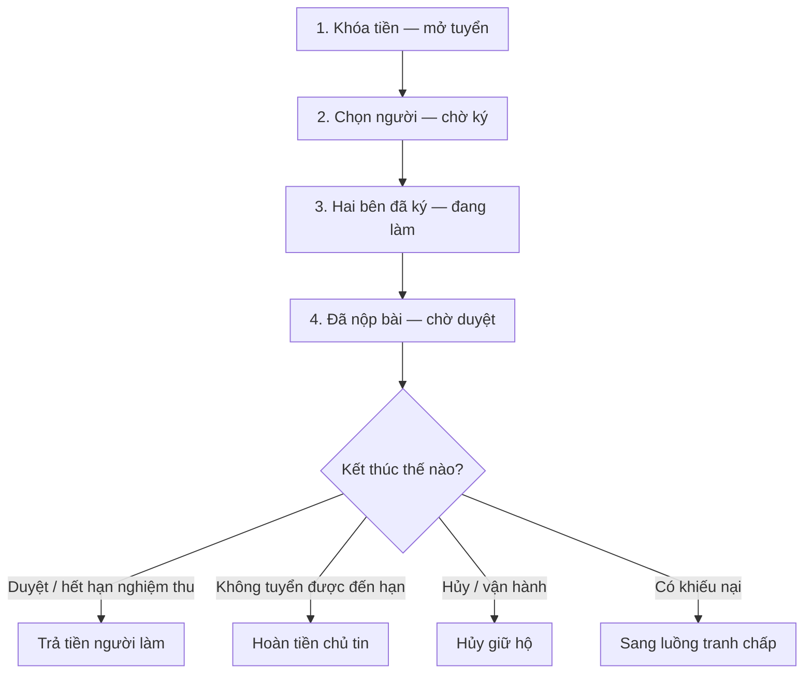
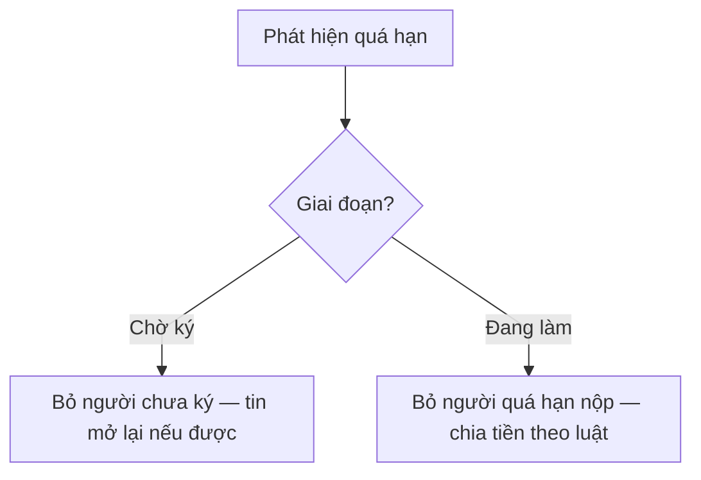
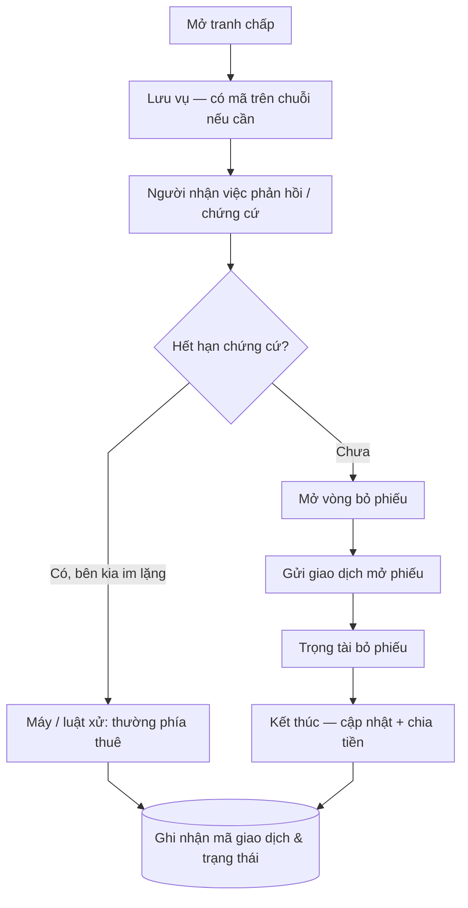
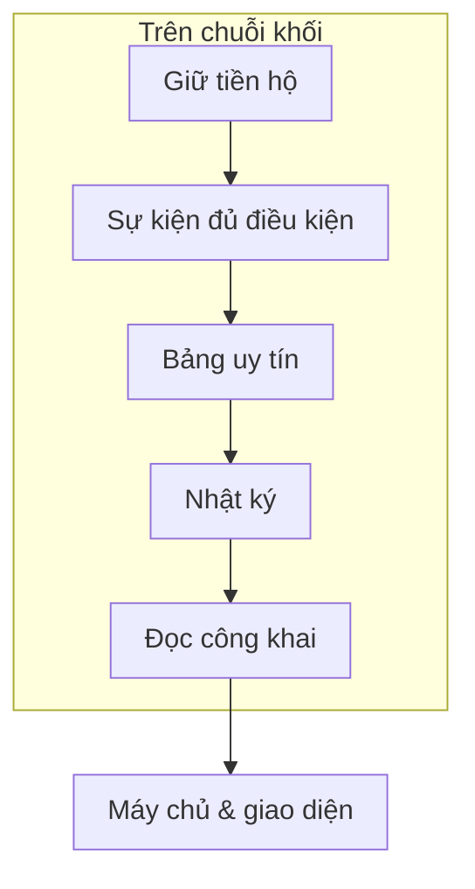

# Chuỗi khối: Tiền giữ hộ, Tranh chấp & Điểm uy tín

**Vấn đề:** Mô hình **làm việc từ xa** đòi hỏi **đảm bảo thanh toán** (bên giữ quỹ, điều kiện giải ngân, hoàn trả), **cơ chế tranh chấp có thể kiểm chứng**, và **tín hiệu uy tín lặp lại** (UT/KUT) để giảm rủi ro đối tác. Nếu chỉ dựa **CSDL tập trung**, bên thứ ba khó **xác minh độc lập** việc phân bổ tiền và **toàn vẹn** lịch sử điểm.

**Cách xử lý:** Gắn **chuỗi khối công khai** (hệ Aptos) làm **lớp tin cậy** cho **ký quỹ**, **xử lý tranh chấp** và **ghi nhận điểm uy tín** sau các **mốc nghiệp vụ** (nghiệm thu, hết hạn theo cam kết, đóng tranh chấp). **Máy chủ nghiệp vụ** đồng bộ **trạng thái** trong **cơ sở dữ liệu** với chuỗi, dùng **ví vận hành** được phép cho **giao dịch tự động**, đồng thời lưu **mã băm giao dịch** do **ví người dùng** ký. **Bản sao điểm uy tín** trên CSDL phục vụ **đọc nhanh** và cần **khớp** với chuỗi khi lấy **sổ cái phân tán** làm chuẩn.

## Kiến trúc và công nghệ chuỗi khối trong nền tảng

### Vai trò kiến trúc

**Chuỗi khối** ở đây không thay thế **hệ quản trị cơ sở dữ liệu** của nền tảng. CSDL vẫn lưu **tin tuyển**, **đơn ứng tuyển**, **tin nhắn**, **hồ sơ người dùng** — những dữ liệu cần **truy vấn linh hoạt** và **cập nhật thường xuyên**. Chuỗi khối đảm nhận phần **cần minh bạch, khó đơn phương thay đổi sau khi đã cam kết**: **số dư ký quỹ**, **điều kiện giải ngân**, **luồng tranh chấp** và **điểm uy tín** theo **quy tắc đã triển khai trong hợp đồng thông minh**.

### Hợp đồng thông minh và ngôn ngữ triển khai

**Hợp đồng thông minh** là **bộ quy tắc tự động** chạy trên mạng, xác định **ai được phép gọi thao tác nào** và **trạng thái quỹ / tranh chấp / uy tín** chuyển thế nào khi đủ điều kiện. Nền tảng dùng **ngôn ngữ Move** trên **Aptos** — đặc thù là **kiểm tra tài nguyên và quyền sở hữu** chặt chẽ, phù hợp **tài sản và trạng thái** cần **an toàn**. Người đọc tài liệu luồng chỉ cần hiểu: mọi **thay đổi có hiệu lực kinh tế** trên chuỗi đều đi qua **giao dịch** được **xác thực** theo quy tắc mạng.

### Giao dịch, chữ ký và danh tính trên chuỗi

Mỗi **giao dịch** là một **gói thao tác** người dùng hoặc hệ thống gửi lên mạng. **Chữ ký bằng ví** chứng minh **chủ thể** đồng ý (ví dụ: **khóa ký quỹ**, **chấp nhận nghiệm thu**, **mở tranh chấp**). **Địa chỉ ví** là **định danh** gắn với **điểm uy tín** và **luồng tiền**. Một số bước **đến hạn** (quá hạn ký, quá hạn nộp bài, **kết thúc thời gian chứng cứ**…) được **máy chủ nghiệp vụ** hoặc **bộ lập lịch** thực hiện bằng **ví vận hành** đã được **phân quyền** trong thiết kế hợp đồng — để **tự động hóa** mà vẫn **kiểm chứng được** trên chuỗi.

### Ký quỹ và trạng thái công việc

**Ký quỹ** là cơ chế **giữ tiền trong hợp đồng** cho đến khi **điều kiện nghiệp vụ** thỏa (ví dụ **nghiệm thu**, **hoàn tiền** khi không tuyển được, **chuyển sang tranh chấp**). Trạng thái **“đang mở tuyển / đang thực hiện / chờ duyệt / đã đóng”** được **ăn khớp** giữa **CSDL** (để ứng dụng hiển thị) và **trạng thái on-chain** (để **đảm bảo tiền**). Khi hai nguồn lệch, **ưu tiên đối soát** theo **chính sách triển khai** (thường lấy **chuỗi** làm chuẩn cho **tiền và uy tín**).

### Sổ uy tín và cập nhật có kiểm soát

**UT** (độ tin cậy) và **KUT** (độ bất tin cậy) là **chỉ số nghiệp vụ** được **cộng trừ** khi có **sự kiện** tương ứng. **Cập nhật điểm** không nên là thao tác **tùy tiện**: thiết kế hướng tới việc **chỉ luồng ký quỹ / tranh chấp hợp lệ** mới kích hoạt **ghi nhận**, tránh **can thiệp tay** trái quy tắc. Ai cũng có thể **đọc công khai** bảng điểm theo địa chỉ — tăng **trách nhiệm giải trình** giữa các bên.

### Rủi ro và giới hạn công nghệ

Chuỗi khối **không** giải quyết tranh chấp **pháp lý ngoài nền tảng**; nó **mã hóa** phần **đã thỏa thuận** trong hợp đồng. **Phí mạng**, **độ trễ xác nhận** và **sai lệch đồng bộ** với CSDL là **rủi ro vận hành** cần **giám sát**. Tài liệu luồng **không** thay cho **điều khoản pháp lý** hay **mô tả kỹ thuật triển khai chi tiết** — chỉ cố định **vai trò kiến trúc** trong hệ sinh thái freelancer.

---

## 1. Sơ đồ tổng: Ba lớp

**Các bước luồng nghiệp vụ**

1. **Người đăng việc** khóa tiền vào **hợp đồng giữ hộ** khi đăng tin (theo điều khoản và bước ký).  
2. Theo tiến độ, tiền **trả cho người làm**, **hoàn cho chủ tin**, hoặc chuyển sang **tranh chấp** — tùy trạng thái, chữ ký và **hạn tự động**.  
3. **Máy chủ** lưu trạng thái nghiệp vụ, mã khóa ký quỹ, **mã giao dịch**, mã tranh chấp trên chuỗi; có thể gửi giao dịch bổ sung khi hết hạn hoặc sau phân xử.  
4. **Điểm tin cậy / bất tin cậy (UT/KUT)** được **cập nhật trong hợp đồng uy tín** khi các giao dịch **ký quỹ** (và nhánh **tranh chấp** liên quan) **hoàn tất hợp lệ** — ánh xạ **theo địa chỉ ví**; bất kỳ ai cũng có thể **đọc công khai** trên mạng. **Cơ sở dữ liệu** có thể lưu **bản sao** phục vụ hiển thị; nếu coi **chuỗi** là chuẩn thì bản sao phải **đồng bộ** sau mỗi giao dịch liên quan.

---

## 2. Vòng đời ký quỹ (nghiệp vụ)

**Luồng chính (một hàng, trên xuống):**

**Hết hạn do máy quét (song song với các bước trên, không nằm trong hàng chính):**

**Các bước luồng nghiệp vụ**

1. **Mở ký quỹ:** số tiền công việc (và phí nền tảng nếu có) được **khóa** trong hợp đồng.  
2. **Trong lúc làm:** trạng thái tin thay đổi trên **cơ sở dữ liệu**; chuỗi phản ánh bước cần **chữ ký** (chọn người, ký hợp đồng, duyệt bài…).  
3. **Kết thúc tốt:** trả tiền người làm (ví dụ khi hết hạn duyệt mà hệ thống tự trả).  
4. **Hết hạn không tuyển được:** hoàn cho người đăng việc.  
5. **Quá hạn ký / quá hạn nộp:** máy chủ hoặc lịch có thể gửi giao dịch **bỏ người quá hạn ký** / **bỏ người quá hạn nộp** cho khớp nghiệp vụ.  
6. **Tranh chấp:** ký quỹ gắn vụ tranh chấp cho đến khi có kết quả.

**Các bước tự động hết hạn** thường do **máy chủ nghiệp vụ** (kèm **ví vận hành** được phép) phát **giao dịch** tương ứng **thao tác công khai** trong hợp đồng ký quỹ — ví dụ: hết hạn nhận hồ sơ, hủy ký quỹ, loại ứng viên quá hạn ký hoặc nộp, **tự động nghiệm thu** khi hết thời gian duyệt theo luật tin.

---

## 3. Tranh chấp (chuỗi và nền tảng)

**Các bước luồng nghiệp vụ**

1. **Mở tranh chấp:** kèm mô tả, chứng cứ; giao diện có thể tạo **mã tranh chấp trên chuỗi** và gửi về máy chủ.  
2. **Giai đoạn chứng cứ:** nếu hết hạn mà người nhận việc không phản hồi, hệ thống có thể gửi giao dịch **xử lý hết hạn và chia tiền** (máy chủ ký) theo luật hợp đồng.  
3. **Bỏ phiếu:** khi đủ điều kiện, máy chủ có thể gửi giao dịch **mở phiếu** trên chuỗi.  
4. **Kết thúc:** ghi nhận bên thắng, cập nhật tin và ký quỹ; có thể còn bước **nhận tiền** bổ sung tùy thiết kế hợp đồng.

Chi tiết trọng tài: [tài liệu trọng tài](admin.md). Hết hạn tự động: [hệ thống tự động](system.md).

---

## 4. Điểm uy tín trên chuỗi

**Cấu trúc nghiệp vụ:** Một **kho lưu trữ chung** trên chuỗi giữ bảng **địa chỉ ví → bản ghi uy tín** (điểm **tin cậy**, **bất tin cậy**, số việc đã làm, số việc làm chủ tin, số tranh chấp thắng/thua). Mỗi lần đổi điểm có **nhật ký sự kiện** (ai, thao tác, thay đổi điểm, điểm mới, thời điểm). Chỉ **phần giữ tiền hộ** được phép gọi **cập nhật nội bộ** trong cùng giao dịch — tránh ai tự ý sửa điểm. Vẫn có thể có **lối vào công khai** (ký riêng) cho một số tình huống vận hành nếu cấu hình cho phép.

**Quy tắc cộng trừ (theo bản hợp đồng đang triển khai)**

| Tình huống | Ai chịu tác động | Thay đổi |
| ---------- | ---------------- | -------- |
| Hoàn việc | Người nhận việc | **+10** điểm tin cậy; tăng đếm việc đã hoàn thành |
| Duyệt đúng hạn | Người đăng việc (khi nghiệm thu đúng hạn) | **+5** điểm tin cậy; tăng đếm việc làm chủ tin |
| Thắng tranh chấp | Bên thắng | **+5** điểm tin cậy |
| Thua tranh chấp | Bên thua | **+20** bất tin cậy; **−10** tin cậy (không âm) |
| Quá hạn nộp bài | Người nhận việc | **+10** bất tin cậy; **−5** tin cậy (không âm) |
| Quá hạn duyệt | Người đăng việc | **+10** bất tin cậy; **−5** tin cậy (không âm) |

**Các bước luồng nghiệp vụ**

1. **Tiền và trạng thái công việc** do **giữ tiền hộ / tranh chấp** điều phối; khi điều kiện trong hợp đồng thỏa, **điểm uy tín được cập nhật ngay trên chuỗi** trong cùng luồng giao dịch.  
2. **Trọng tài / máy chủ** không tự “nhập điểm tay” trong phần này — họ thay đổi **luồng tranh chấp và tiền**; điểm **bám theo kết quả thực thi** đã ghi trong hợp đồng.  
3. **Điều khoản trên giao diện** giải thích cho người dùng; **con số cụ thể** cần khớp bảng trên khi hệ thống dùng đúng phiên bản hợp đồng đã triển khai.

Luồng theo vai: [người đăng việc](poster.md), [người nhận việc](freelancer.md), [trọng tài](admin.md), [máy tự động](system.md) (mục 4).

---

## 5. Các thao tác máy chủ thường ký (ý nghĩa nghiệp vụ)

| Chủ đề | Việc làm (lời văn) | Ghi chú |
| ------ | ------------------ | ------- |
| Giữ hộ | Hết hạn ký — bỏ người làm | Trong phần hợp đồng giữ tiền |
| Giữ hộ | Hết hạn nộp — bỏ người làm | |
| Giữ hộ | Hết hạn duyệt — trả tiền người làm | |
| Giữ hộ | Hết hạn nhận hồ sơ — hoàn chủ tin | |
| Giữ hộ | Hủy ký quỹ (vận hành / khôi phục) | |
| Tranh chấp | Hết hạn chứng cứ / xử lý quá hạn | |
| Tranh chấp | Mở vòng bỏ phiếu | |
| Uy tín | Thường **không** gọi riêng — **đi kèm** giao dịch giữ hộ khi luật trong hợp đồng kích hoạt | Hoàn việc, hết hạn, xong tranh chấp |
| Uy tín | **Đọc** điểm để hiển thị / đối soát | Truy vấn **chỉ đọc** trên mạng chuỗi khối |

Người dùng ký các bước tạo tin, chọn người, duyệt bài, mở tranh chấp… bằng **ví**; **mã giao dịch** lưu kèm tin / tranh chấp trên máy chủ. **Cập nhật uy tín** đi kèm các giao dịch **giữ tiền hộ** khi điều kiện trong hợp đồng thỏa (xem mục 4).

---

