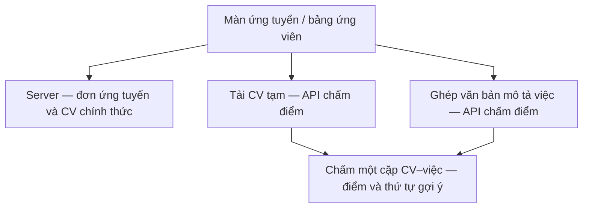
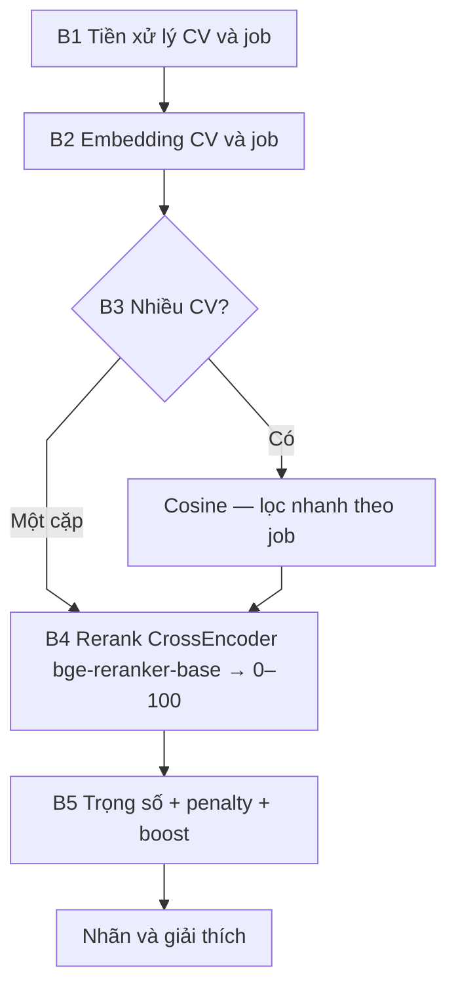

# Luồng chấm điểm CV bằng AI

**Phạm vi:** Bộ chấm điểm CV triển khai **độc lập**, chuyên **suy luận**, kết nối [**server**](thuat-ngu.md#server) nền tảng. Kiến trúc: [architecture](architecture.md). Thuật ngữ: [bảng thuật ngữ](thuat-ngu.md).

**Bối cảnh:** Người đăng việc cần sàng lọc khối lượng đơn ứng tuyển; người làm tự do cần đánh giá sơ bộ mức phù hợp giữa hồ sơ và tin tuyển trước khi nộp. Xử lý thuần thủ công tốn thời gian và khó đảm bảo nhất quán tiêu chí.

**Phương án:** So khớp nội dung CV với mô tả công việc, trả về **điểm số** và **nhãn phân loại** trên màn hình ứng tuyển hoặc bảng ứng viên. Việc **chấp nhận hồ sơ** và **ghi nhận đơn ứng tuyển** do người dùng thực hiện qua **server**; **Chấm điểm AI** chỉ **hỗ trợ** quyết định, không thay thế phán quyết pháp lý hay quy trình nghiệp vụ nội bộ.

## Vai trò của bộ chấm điểm CV

- **Tách kiến trúc** khỏi server nghiệp vụ nhằm cô lập tải tính toán, thuận tiện mở rộng và nâng cấp mô hình.
- **Dữ liệu hệ thống chính** gồm đơn ứng tuyển CV đã lưu và trạng thái tin trên **server** và **cơ sở dữ liệu**; bộ chấm điểm CV chỉ nhận bản sao tạm hoặc đoạn văn để tính điểm.
- Tệp gửi vào bước chấm thường là **bản tạm**; đầu ra gồm **điểm**, **nhãn** và **văn bản giải thích ngắn** phục vụ hiển thị.

## Chuỗi xử lý (B1 → B5)

**Ràng buộc thiết kế:** Không bổ sung bước xếp hạng riêng sau lọc nhanh. Sau **B3 ([Cosine similarity](thuat-ngu.md#cosine))** hệ thống chuyển sang **B4 ([CrossEncoder](thuat-ngu.md#crossencoder) [rerank](thuat-ngu.md#rerank))** cho từng cặp cần chấm; thứ tự ưu tiên cuối cùng căn cứ **điểm sau B5**.

**B1 — Tiền xử lý văn bản**  
Chuyển chữ thường, loại bỏ khoảng trắng và xuống dòng thừa.

**B2 — Vector hóa (embedding)**  
CV (sau tải lên hoặc trích xuất văn bản) và mô tả việc được biểu diễn bằng **vector** trong cùng không gian nhúng để tính **độ tương đồng Cosine**.

**B3 — Lọc nhanh (danh sách nhiều CV)**  
Đầu vào: vector job và danh sách vector CV. Dùng **Cosine** để giảm số lần gọi rerank. Trường hợp **một CV — một tin:** bỏ qua lọc danh sách; Cosine trực tiếp cho **embedding_score**, sau đó vào B4.

**B4 — Rerank (CrossEncoder)**  
CV và mô tả việc được đưa **đồng thời** vào một lần suy luận nhằm khai thác ngữ cảnh hai chiều. Mô hình **BAAI/bge-reranker-base**: đầu ra qua **Sigmoid**, ánh xạ sang thang **0–100** (**rerank_score**).

**B5 — Tổng hợp điểm**  
Kết hợp embedding và rerank thành **final_score**, áp dụng **penalty** và **boost** như mục 4.

**Chi phí tính toán:** B4 tốn tài nguyên hơn B3. Với nhiều hồ sơ, B3 thực hiện trước; với một cặp, một lần B4 sau khi có **embedding_score**.

**Giới hạn mô hình:** Có thể thiên lệch theo dữ liệu huấn luyện, bỏ sót thông tin không được mô tả rõ trong CV, hoặc sai lệch khi tin tuyển thiếu nội dung. **Điểm số mang tính tham khảo**, không thay thế đánh giá của người phụ trách tuyển dụng.

---

## 1. Kịch bản sử dụng theo vai trò

### Người làm tự do — màn ứng tuyển

1. Tải CV lên **server** để lưu trữ và đính kèm đơn ứng tuyển.  
2. Có thể **xem trước điểm khớp:** gửi tệp tới bộ chấm điểm CV, ghép mô tả việc từ tiêu đề tin và thư giới thiệu, chấm **một cặp**, hiển thị điểm và mức phù hợp.  
3. Gửi đơn qua **server**; bước chấm điểm có thể thực hiện trước hoặc song song với nghiệp vụ nộp đơn.

### Người đăng việc — bảng ứng viên

1. Truy vấn tin và danh sách hồ sơ từ **server**.  
2. Với từng ứng viên có CV: tải tệp, gọi bộ chấm điểm CV với mô tả việc ghép từ tiêu đề, phần mô tả và yêu cầu — thu được điểm, cột mức khớp và khả năng sắp xếp để hỗ trợ duyệt hồ sơ.

---

## 2. Sơ đồ tích hợp ứng dụng web

1. Người dùng đã đăng nhập mở màn ứng tuyển hoặc danh sách ứng viên.  
2. Thao tác dữ liệu chính đọc/ghi qua **server**.  
3. Chấm điểm: ứng dụng gọi **bộ chấm điểm CV** kèm CV tạm và văn bản mô tả việc.  
4. Sau khi **người đăng việc** hoặc **người làm tự do** xác nhận, **server** mới ghi nhận đơn hoặc cập nhật trạng thái chấp nhận ứng viên.

---

## 3. Chuỗi thao tác API (tóm tắt)

| Bước | Nội dung |
| ---- | -------- |
| 1 | Đẩy tệp CV thường là PDF lên bộ chấm điểm CV, nhận định danh bản ghi CV tạm. |
| 2 | Ghép mô tả việc từ tin: người làm tự do lấy tiêu đề và thư giới thiệu, người đăng việc lấy tiêu đề mô tả và yêu cầu. |
| 3 | Tạo bản ghi việc trong bộ chấm điểm CV → nhận định danh bản ghi việc. |
| 4 | Gửi định danh CV và định danh việc → thực thi **B1→B5** → **embedding_score**, **rerank_score**, **final_score** và nhãn kết luận. |
| 5 | Hiển thị trên giao diện theo ngưỡng điểm và cấu hình ngôn ngữ. |

---

## 4. Công thức và quy tắc điểm

### Sơ đồ B1 → B5

Không có thêm bước xếp hạng trung gian sau bước lọc nhanh.

### embedding_score

Độ tương đồng ngữ nghĩa giữa hai vector bằng Cosine, quy về thang **0–100**.

| Khoảng điểm | Diễn giải |
| ----------- | --------- |
| >85 | Rất gần về nghĩa |
| 70–85 | Có liên quan |
| <70 | Ít liên quan |

### rerank_score

So khớp sâu bằng mô hình AI, thang **0–100**.

| Khoảng điểm | Diễn giải |
| ----------- | --------- |
| >70 | Rất phù hợp |
| 50–70 | Mức trung bình |
| <50 | Không phù hợp |

### final_score

**final_score = 0.3 × embedding_score + 0.7 × rerank_score**

### Điều chỉnh bổ sung

| Quy tắc | Mô tả |
| ------- | ----- |
| Rerank fallback | Khi rerank khoảng **50** nghĩa là mức không phân hóa rõ, tăng trọng **embedding_score** trong tổng hợp. |
| Domain penalty | Phát hiện lệch ngành / lĩnh vực → áp hệ số **giảm 50%** theo cách triển khai trong mã nguồn. |
| Boost cùng ngành | **Embedding_score** cao và cùng domain → cộng **+5**. |
| Boost QA / kiểm thử | Cặp mô tả QA đối chiếu QA → cộng **+5**. |
| Soft decisiveness | Điều chỉnh nhẹ để tăng độ phân tán: điểm tổng đã cao được nâng nhẹ, điểm đã thấp được hạ nhẹ. |

### Nhãn kết luận theo điểm cuối

| Khoảng điểm | Nhãn giao diện |
| ----------- | -------------- |
| >75 | Strong match |
| 50–75 | Moderate |
| <50 | Low |

### Giải thích nhãn cho người dùng

| Nhãn | Ý nghĩa hiển thị |
| ------------------ | ---------------- |
| Strong match | Rất phù hợp |
| Moderate match | Trung bình |
| Low match | Không phù hợp |

---

## 5. Đầu ra phục vụ giao diện

Mỗi lần chấm **một cặp** CV–việc, bộ chấm điểm trả về **embedding_score**, **rerank_score**, **final_score** sau các bước chỉnh nếu có, nhãn **Strong / Moderate / Low** và trường **explanation**. Dùng để **lọc và sắp xếp**; **không** tự **từ chối** hay **trúng tuyển** thay **người đăng việc**.
