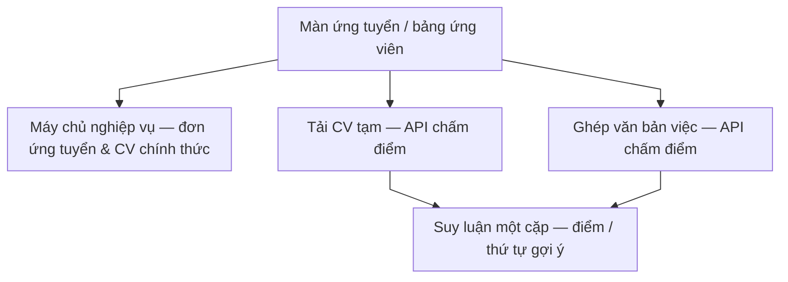
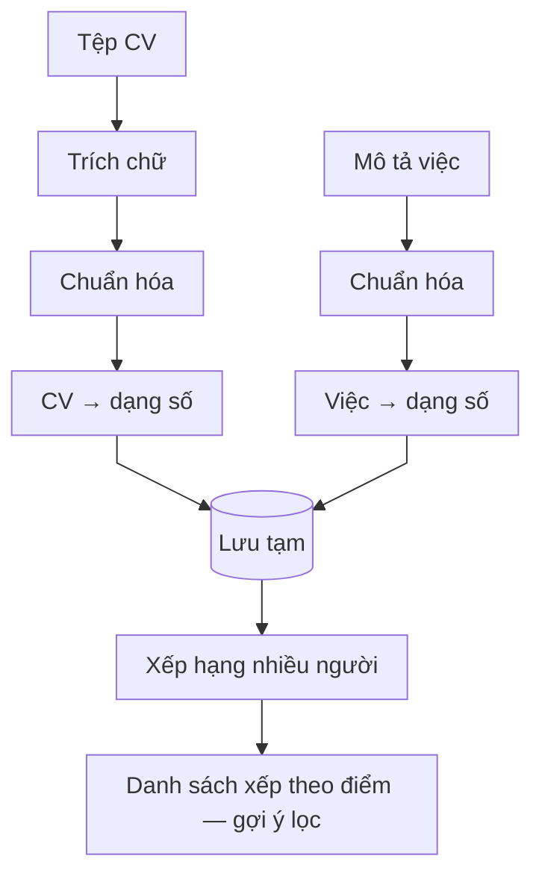
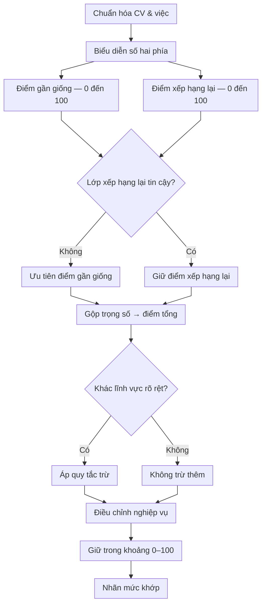
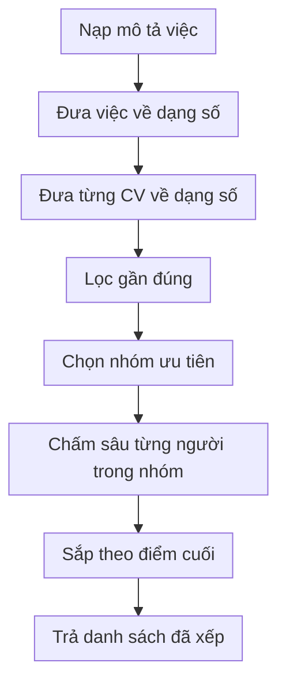

# Luồng AI hỗ trợ sàng lọc & duyệt hồ sơ (chấm điểm CV)

**Phạm vi:** Tích hợp **dịch vụ chấm điểm** (triển khai **độc lập**, dạng **máy chủ ứng dụng nhẹ** chuyên **suy luận**) với **máy chủ nghiệp vụ** của nền tảng. Thuật ngữ tổng thể: [kiến trúc — bảng chung](architecture.md).

**Vấn đề:** **Chủ tin** phải **sàng lọc** nhiều **đơn ứng tuyển**; **người nhận việc** cần **tín hiệu sớm** về **điểm và thứ tự đọc** so với **tin tuyển** trước khi gửi đơn. Duyệt thủ công tốn **chi phí thời gian**, dễ **bỏ sót ứng viên** và **thiếu nhất quán tiêu chí**.

**Cách xử lý:** Chạy **chuỗi xử lý suy luận** nội bộ (tham số theo **môi trường triển khai**), **ước lượng độ khớp ngữ nghĩa** giữa **bản trích hồ sơ** và **văn bản mô tả việc**, trả **điểm, nhãn và gợi ý sắp xếp** ngay trên **màn ứng tuyển** hoặc **bảng ứng viên**. **Quyết định cuối** luôn có **người trong vòng lặp**: **chấp nhận ứng viên** và **lưu đơn ứng tuyển** chỉ qua **giao diện lập trình** của **máy chủ nghiệp vụ**; dịch vụ chấm điểm **không** thay thế phán quyết pháp lý hay nghiệp vụ.

## Kiến trúc và công nghệ dịch vụ chấm điểm

### Vai trò kiến trúc

Dịch vụ chấm điểm là **lớp trí tuệ nhân tạo phụ trợ**, **tách tiến trình** khỏi **máy chủ nghiệp vụ** để: **cô lập tải tính toán nặng**, **mở rộng theo nhu cầu** (nhiều phiên suy luận song song), và **giảm rủi ro** khi nâng cấp mô hình. **Nguồn chân lý** về **đơn ứng tuyển**, **tệp CV đã lưu**, **trạng thái tin** vẫn nằm ở **CSDL nghiệp vụ**; dịch vụ chấm điểm chỉ nhận **bản sao tạm** hoặc **đoạn văn bản** phục vụ **so khớp**.

### Luồng dữ liệu và ranh giới tin cậy

Từ góc nhìn **an toàn và quyền riêng tư**, hồ sơ qua bước chấm thường là **tệp tải lên tạm** hoặc **dữ liệu đã được phép** theo luồng đăng nhập; **không** thay thế **kênh lưu chính thức**. Kết quả trả về là **điểm số, nhãn phân loại, văn bản nhận xét ngắn** — phục vụ **hiển thị**, không mang **hiệu lực pháp lý** tự thân.

### Chuỗi xử lý công nghệ (ý niệm)

1. **Trích và chuẩn hóa văn bản** từ PDF hoặc trường nhập — loại nhiễu định dạng, thống nhất **đơn vị văn bản nhỏ** (từ, cụm) trước khi đưa vào mô hình.  
2. **Biểu diễn ngữ nghĩa**: đưa đoạn văn vào **không gian vector** sao cho đoạn **gần nhau về nghĩa** có **độ đo gần** cao — nền tảng của **so khớp tương đồng ngữ nghĩa**.  
3. **Tái xếp hạng**: sau bước lấy điểm nhanh trên tập rút gọn, có thể dùng **bước so sánh sâu** (xem xét **cặp** CV–việc cùng lúc) để **độ chính xác thứ hạng** tốt hơn, đổi lấy **chi phí tính toán** lớn hơn.  
4. **Hậu xử lý theo quy tắc nghiệp vụ**: ví dụ **trừ điểm** khi **lĩnh vực** lệch xa, **ghép trọng số** giữa các thành phần điểm, **chuẩn hóa** về thang **zero–một trăm**.  
5. **Kết xuất cho giao diện**: ánh xạ sang **nhãn dễ đọc** và **màu / mức** theo **ngưỡng nội bộ**.

### Độ trễ, tài nguyên và vận hành

**Suy luận** phụ thuộc **kích cỡ mô hình**, **độ dài văn bản**, **bước tái xếp hạng** và **tải máy chủ**. Thực tế triển khai cần **giới hạn đồng thời**, **hàng đợi**, hoặc **bớt bước nặng** trên danh sách dài (ví dụ **lọc gần đúng** trước rồi mới **chấm sâu**). Đây là **cân bằng** giữa **trải nghiệm người dùng** và **chi phí hạ tầng**.

### Rủi ro, thiên lệch và trách nhiệm

Mô hình có thể **thiên lệch** theo dữ liệu huấn luyện, **bỏ sót** kỹ năng mềm hoặc kinh nghiệm **không được viết rõ** trong CV, hoặc **đánh giá sai** khi **tin tuyển** thiếu thông tin. Vì vậy luồng nghiệp vụ luôn coi điểm là **gợi ý**: **chủ tin** chịu **quyết định tuyển**; **người nhận việc** tự **cân nhắc** trước khi nộp đơn.

---

## 1. Hai nhánh người dùng (cùng sản phẩm)

### A. Người nhận việc — màn ứng tuyển

1. **Tải CV** lên **máy chủ nghiệp vụ** để lưu và đính kèm đơn ứng tuyển.  
2. **AI hỗ trợ xem trước:** gửi bản tệp sang **dịch vụ chấm điểm (AI)**, ghép mô tả việc tạm từ **tiêu đề tin + thư giới thiệu**, chạy **phân tích một cặp** → hiển thị **điểm và mức phù hợp** trong hộp thoại — để **tự lọc** (có nên nộp / chỉnh CV hay không) trước khi gửi.  
3. **Gửi đơn ứng tuyển** qua máy chủ nền tảng (CV đã lưu); bước chấm điểm AI đi **trước hoặc song song** cùng bước nộp, trong cùng luồng trải nghiệm tuyển.

### B. Người đăng việc — bảng ứng viên

1. Lấy tin và danh sách hồ sơ từ **máy chủ nghiệp vụ**.  
2. **Hỗ trợ lọc danh sách (AI):** với từng ứng viên chờ duyệt có file CV — tải file từ hệ thống → gửi sang **dịch vụ chấm điểm**, mô tả việc ghép từ **tiêu đề + mô tả + yêu cầu** → phân tích từng cặp → **cột điểm / mức khớp** và **sắp xếp** theo độ phù hợp để **rút ngắn thời gian duyệt** và chọn người trong cùng màn quản lý tuyển dụng.

---

## 2. Sơ đồ: Luồng tích hợp web

**Các bước luồng nghiệp vụ**

1. Người dùng mở **ứng tuyển** hoặc **danh sách ứng viên** (đã đăng nhập).  
2. **Hồ sơ và tin việc** đọc/ghi qua **máy chủ nghiệp vụ** (đăng nhập, cơ sở dữ liệu, lưu trữ tệp).  
3. **Chấm điểm trên cùng màn hình:** ứng dụng gọi **dịch vụ chấm điểm** (tải bản tạm, ghép **văn bản mô tả việc**, yêu cầu **phân tích một cặp**).  
4. **Chủ tin / người nhận việc** quyết định dựa trên điểm và phán đoán, sau đó **máy chủ nghiệp vụ** mới **ghi nhận đơn** hoặc **chấp nhận ứng viên**.

---

## 3. Chuỗi bước nghiệp vụ (từ tải CV đến điểm hiển thị)

| Bước | Việc làm |
| ---- | -------- |
| 1 | Gửi **tệp CV** (thường định dạng PDF) lên dịch vụ chấm → nhận **mã bản ghi CV** tạm |
| 2 | Ghép chữ **mô tả việc** từ tin (ứng viên: tiêu đề + thư giới thiệu; chủ tin: tiêu đề + mô tả + yêu cầu) |
| 3 | Tạo **bản ghi việc** trong dịch vụ chấm → nhận **mã bản ghi việc** |
| 4 | Gửi **định danh bản CV** + **định danh bản việc** → **chuỗi suy luận** (tương đồng ngữ nghĩa → tái xếp hạng → quy tắc) → **điểm tổng hợp** và nhãn mức khớp (phục vụ **lọc / sắp** trên bảng) |
| 5 | Giao diện hiển thị; ánh xạ nhãn theo **ngưỡng điểm** và **bản dịch / bản địa hóa** giao diện |

---

## 4. Bên trong dịch vụ chấm điểm (chi tiết bước kỹ thuật)

Ở mức **tổng hợp**, bên trong gồm: **mô hình nhúng văn bản** (tạo **vector** đặc trưng cho từng đoạn), **bước đo độ tương đồng ngữ nghĩa**, **bước tái xếp hạng** (so sánh sâu từng **cặp** nếu cần), rồi **điều chỉnh theo quy tắc nghiệp vụ** để ra **điểm và nhãn**. Đây là **lớp suy luận** hỗ trợ **xếp thứ tự đọc ứng viên** trước khi **người duyệt** ra quyết định. Môi trường phát triển có thể **lưu bản chụp kết quả** phục vụ kiểm thử.

### 4.1. Từ tải lên đến xếp hạng nhiều người

**Các bước luồng nghiệp vụ**

1. Ít nhất **một CV** và **một mô tả việc** đã vào dịch vụ chấm.  
2. Trích chữ, chuẩn hóa, chuyển sang dạng số; lưu tạm cho các lần gọi sau.  
3. **Một lần gọi xếp hạng:** lọc nhanh theo độ gần rồi chấm sâu từng ứng viên → trả **phần đầu** danh sách — **cùng ý tưởng** với vòng lặp “phân tích từng cặp” trên giao diện, khác cách đóng gói.  
4. **Giao diện hiện tại** thường dùng **phân tích từng ứng viên** (bảng bấm chấm từng dòng); có thể chuyển sang **một lần xếp hạng** khi cần tối ưu mà **không đổi** luồng nghiệp vụ tuyển.

### 4.2. Phân tích một cặp (luồng chính trên màn hình)

**Các bước luồng nghiệp vụ**

1. So **CV** và **mô tả việc** như hai văn bản (đầu vào của **chuỗi suy luận**).  
2. Điểm **gần giống** + điểm **xếp hạng lại**; xử lý khi lớp xếp hạng lại không tin cậy.  
3. **Gộp trọng số** và **quy tắc** (ví dụ lĩnh vực khác nhau).  
4. Chuẩn hóa thang điểm và **nhận xét** hiển thị — phục vụ người **đọc nhanh** khi lọc.

### 4.3. Xếp hạng nhiều CV

Lọc nhanh theo độ gần trong không gian số → chấm sâu nhóm ứng viên gần nhất (ví dụ mở rộng gấp đôi nhóm đầu rồi thu hẹp lại).

**Các bước luồng nghiệp vụ**

1. Có **mô tả việc** và **danh sách CV** trong dịch vụ chấm.  
2. Lọc nhanh → giảm số lần chạy mô hình nặng.  
3. Áp **cùng công thức** như mục 4.2 cho từng ứng viên còn lại.  
4. Trả **bảng xếp hạng** — **danh sách gợi ý thứ tự duyệt** cho giao diện hoặc cho lớp gọi nội bộ.

---

## 5. Kết quả trả về giao diện

Mỗi lần **suy luận một cặp**, dịch vụ trả về **điểm tương đồng nhanh**, **điểm sau bước tái xếp hạng** (nếu có), **điểm tổng hợp cuối** và **nhận xét ngắn** (từ mô hình hoặc quy tắc). Giao diện **ánh xạ** các giá trị này sang **nhãn dễ đọc** theo **ngưỡng** và **ngôn ngữ hiển thị**. Bộ dữ liệu trả về chỉ phục vụ **lọc và sắp xếp** trên **bảng ứng viên** — **không** kích hoạt **từ chối** hay **trúng tuyển** thay **chủ tin**.
