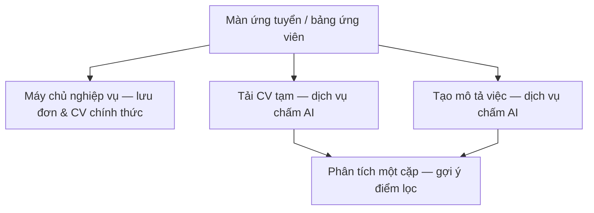
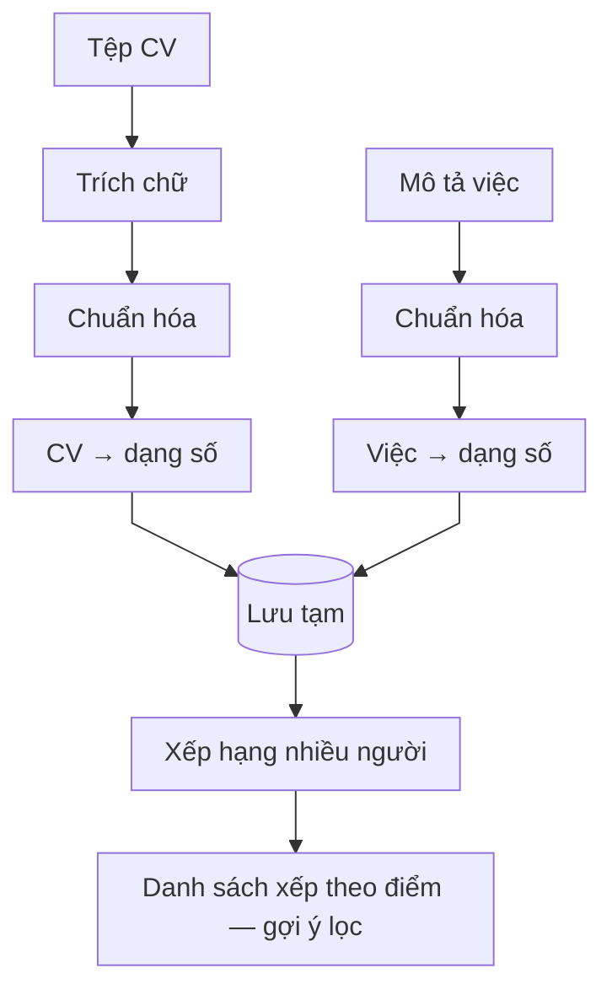
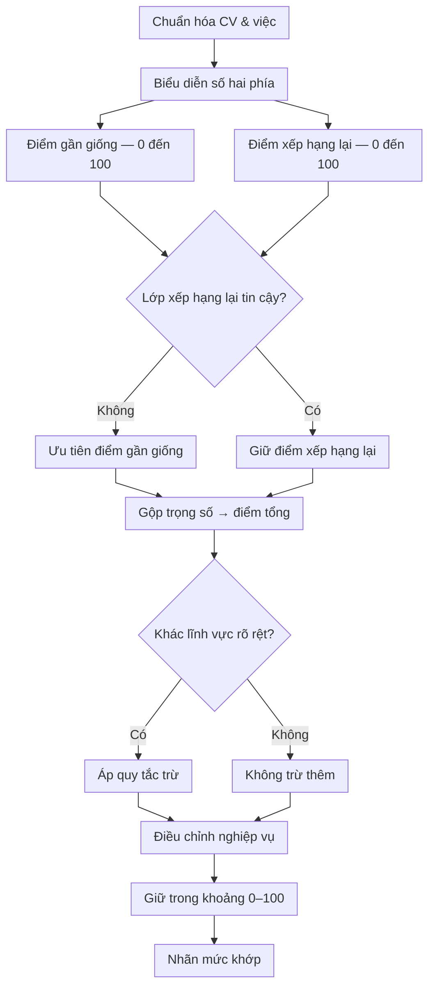
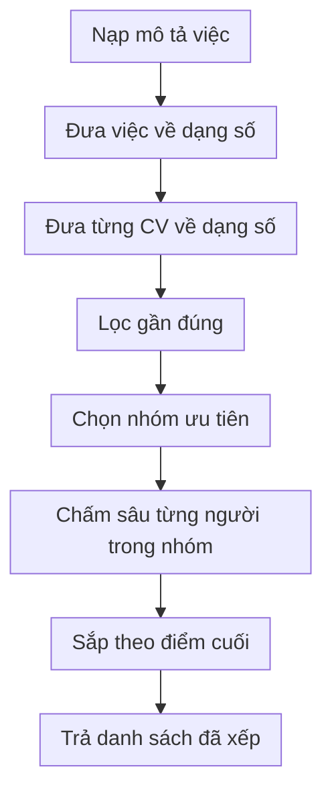

# Luồng AI hỗ trợ duyệt lọc hồ sơ (chấm điểm CV)

**Vấn đề:** Chủ tin phải **duyệt nhiều hồ sơ**; người nhận việc cần **biết sớm** CV có đi theo đúng tin hay không. Làm thủ công thì **chậm**, dễ **bỏ sót** và **không thống nhất tiêu chí** giữa các vòng xem.

**Cách xử lý:** **Mô hình AI** (chạy trong **dịch vụ chấm điểm** nội bộ, cấu hình theo môi trường) **đóng góp bằng cách đánh giá mức khớp** CV–mô tả việc: trả **điểm, nhãn, gợi ý sắp xếp** ngay **trên cùng màn** ứng tuyển hoặc bảng ứng viên. Đây là **hỗ trợ lọc và duyệt**, không thay chỗ quyết định pháp lý/nghiệp vụ của người — **chấp nhận ứng viên / nộp đơn** vẫn do người bấm xác nhận qua máy chủ nền tảng. Luồng này là **một phần cố định của tuyển dụng** trên hệ thống, không tách ra như công cụ ngoài.

---

## 1. Hai nhánh người dùng (cùng sản phẩm)

### A. Người nhận việc — màn ứng tuyển

1. **Tải CV** lên **máy chủ nghiệp vụ** để lưu và đính kèm đơn ứng tuyển.  
2. **AI hỗ trợ xem trước:** gửi bản tệp sang **dịch vụ chấm điểm (AI)**, ghép mô tả việc tạm từ **tiêu đề tin + thư giới thiệu**, chạy **phân tích một cặp** → hiển thị **điểm và mức phù hợp** trong hộp thoại — để **tự lọc** (có nên nộp / chỉnh CV hay không) trước khi gửi.  
3. **Gửi đơn ứng tuyển** qua máy chủ nền tảng (CV đã lưu); bước chấm điểm AI đi **trước hoặc song song** cùng bước nộp, trong cùng luồng trải nghiệm tuyển.

### B. Người đăng việc — bảng ứng viên

1. Lấy tin và danh sách hồ sơ từ **máy chủ nghiệp vụ**.  
2. **AI hỗ trợ lọc danh sách:** với từng ứng viên chờ duyệt có file CV — tải file từ nền tảng → gửi sang **dịch vụ chấm điểm (AI)**, mô tả việc ghép từ **tiêu đề + mô tả + yêu cầu** → phân tích từng cặp → **cột điểm / mức khớp** và **sắp thử** theo độ phù hợp để **người đăng duyệt nhanh hơn** và chọn người trong cùng màn quản lý tuyển.

---

## 2. Sơ đồ: Luồng tích hợp web

**Các bước luồng nghiệp vụ**

1. Người dùng mở **ứng tuyển** hoặc **danh sách ứng viên** (đã đăng nhập).  
2. **Hồ sơ và tin việc** đọc/ghi qua **máy chủ nghiệp vụ** (đăng nhập, cơ sở dữ liệu, lưu trữ tệp).  
3. **Gợi ý lọc bằng AI** là **bước trên cùng màn hình:** gọi dịch vụ chấm điểm (tải bản CV tạm + tạo chữ mô tả việc + phân tích cặp).  
4. Người dùng **quyết định tuyển** dựa trên điểm gợi ý và phán đoán của mình, rồi **nộp đơn** hoặc **chấp nhận ứng viên** — vẫn qua máy chủ nền tảng.

---

## 3. Chuỗi bước nghiệp vụ (từ tải CV đến điểm hiển thị)

| Bước | Việc làm |
| ---- | -------- |
| 1 | Gửi **tệp CV** (thường định dạng PDF) lên dịch vụ chấm → nhận **mã bản ghi CV** tạm |
| 2 | Ghép chữ **mô tả việc** từ tin (ứng viên: tiêu đề + thư giới thiệu; chủ tin: tiêu đề + mô tả + yêu cầu) |
| 3 | Tạo **bản ghi việc** trong dịch vụ chấm → nhận **mã bản ghi việc** |
| 4 | Gửi **mã CV** + **mã việc** → pipeline AI chạy phân tích một cặp → nhận **điểm cuối** và nhãn mức khớp (dùng cho cột lọc / sắp) |
| 5 | Hiển thị trên giao diện; có thể ánh xạ nhãn sang tiếng Việt theo ngưỡng điểm |

---

## 4. Bên trong dịch vụ chấm điểm (AI)

So khớp nhờ **biểu diễn ngữ nghĩa** (embedding / mô hình ngôn ngữ) và **xếp hạng**, cộng **quy tắc** nghiệp vụ — đó là **phần AI đóng góp** cho việc lọc ứng viên trước mắt người duyệt. Trong môi trường thử, có thể lưu **bản ghi phân tích** cục bộ để minh họa.

### 4.1. Từ tải lên đến xếp hạng nhiều người

**Các bước luồng nghiệp vụ**

1. Ít nhất **một CV** và **một mô tả việc** đã vào dịch vụ chấm.  
2. Trích chữ, chuẩn hóa, chuyển sang dạng số; lưu tạm cho các lần gọi sau.  
3. **Một lần gọi xếp hạng:** lọc nhanh theo độ gần rồi chấm sâu từng ứng viên → trả **phần đầu** danh sách — **cùng ý tưởng** với vòng lặp “phân tích từng cặp” trên giao diện, khác cách đóng gói.  
4. **Giao diện hiện tại** thường dùng **phân tích từng ứng viên** (bảng bấm chấm từng dòng); có thể chuyển sang **một lần xếp hạng** khi cần tối ưu mà **không đổi** luồng nghiệp vụ tuyển.

### 4.2. Phân tích một cặp (luồng chính trên màn hình)

**Các bước luồng nghiệp vụ**

1. So **CV** và **mô tả việc** như hai văn bản (đầu vào của pipeline AI).  
2. Điểm **gần giống** + điểm **xếp hạng lại**; xử lý khi lớp xếp hạng lại không tin cậy.  
3. **Gộp trọng số** và **quy tắc** (ví dụ lĩnh vực khác nhau).  
4. Chuẩn hóa thang điểm và **nhận xét** hiển thị — phục vụ người **đọc nhanh** khi lọc.

### 4.3. Xếp hạng nhiều CV

Lọc nhanh theo độ gần trong không gian số → chấm sâu nhóm ứng viên gần nhất (ví dụ mở rộng gấp đôi nhóm đầu rồi thu hẹp lại).

**Các bước luồng nghiệp vụ**

1. Có **mô tả việc** và **danh sách CV** trong dịch vụ chấm.  
2. Lọc nhanh → giảm số lần chạy mô hình nặng.  
3. Áp **cùng công thức** như mục 4.2 cho từng ứng viên còn lại.  
4. Trả **bảng xếp hạng** — **danh sách gợi ý thứ tự duyệt** cho giao diện hoặc cho lớp gọi nội bộ.

---

## 5. Kết quả trả về giao diện

Mỗi lần phân tích một cặp: **điểm gần giống**, **điểm xếp hạng lại**, **điểm cuối**, **nhận xét**; giao diện có thể dịch nhận xét sang tiếng Việt theo ngưỡng điểm. Các trường này **hỗ trợ cột lọc / sắp** — **không** tự động loại hay chọn ứng viên thay người duyệt.
