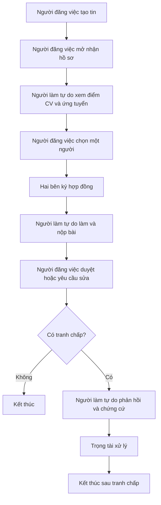
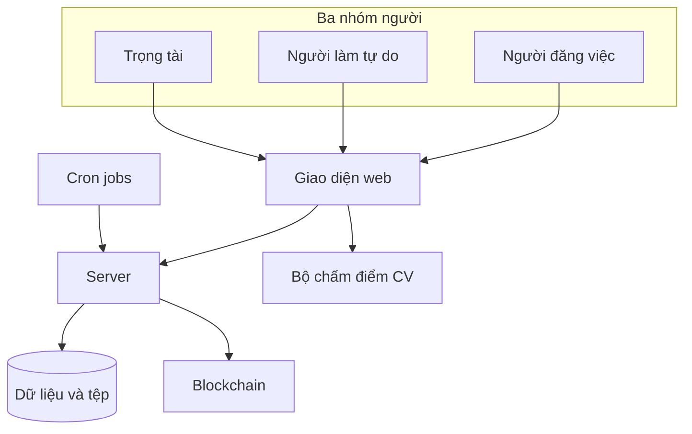
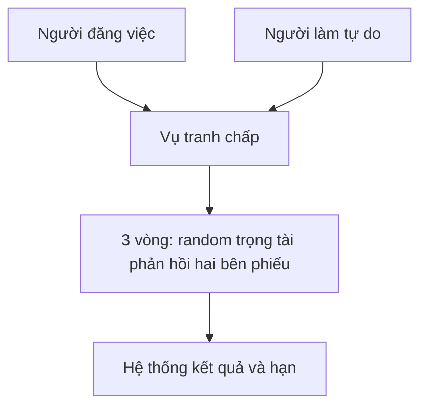

# Luồng tổng quan nền tảng

Tóm lược vai **người đăng việc**, **người làm tự do**, **trọng tài chuyên môn**; các phần **web**, **server**, **bộ chấm điểm CV**, **blockchain**, **hệ thống**; và vòng đời **tin tuyển → hợp đồng → làm bài → tranh chấp nếu có**. Kiến trúc: [architecture](architecture.md). Thuật ngữ kỹ thuật: [bảng thuật ngữ](thuat-ngu.md).

---

## 1. Bảng vai và phần hệ thống

| Phần | Việc chính | Đọc thêm |
| ---- | ---------- | -------- |
| Người đăng việc | Đăng tin chấm CV chọn người duyệt tranh chấp khi cần | [poster](poster.md) |
| Người làm tự do | Xem điểm CV ứng tuyển ký làm nộp bài | [freelancer](freelancer.md) |
| Trọng tài chuyên môn | Chỉ xử lý tranh chấp | [trọng tài](trong-tai.md) |
| Hệ thống | Hết hạn, thông báo, giao dịch blockchain theo **cron jobs** | [hệ thống](system.md) |
| Chấm điểm CV | So khớp CV với tin khi đang tuyển | [cv-ai-scoring](cv-ai-scoring.md) |
| Điểm uy tín | Ghi trên blockchain; database giữ bản sao để hiển thị | [blockchain](blockchain.md) |
| Blockchain | Giữ tiền, tranh chấp, cập nhật điểm | [blockchain](blockchain.md) |

Cột **Đọc thêm** dẫn vào tài liệu chi tiết; trong mỗi file vai có **bảng nhiệm vụ và phạm vi** (task nằm trong giới hạn nào, việc gì **không** thuộc vai). Chấm điểm chỉ trong giai đoạn tuyển.

---

## 2. Vòng đời một công việc

Luồng chính là các bước **theo thứ tự** trên sơ đồ. **Người đăng việc** và **người làm tự do** thay nhau làm các bước ghi trên ô.

**Hệ thống** quét hạn nhận hồ sơ ký nộp duyệt chứng cứ phiếu song song với luồng trên. Chi tiết: [hệ thống](system.md).

**Thứ tự nghiệp vụ**

1. **Người đăng việc** tạo tin mở nhận hồ sơ.  
2. **Người làm tự do** dùng **bộ chấm điểm CV** nếu cần rồi nộp đơn **người đăng việc** có thể chấm từng người hoặc cả bảng trước khi chọn.  
3. **Người đăng việc** chọn một người.  
4. Hai bên **ký hợp đồng**.  
5. **Người làm tự do** nộp bài **người đăng việc** duyệt hoặc yêu cầu sửa.  
6. Nếu **không** tranh chấp kết thúc bình thường.  
7. Nếu **có** tranh chấp **người làm tự do** phản hồi **trọng tài** xử lý **hệ thống** có thể tự áp hạn xem [hệ thống](system.md).

---

## 3. Ai

1. Ba nhóm đều vào **web** rồi **server** cho tài khoản tin hồ sơ tiền giữ.  
2. Khi đang nhận hồ sơ **web** gọi **bộ chấm điểm CV** địa chỉ cấu hình sẵn đơn và CV chính vẫn lưu qua **server**.  
3. **Server** lưu dữ liệu và xử lý tiền trên **blockchain** khi có giao dịch.  
4. **Cron jobs** chạy nền, đồng bộ hạn với **blockchain**.

---

## 4. Tranh chấp

Một vụ gồm **ba vòng** cố định: mỗi vòng **hệ thống** gán **ngẫu nhiên trọng tài**, hai bên **phản hồi** theo thứ tự **người làm tự do** rồi **người đăng việc**, sau đó **trọng tài** bỏ phiếu; hết ba vòng thì **hệ thống** cập nhật kết quả và thông báo. Chi tiết và sơ đồ: [trọng tài](trong-tai.md).

