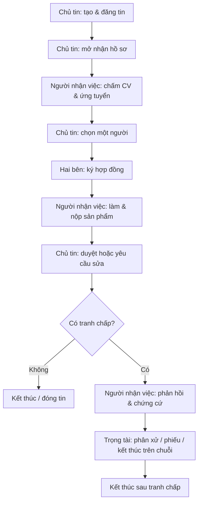
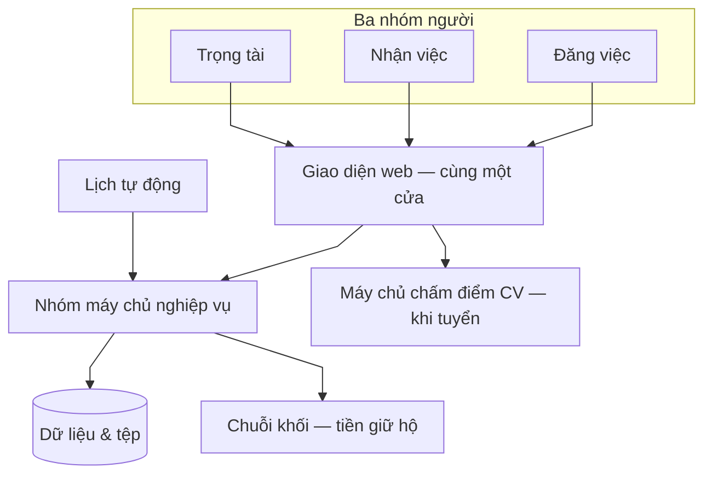
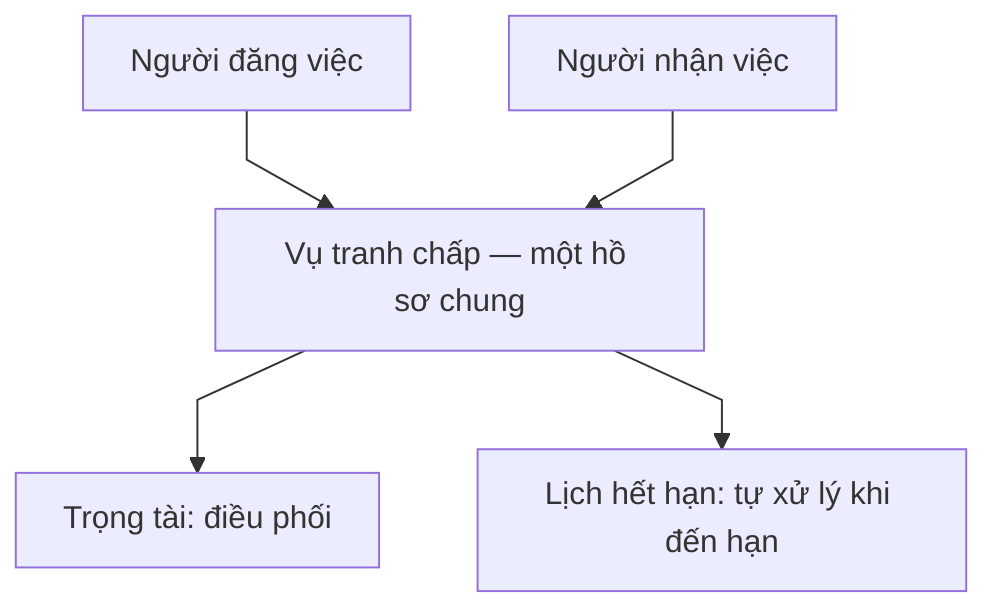

# Luồng tổng quan nền tảng

Tóm lược **tác nhân** (chủ tin · người nhận việc · trọng tài), **hạ tầng** (front-end, **máy chủ nghiệp vụ**, **microservice chấm CV**, **chuỗi khối**, **bộ lập lịch**) và **vòng đời tin tuyển → hợp đồng → bàn giao → tranh chấp**. Thuật ngữ thống nhất: [kiến trúc — bảng thuật ngữ](architecture.md).

---

## 1. Bốn nhóm người, máy, và phần nền tảng

| Nhóm / phần | Việc chính | Chi tiết |
| ---- | ---------- | -------- |
| **Người đăng việc** | Đăng tin, **chấm điểm CV ứng viên**, chọn người, duyệt bài, tranh chấp nếu cần | [poster.md](poster.md) |
| **Người nhận việc** | **Xem điểm phù hợp CV–tin**, ứng tuyển, ký hợp đồng, làm và nộp sản phẩm | [freelancer.md](freelancer.md) |
| **Trọng tài / chuyên gia** | Chỉ xử lý **tranh chấp** giữa hai bên | [admin.md](admin.md) |
| **Máy tự động** | Hết hạn, tiền giữ hộ, thông báo, lịch chạy | [system.md](system.md) |
| **Chấm điểm CV (AI)** | Giai đoạn tuyển: **inference** so khớp CV–**job text** trên màn ứng tuyển / bảng ứng viên (API tách **`scan_chamdiemCV`**) | [cv-ai-scoring.md](cv-ai-scoring.md) |
| **Điểm uy tín** | UT/KUT: **ghi trên chuỗi** trong hợp đồng uy tín ([blockchain.md](blockchain.md) mục 4); CSDL có thể giữ **bản sao đọc (mirror)** cần **đối soát**; vai & sự kiện: [poster](poster.md) · [freelancer](freelancer.md) · [admin](admin.md) · [system](system.md) mục 4 |
| **Chuỗi khối** | **Escrow**, tranh chấp, **cập nhật UT/KUT**; đối soát với **mã giao dịch** | [blockchain.md](blockchain.md) |

**Kiến trúc khối:** [architecture.md](architecture.md)

**Cách đọc bảng:** **Chấm điểm CV** nằm trong luồng tuyển. **Điểm uy tín** được mô tả theo từng vai trong [poster](poster.md), [freelancer](freelancer.md), [admin](admin.md), [system](system.md) — không tách một file “uy tín” riêng. **Máy tự động** chạy nền (hạn, chuỗi khối, thông báo, cập nhật điểm khi có giao dịch — [system.md](system.md) mục 4). Cột “Chi tiết” trỏ tới file mô tả sâu.

---

## 2. Sơ đồ: Luồng đời một công việc

**Đường chính (nét liền):** một bước xong mới tới bước kế; **chủ tin** và **người nhận việc** làm xen kẽ theo nhãn trong ô.

**Chạy nền (lịch hết hạn — không vẽ nét đứt chéo trên luồng chính):** mục [Hệ thống tự động](system.md) quét **nhận hồ sơ, ký, nộp, duyệt, chứng cứ, phiếu**; khi quá hạn thì cập nhật trạng thái / tiền / giữ hộ theo luật.

**Các bước luồng nghiệp vụ**

1. **Người đăng việc** tạo tin và mở nhận hồ sơ.  
2. **Người nhận việc** xem **điểm / rank** CV–tin (API chấm điểm), rồi **gửi đơn**; **chủ tin** có thể chấm **theo từng dòng** hoặc batch trên **bảng ứng viên** trước khi chọn người.  
3. **Người đăng việc** chọn một người trong danh sách.  
4. **Hai bên ký hợp đồng** → công việc chuyển sang đang làm.  
5. **Người nhận việc** nộp sản phẩm; **người đăng việc** duyệt hoặc yêu cầu sửa.  
6. Nếu **không tranh chấp:** kết thúc theo luồng hoàn thành hoặc đóng tin.  
7. Nếu **có tranh chấp:** **người nhận việc** phản hồi; **trọng tài** xử lý; **lịch hết hạn** chạy song song và có thể tự chia tiền / đóng vụ (xem [system.md](system.md)).

---

## 3. Sơ đồ: Ai tương tác với hệ thống

**Các bước luồng nghiệp vụ**

1. **Đăng việc / nhận việc / trọng tài** đều dùng **giao diện web** → gọi **máy chủ nghiệp vụ** cho tài khoản, tin, hồ sơ, ký quỹ.  
2. Trong **giai đoạn nhận hồ sơ**, front-end gọi **API microservice chấm điểm** (base URL theo **env**) cho **suy luận**; **đơn & CV canonical** vẫn qua **máy chủ nghiệp vụ**.  
3. Máy chủ lưu **dữ liệu** và xử lý **tiền giữ hộ** qua **chuỗi khối** khi có giao dịch.  
4. **Lịch tự động** chạy nền: đồng bộ hạn, trạng thái, giao dịch với chuỗi.

---

## 4. Tranh chấp (chỗ ba bên gặp nhau)

**Các bước luồng nghiệp vụ**

1. **Người đăng việc** và **người nhận việc** cùng tham gia một **vụ tranh chấp** (khiếu nại / bất đồng sau khi làm việc).  
2. **Trọng tài** vào vai trò trung gian: điều phối phản hồi, phân xử hoặc bỏ phiếu theo quy trình.  
3. **Máy** vẫn chạy song song: nhắc hạn, tự áp quy tắc khi quá hạn nộp chứng cứ hoặc quá hạn bỏ phiếu.

---

