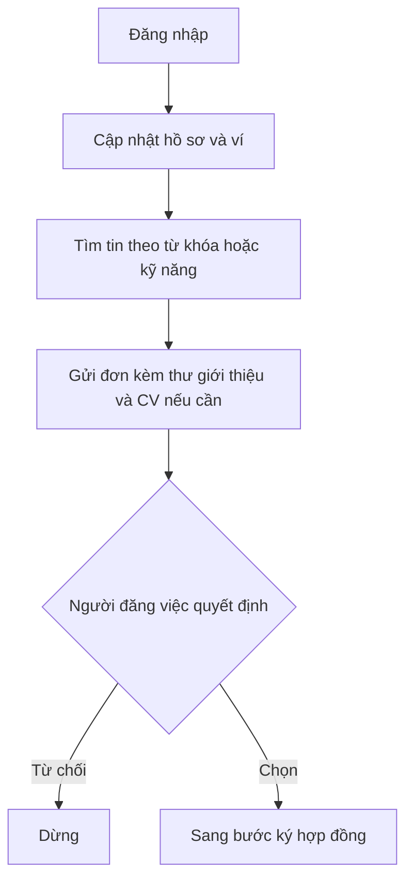
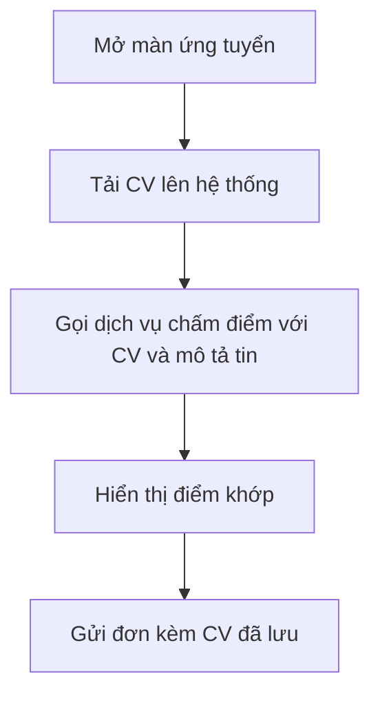
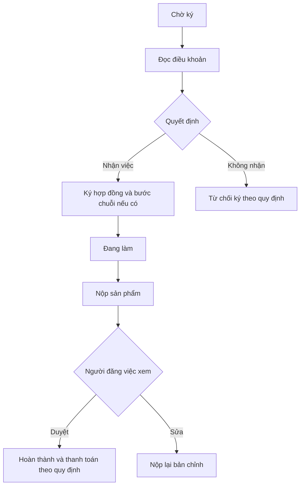
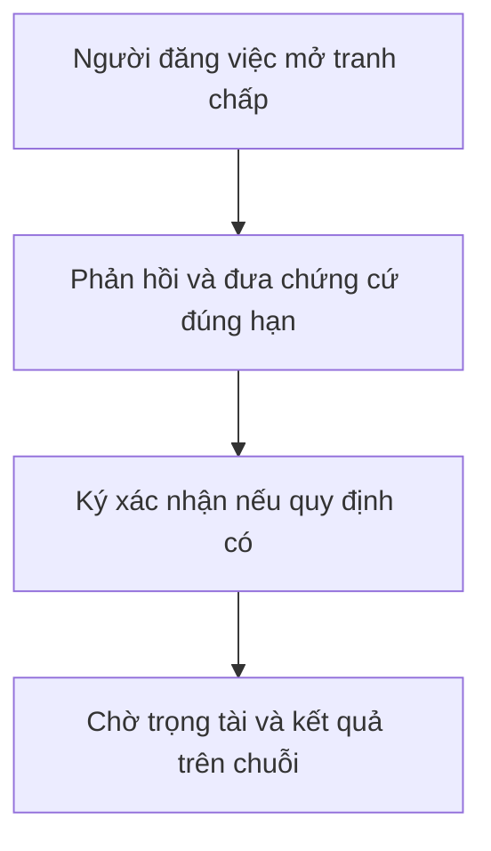

# Người làm tự do

Vai trò **người làm tự do**: tìm tin, **xem điểm khớp CV** trước khi nộp đơn nếu dùng, **ứng tuyển**, **ký hợp đồng**, **làm và nộp bài**, **chờ duyệt** hoặc **tham gia tranh chấp** đúng thời hạn.

## Tóm tắt trạng thái

Tin mở → ứng tuyển → được chọn → chờ ký → ký xong → đang làm → đã nộp → duyệt hoặc sửa → hoàn thành hoặc tranh chấp.

---

## Tìm việc và ứng tuyển

1. Chuẩn bị hồ sơ và ví.  
2. Tìm và chọn tin.  
3. Gửi đơn.  
4. Chờ **người đăng việc** chấp nhận hoặc từ chối.

---

## Chấm điểm CV lúc ứng tuyển

Chi tiết kỹ thuật: [cv-ai-scoring](cv-ai-scoring.md).

---

## Hợp đồng và thực hiện

---

## Tranh chấp và rút lui

Rút khỏi việc khi được phép: gửi đơn xin rút và lý do, làm bước ký kèm nếu có.

1. Nhận thông báo tranh chấp, phản hồi trong hạn.  
2. Theo các bước ký trên chuỗi nếu cần.  
3. Chờ **trọng tài chuyên môn** và **hệ thống** xử lý hết hạn khi áp dụng.  

Chi tiết: [trọng tài](trong-tai.md), [hệ thống](system.md).

---

## Điểm uy tín phía người làm tự do

Điểm hiển thị trên hồ sơ và nơi **người đăng việc** xem ứng viên. Quy tắc trong điều khoản ứng dụng và phần điểm uy tín trong [chuỗi khối](blockchain.md).

| Tình huống | Tin cậy | Bất tin cậy |
| --- | --- | --- |
| Hoàn thành đúng điều khoản | +10 | — |
| Thắng tranh chấp | +5 | — |
| Thua tranh chấp | −10 | +20 |
| Quá hạn nộp bài | −5 | +10 |
| Quá hạn ký theo điều khoản | −5 | +10 |
| Rút khỏi việc khi có phạt theo điều khoản | −5 | +10 |

Phía **người đăng việc**: [poster](poster.md).

---

**Tiện ích:** việc đã lưu, việc đang làm, tin nhắn với người đăng việc.
