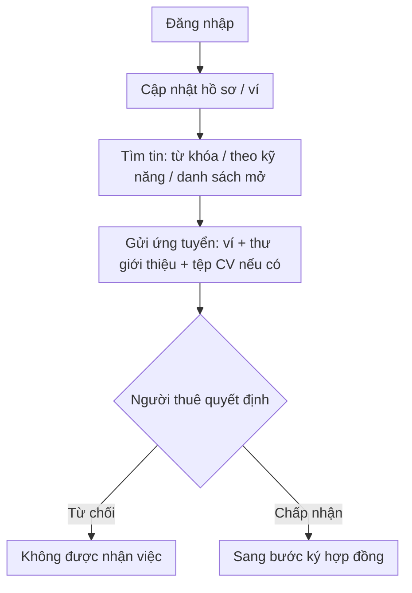
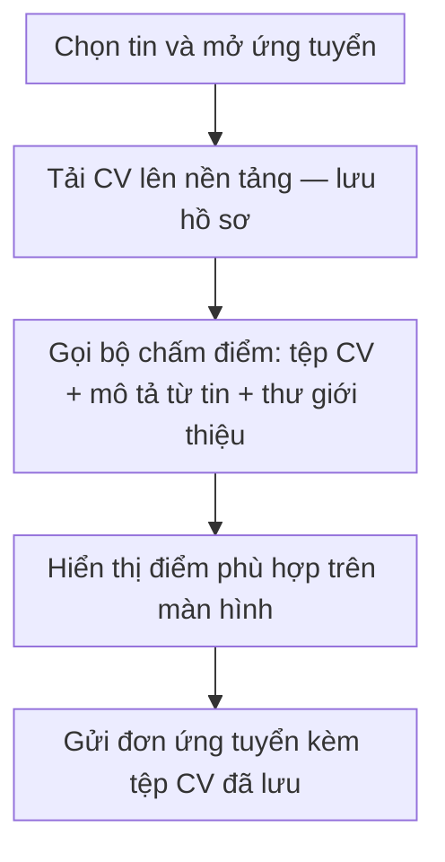
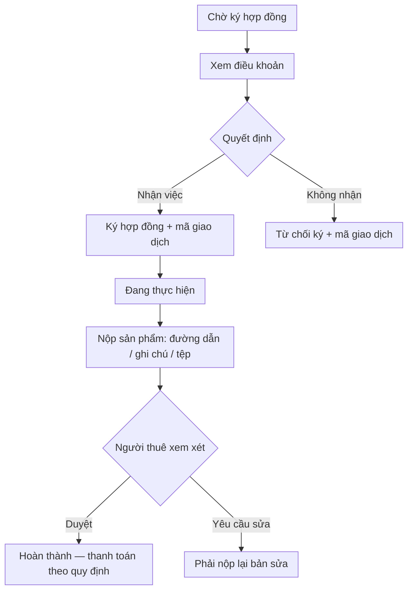
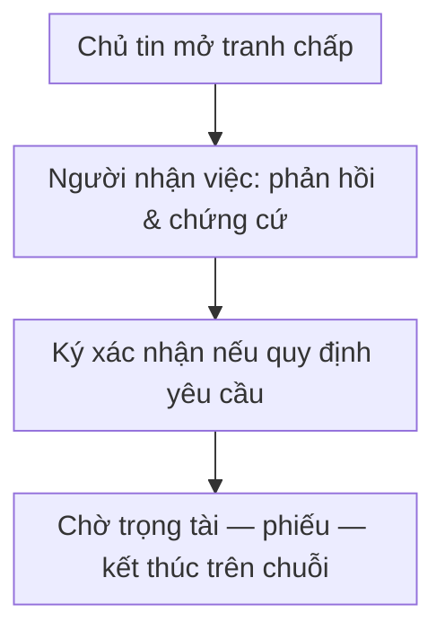
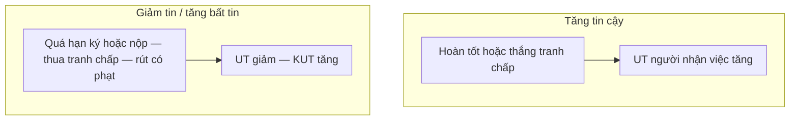

# Người nhận việc

**Vấn đề:** Người tìm việc cần **thấy rõ tin phù hợp**, **nộp hồ sơ có kiểm soát**, **được trả công xứng đáng** sau khi làm xong, và nếu bị khiếu nại oan phải **phản hồi có hạn**; nếu không, dễ **chọn nhầm tin**, **thiệt tiền**, hoặc **mất điểm uy tín** vì hiểu sai thứ tự bước.

**Cách xử lý:** Vai **người nhận việc** theo lộ trình **tìm tin → (chấm CV trước khi nộp nếu cần) → ứng tuyển → được chọn → ký → làm và nộp bài → chờ duyệt / sửa → hoàn thành hoặc tham gia tranh chấp**; chi tiết trạng thái và sơ đồ dưới đây.

## Trạng thái công việc (tóm tắt)

Tin **đang mở** → ứng tuyển → được chọn → **chờ ký** → ký xong → **đang làm** → nộp bài → chờ duyệt hoặc sửa → **hoàn thành** hoặc **tranh chấp**.

---

## Tìm việc và ứng tuyển

**Các bước luồng nghiệp vụ**

1. Đăng nhập và (khuyến nghị) cập nhật **hồ sơ**, **ví** để đủ điều kiện ứng tuyển.  
2. Tìm tin: lọc theo từ khóa, kỹ năng hoặc xem danh sách tin đang mở.  
3. Gửi **đơn ứng tuyển** kèm ví / thư giới thiệu / CV nếu tin yêu cầu.  
4. Chờ người thuê: **từ chối** thì dừng; **chấp nhận** thì chuyển sang bước ký hợp đồng.

---

## Chấm điểm CV khi ứng tuyển

**Các bước luồng nghiệp vụ**

1. Trên **hộp thoại ứng tuyển**, tải CV để **lưu vào hệ thống** (bắt buộc cho đơn có đính kèm).  
2. Bấm **đánh giá CV** để **bộ chấm điểm** trả về điểm và mức khớp với tin — **cùng luồng** xem việc trước khi nộp.  
3. Điều chỉnh thư giới thiệu hoặc CV nếu cần, rồi **gửi đơn** qua máy chủ nền tảng.  

Chi tiết: [luồng chấm điểm CV](cv-ai-scoring.md).

---

## Hợp đồng và thực hiện

**Các bước luồng nghiệp vụ**

1. Khi tin ở trạng thái **chờ ký**, người nhận việc đọc **điều khoản**.  
2. **Đồng ý** → ký hợp đồng (và giao dịch trên chuỗi nếu có); **không đồng ý** → từ chối ký theo quy trình.  
3. Khi đã **đang làm**, thực hiện công việc và **nộp sản phẩm** đúng hình thức quy định.  
4. Người thuê **duyệt** → kết thúc tốt đẹp / nhận thanh toán theo quy định; **yêu cầu sửa** → nộp lại bản chỉnh; lặp cho đến khi đạt hoặc phát sinh tranh chấp.

---

## Tranh chấp và rút lui

*(Rút khỏi việc khi được phép: luồng riêng — **xin rút**, lý do, ký kèm nếu có — theo điều khoản.)*

**Các bước luồng nghiệp vụ**

1. Khi người thuê **mở tranh chấp**, người nhận việc nhận thông báo và **gửi phản hồi** kèm chứng cứ trong thời hạn.  
2. **Ký xác nhận** các bước trên chuỗi khối nếu quy định yêu cầu.  
3. Chờ **trọng tài** điều phối / bỏ phiếu / kết luận; máy có thể tự xử lý một phần khi hết hạn.  
4. **Rút khỏi công việc** (nếu được phép): gửi đơn xin rút, lý do, và thực hiện giao dịch kèm theo nếu có — áp theo điều khoản nền tảng.

---

## Điểm uy tín (phía người nhận việc)

**UT / KUT** hiển thị trên **hồ sơ**, **tin nhắn**, và **danh sách ứng viên** (chủ tin thấy điểm người nhận việc). Quy tắc trong **điều khoản trên ứng dụng**.

**Lưu ý triển khai:** Cộng trừ **được mã hóa trên chuỗi** trong hợp đồng uy tín; bảng dưới là **chuẩn nghiệp vụ** — xem [chuỗi khối, mục 4](blockchain.md).

| Tình huống (người nhận việc) | UT | KUT |
| --- | --- | --- |
| **Hoàn thành** công việc (theo điều khoản điểm uy tín) | +10 | — |
| **Thắng** tranh chấp | +5 | — |
| **Thua** tranh chấp | −10 | +20 |
| **Quá hạn nộp bài** | −5 | +10 |
| **Quá hạn ký** hợp đồng (theo điều khoản, không áp nếu từ chối ký đúng cách) | −5 | +10 |
| **Tự rút** khỏi việc trước khi nộp (theo điều khoản / màn xin rút) | −5 | +10 |

**Các bước luồng nghiệp vụ**

1. Mỗi **mốc** (ký, nộp bài, tranh chấp, rút, **máy quét** hết hạn — [system.md](system.md)) có thể kích hoạt cập nhật điểm.  
2. **Chủ tin** dùng UT/KUT khi **xem ứng viên** và quyết định chọn người.  

Điểm cho **chủ tin** (quá hạn nghiệm thu, thắng thua tranh chấp…) — xem [người đăng việc](poster.md).

---

## Tiện ích khác

- **Việc đã lưu** để xem sau.
- **Việc đang làm / thống kê** theo dõi tiến độ.
- **Tin nhắn** trao đổi với người thuê.

---

