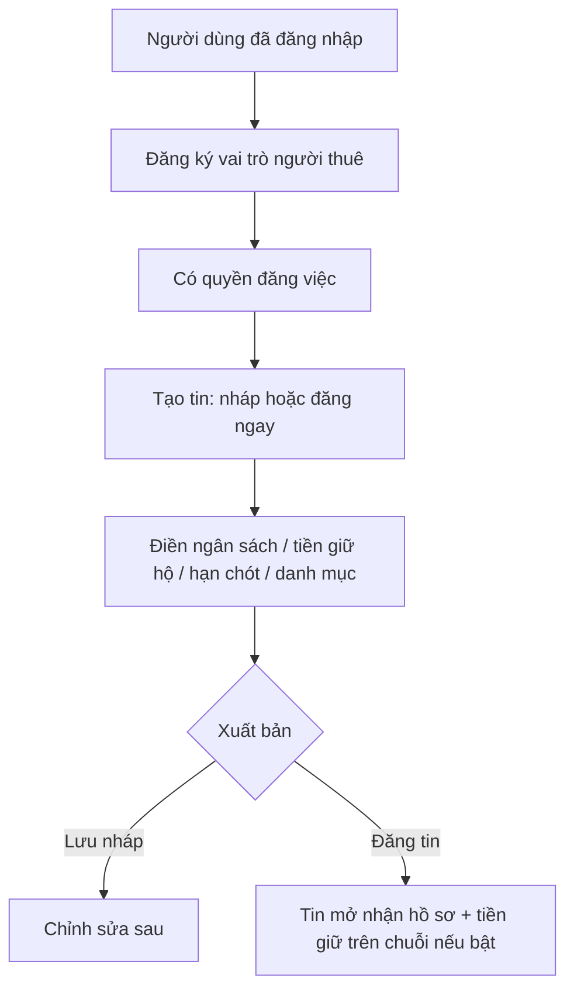
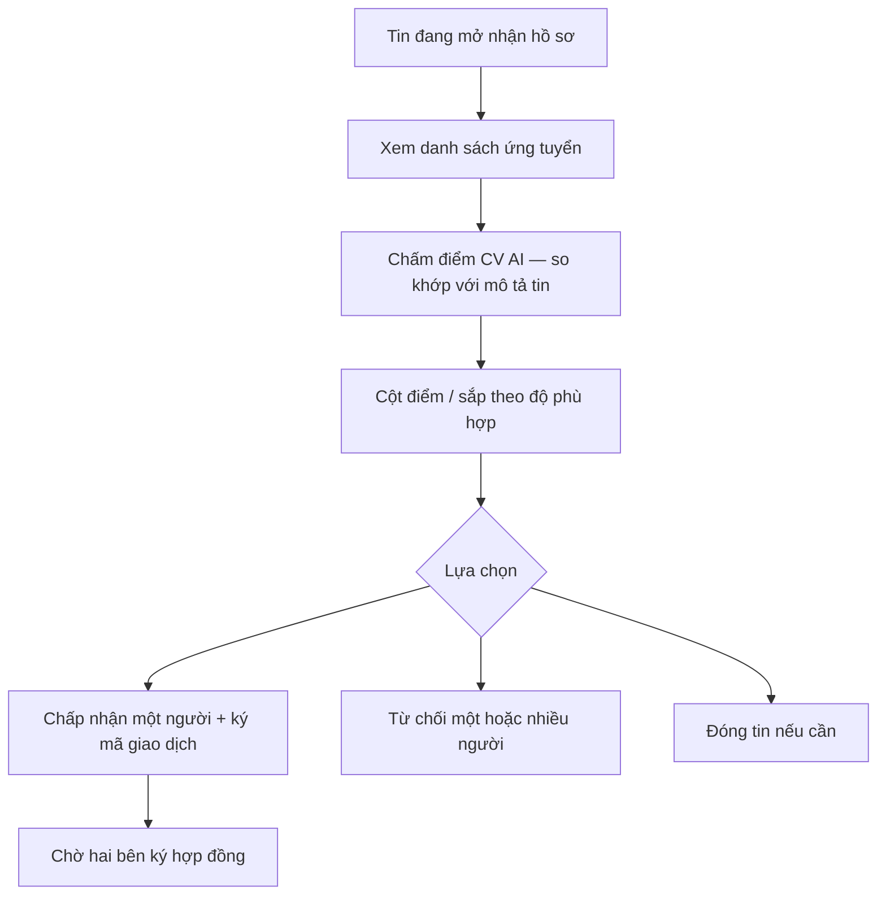
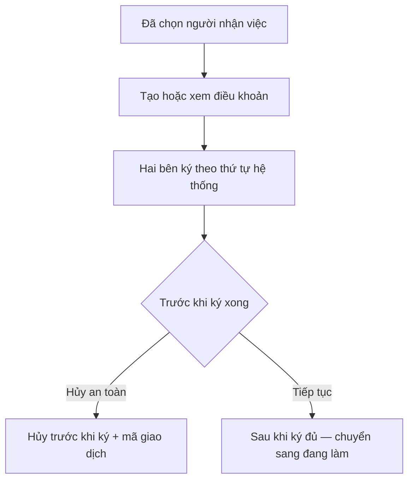
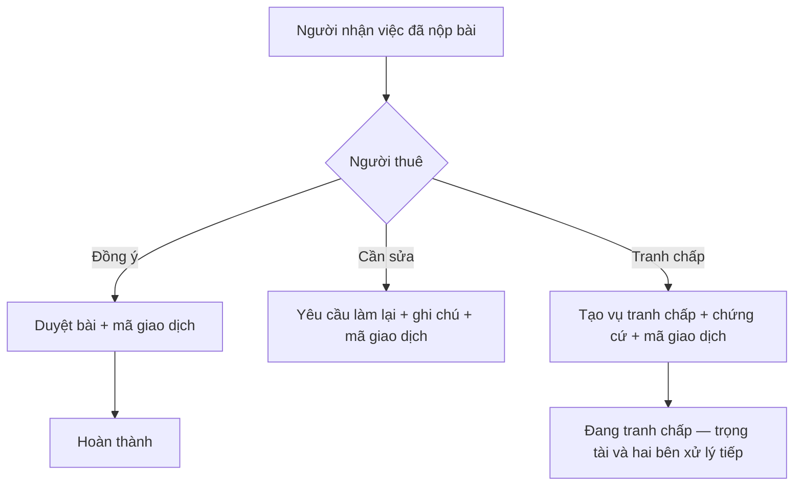
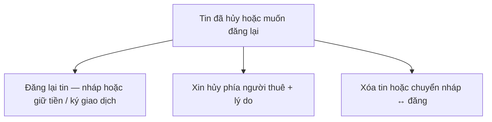
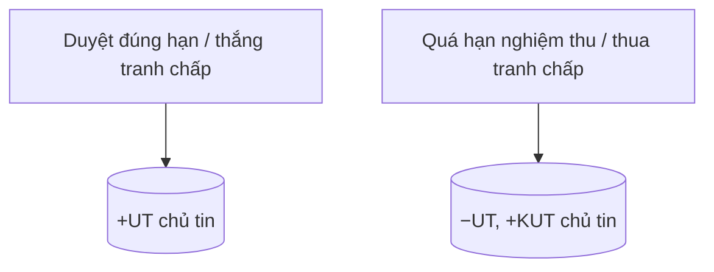

# Người đăng việc / bên thuê (vai trò `ROLE_EMPLOYER`)

**Phạm vi nghiệp vụ:** **đăng tin tuyển dụng**, **sàng lọc ứng viên** (kèm chấm điểm CV khi bật), **ký kết hợp đồng điện tử**, **nghiệm thu bàn giao**, và **khởi tạo tranh chấp** khi phát sinh bất đồng sau thực hiện.

---

## Trở thành người đăng việc và tạo tin

**Các bước luồng nghiệp vụ**

1. Người dùng đã có tài khoản; **xin thêm vai trò** người thuê nếu nền tảng yêu cầu.  
2. Tạo tin mới: có thể **lưu nháp** để chỉnh sau hoặc **đăng ngay**.  
3. Điền đủ thông tin nghiệp vụ: ngân sách, thời hạn, hạng mục, và (nếu có) **đặt cọc / tiền giữ hộ** trên chuỗi khối.  
4. Xuất bản: tin chuyển sang trạng thái **mở nhận hồ sơ**; ứng viên có thể thấy và ứng tuyển.

---

## Quản lý ứng viên và chọn người nhận việc

**Các bước luồng nghiệp vụ**

1. Tin đang **mở nhận hồ sơ**; người thuê xem danh sách người đã ứng tuyển.  
2. **Chấm điểm CV** (module nền tảng): với ứng viên có file đính kèm, hệ thống tải CV, so với **tiêu đề + mô tả + yêu cầu** của tin, hiển thị điểm và **sắp danh sách** — bước **sàng lọc** trước khi quyết định.  
3. **Từ chối** một hoặc nhiều hồ sơ hoặc **đóng tin** nếu không còn tuyển.  
4. **Chấp nhận một người** → **chờ ký hợp đồng**; thường kèm xác nhận / ký trên chuỗi (tiền giữ hộ).  
5. Ứng viên không được chọn nhận trạng thái từ chối theo quy định nền tảng.

Chi tiết kỹ thuật và API: **`cv-ai-scoring.md`**.

---

## Hợp đồng (phía người thuê)

**Các bước luồng nghiệp vụ**

1. Sau khi chọn ứng viên, hai bên xem **điều khoản hợp đồng** do hệ thống hoặc template quy định.  
2. Mỗi bên **ký theo thứ tự** quy định (ví dụ chủ tin trước hoặc người nhận việc trước).  
3. Nếu **chưa ký xong** mà chủ tin muốn dừng: dùng **hủy an toàn** (hoàn tác có kiểm soát, kèm giao dịch nếu cần).  
4. Khi **đủ chữ ký**, công việc chuyển sang **đang thực hiện** — bắt đầu đếm hạn nộp / duyệt theo tin đã thỏa thuận.

---

## Nhận sản phẩm và tranh chấp

**Các bước luồng nghiệp vụ**

1. Người nhận việc **nộp sản phẩm** (link, tệp, ghi chú theo quy định).  
2. Người thuê xem xét: **duyệt** → tiến tới hoàn thành và thanh toán / giải phóng tiền giữ hộ; **yêu cầu sửa** → người nhận việc phải nộp lại bản chỉnh; **mở tranh chấp** → gửi mô tả và chứng cứ, chuyển sang quy trình tranh chấp.  
3. Nếu tranh chấp: **trọng tài** điều phối / phân xử; hai bên phản hồi và ký các bước trên chuỗi nếu có.

---

## Hủy tin, đăng lại, rút lui

**Các bước luồng nghiệp vụ**

1. Tin **đã hủy** hoặc cần **đăng lại**: chủ tin chọn đăng lại (có thể lưu nháp hoặc nộp lại tiền giữ hộ / ký giao dịch tùy trạng thái).  
2. **Xin hủy phía người thuê** (rút lui có lý do) theo nút / màn hình nền tảng — áp quy tắc hoàn tiền hoặc phạt.  
3. **Xóa tin** hoặc chuyển **nháp ↔ đã đăng** khi còn trong phạm vi cho phép.

---

## Điểm uy tín (phía người đăng việc)

**Điểm tín nhiệm (UT)** và **bất tín nhiệm (KUT)** hiển thị trên **hồ sơ** và **tin tuyển** (người nhận việc xem uy tín chủ tin). Chi tiết trong **điều khoản hệ thống** (`SystemTermsDisplay`).

**Triển khai:** Trường và hàm cộng trừ đã có trong mã; có thể chưa gắn hết mọi sự kiện — bảng dưới là **chuẩn nghiệp vụ**.

| Tình huống (người thuê) | UT | KUT |
| --- | --- | --- |
| Nghiệm thu / phản hồi **đúng hạn** (theo điều khoản) | +5 | — |
| **Thắng** tranh chấp | +5 | — |
| **Thua** tranh chấp | −10 | +20 |
| **Quá hạn nghiệm thu** | −5 | +10 |

**Các bước luồng nghiệp vụ**

1. Sau **nghiệm thu**, **kết quả tranh chấp**, hoặc **máy quét hết hạn** (xem `system.md`), hệ thống có thể cập nhật UT/KUT cho chủ tin.  
2. Bạn đối tác dùng điểm làm **tín hiệu nhanh** khi chọn tin.  

Điểm cho **người nhận việc** (quá hạn ký, nộp bài, rút…) — xem **`freelancer.md`**.

---

## Ghi chú

- Một tài khoản có thể vừa **đăng việc** vừa **nhận việc** nếu được gán nhiều vai trò.
- Bước liên quan **tiền giữ hộ / hoàn tiền** phụ thuộc cấu hình chuỗi khối và trạng thái công việc; hạn tự động xem `system.md`.
