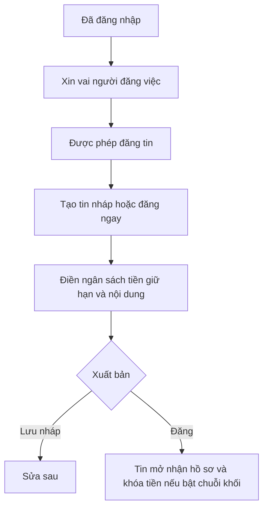
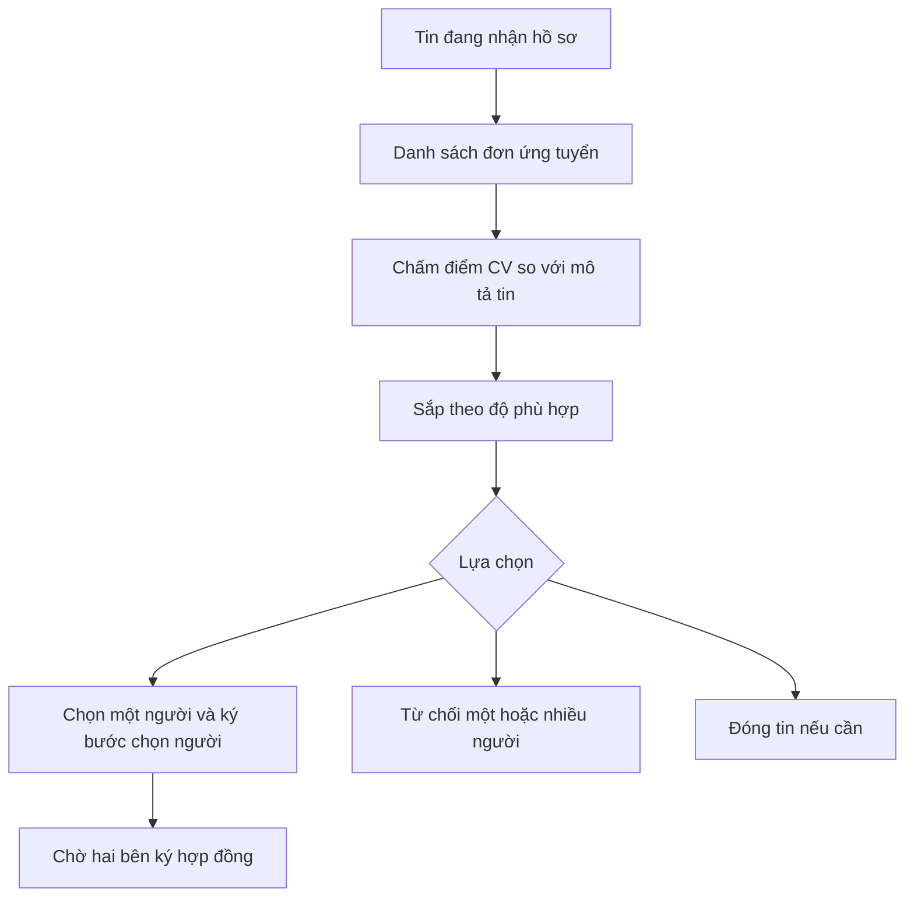
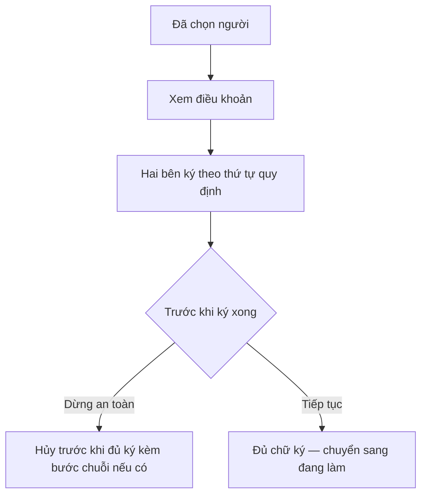
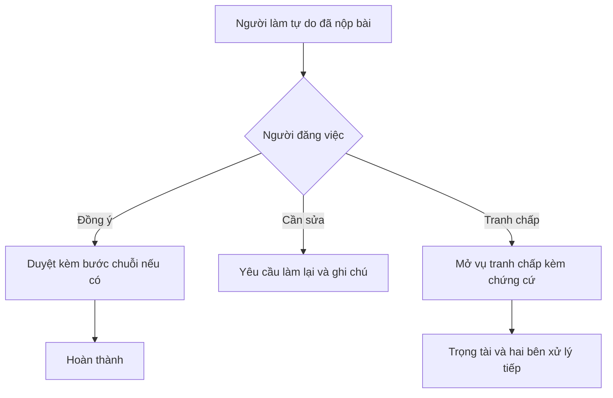
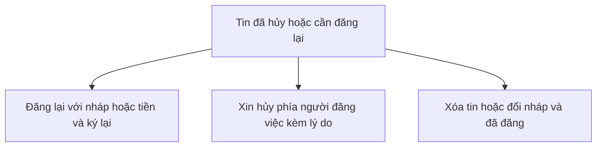

# Người đăng việc

Người đăng việc **đăng tin**, **xem ứng viên**, **chấm điểm CV** khi bật tính năng, **ký hợp đồng**, **duyệt bài**, và **mở tranh chấp** nếu sau bàn giao có bất đồng.

---

## Đăng ký vai và tạo tin

1. Có tài khoản, xin thêm vai **người đăng việc** nếu nền tảng yêu cầu.  
2. Tạo tin, có thể lưu nháp hoặc đăng ngay.  
3. Điền ngân sách, thời hạn, nội dung, và **tiền giữ trên chuỗi** nếu bật.  
4. Đăng tin: ứng viên thấy tin và có thể ứng tuyển.

---

## Ứng viên và chấm điểm CV

1. Xem danh sách người đã ứng tuyển.  
2. **Chấm điểm CV:** hệ thống lấy CV, so với tiêu đề mô tả và yêu cầu của tin, hiển thị điểm và thứ tự gợi ý.  
3. Có thể từ chối hồ sơ hoặc đóng tin.  
4. **Chọn một người** rồi chờ ký hợp đồng, thường kèm bước xác nhận trên chuỗi.  

Kỹ thuật chấm điểm: [cv-ai-scoring](cv-ai-scoring.md).

---

## Hợp đồng

1. Hai bên đọc điều khoản.  
2. Ký lần lượt theo quy định.  
3. Có thể **hủy an toàn** nếu chưa ký xong.  
4. Đủ ký: công việc chuyển sang **đang thực hiện**.

---

## Duyệt bài và tranh chấp

1. Xem bài nộp.  
2. **Duyệt** hoặc **yêu cầu sửa** hoặc **mở tranh chấp** theo quy định.  
3. Nếu tranh chấp: **trọng tài chuyên môn** điều phối; xem [trọng tài](trong-tai.md).

---

## Hủy tin và đăng lại

---

## Điểm uy tín phía người đăng việc

Điểm **tin cậy** và **bất tin cậy** hiển thị trên hồ sơ và tin. Cách cộng trừ nằm trong **điều khoản** trên ứng dụng.

| Tình huống | Tin cậy | Bất tin cậy |
| --- | --- | --- |
| Nghiệm thu đúng hạn theo điều khoản | +5 | — |
| Thắng tranh chấp | +5 | — |
| Thua tranh chấp | −10 | +20 |
| Quá hạn nghiệm thu | −5 | +10 |

Sau nghiệm thu, kết quả tranh chấp, hoặc **hệ thống** xử lý hết hạn, điểm có thể đổi.

Phía **người làm tự do** xem [freelancer](freelancer.md).

---

Một tài khoản có thể vừa đăng việc vừa làm tự do nếu được gán đủ vai. Tiền giữ và hoàn tiền phụ thuộc cấu hình chuỗi và trạng thái việc; hạn tự động xem [hệ thống](system.md).
