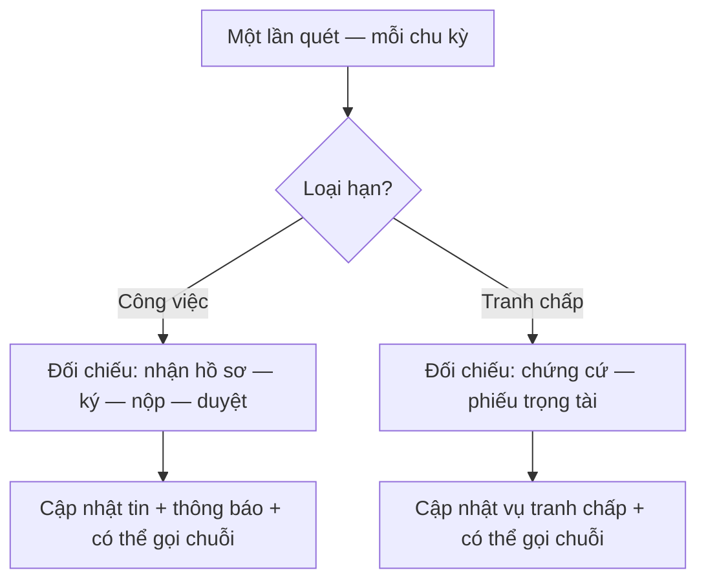
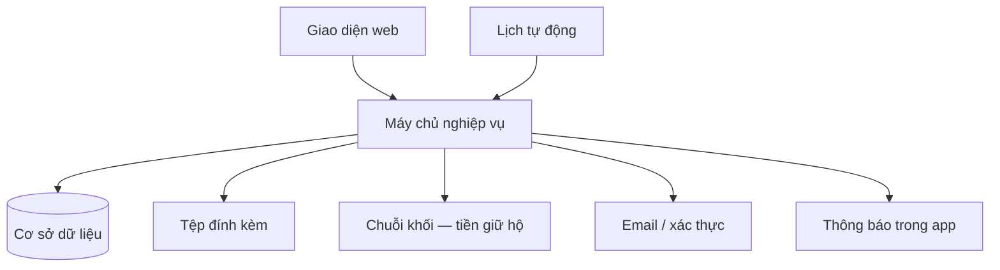
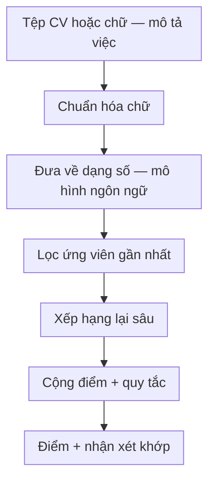
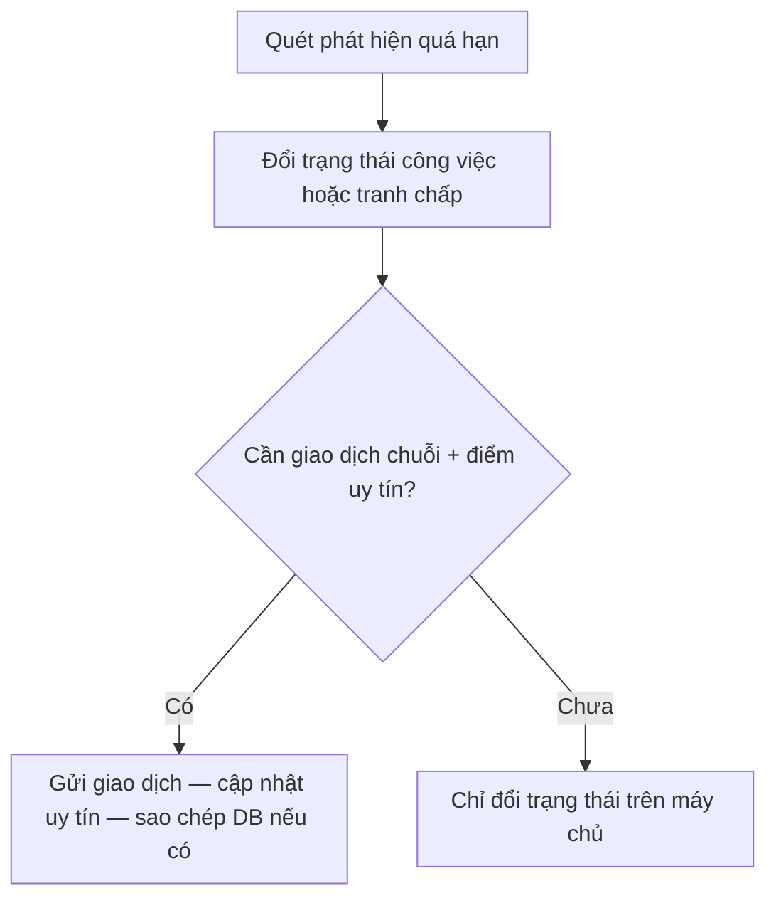

# Hệ thống tự động

**Vấn đề:** Nhiều bước trong tin tuyển và tranh chấp **gắn thời hạn**; nếu chỉ nhờ người nhớ hoặc từng người tự bấm, sẽ quá hạn không đều, tiền và trạng thái **lệch** giữa nền tảng và chuỗi khối, người dùng **không được thông báo** kịp.

**Cách xử lý:** Chạy **lịch quét** (định kỳ) để so thời gian thực với hạn **công việc** và **tranh chấp**, cập nhật trạng thái, gửi **thông báo**, và khi luật cho phép thì **gọi chuỗi khối** (hoàn tiền, hết hạn chứng cứ, v.v.). Riêng **chấm điểm CV** do người dùng mở màn hình nhưng **máy chấm** chạy ở dịch vụ riêng trong cùng sản phẩm — chi tiết thao tác: [luồng chấm điểm CV](cv-ai-scoring.md).

---

## 1. Lịch kiểm tra hạn công việc và tranh chấp

Chạy lặp (mỗi 30 giây) để trạng thái tin tuyển và vụ tranh chấp khớp với thời gian thực.

**Các bước luồng nghiệp vụ (máy quét định kỳ)**

1. Máy chủ tự động chạy theo chu kỳ (mỗi 30 giây), không cần người bấm.  
2. **Nhánh công việc:** so sánh thời gian hiện tại với hạn nhận hồ sơ, hạn ký hợp đồng, hạn nộp sản phẩm, hạn duyệt sản phẩm — nếu quá hạn thì đổi trạng thái tin / công việc cho đúng quy tắc.  
3. **Nhánh tranh chấp:** kiểm tra hạn nộp chứng cứ và hạn bỏ phiếu của trọng tài — nếu hết hạn thì áp quy tắc “tự xử lý” hoặc “hết hạn” (có thể kèm giao dịch hoàn tiền / kết thúc tranh chấp trên chuỗi).  
4. Ghi lịch sử thay đổi, gửi thông báo cho người liên quan; khi cần gọi chuỗi khối và lưu mã giao dịch.

Khi cần, máy chủ gọi **dịch vụ chuỗi khối** (hoàn tiền giữ hộ, kết thúc tranh chấp quá hạn, v.v.) rồi lưu **mã giao dịch** và lịch sử.

---

## 2. Luồng dữ liệu ẩn (người dùng không thấy trực tiếp)

**Các bước luồng nghiệp vụ**

1. Người dùng thao tác trên web → giao diện gọi máy chủ nghiệp vụ để đăng nhập, đăng tin, ứng tuyển, tải tệp.  
2. Máy chủ đọc/ghi **cơ sở dữ liệu**, lưu **tệp đính kèm**, gửi **email / mã xác thực**, phát **thông báo** trong app.  
3. Khi có **tiền giữ hộ** hoặc bước cần chuỗi khối, máy chủ (và đôi khi lịch tự động) tương tác với **chuỗi khối** thay cho người ký từng giao dịch nhỏ.  
4. Lịch chạy tự động can thiệp bổ sung (hết hạn) như mục 1 — người dùng chỉ thấy kết quả: trạng thái đổi, tiền hoàn, thông báo.

---

## 3. Bộ máy chấm điểm CV

**Gắn vào luồng tuyển:** khi người nhận việc mở hộp thoại ứng tuyển hoặc người đăng việc bấm chấm điểm trên bảng ứng viên, **giao diện gọi máy chủ chấm điểm** (địa chỉ và cổng theo cấu hình triển khai). Bộ chấm điểm đọc CV và mô tả việc, đưa về **dạng số**, **lọc gần đúng**, **xếp hạng lại** và **điểm** — bước **sàng lọc / gợi ý** trong cùng phiên tuyển dụng.

**Các bước luồng nghiệp vụ (bên trong bộ chấm điểm — khi giao diện gọi)**

1. Nhận chữ từ CV và mô tả việc (sau bước trích / tải lên).  
2. Chuẩn hóa chữ để so sánh công bằng.  
3. Đưa CV và việc về **dạng số** bằng mô hình ngôn ngữ.  
4. (Luồng xếp hạng nhiều người) Lọc nhanh các CV gần nghĩa với việc.  
5. Xếp hạng lại chi tiết hơn giữa từng cặp CV–việc.  
6. Cộng điểm, áp quy tắc cộng trừ (ngành nghề, v.v.) → ra điểm và nhận xét mức khớp.

**Liên kết luồng web:** [cv-ai-scoring.md](cv-ai-scoring.md).

---

## 4. Điểm uy tín (UT/KUT) và máy quét

**Máy quét hạn** (mục 1) có thể kích hoạt **giao dịch giữ tiền hộ** (hoặc nhánh tranh chấp) trên **chuỗi khối**; trong cùng gói hợp đồng, **phần lưu uy tín** được **phần giữ tiền** gọi khi xử lý **quá hạn nộp / quá hạn duyệt / kết thúc tranh chấp** — điểm **UT/KUT** cập nhật **trên chuỗi** (xem [blockchain.md](blockchain.md) mục 4). Bản ghi người dùng trên máy chủ nghiệp vụ có thể **đồng bộ** sau giao dịch tùy triển khai; máy quét không phải lịch “chỉ chấm điểm” tách khỏi luồng tiền.

**Các bước luồng nghiệp vụ**

1. **Lịch tự động** phát hiện **quá hạn** (nộp bài, nghiệm thu, chứng cứ, phiếu…).  
2. Áp logic nền tảng + có thể **gửi giao dịch chuỗi** (xem [blockchain.md](blockchain.md)).  
3. Khi hợp đồng trên chuỗi đang bật, **điểm uy tín** đi kèm **giao dịch giữ tiền hộ**; máy chủ có thể **cập nhật cơ sở dữ liệu** sau khi có mã giao dịch. Chi tiết theo vai: [poster.md](poster.md), [freelancer.md](freelancer.md), tranh chấp: [admin.md](admin.md); bảng số: [blockchain.md](blockchain.md) mục 4.

---
