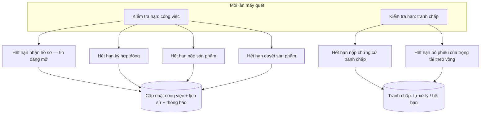
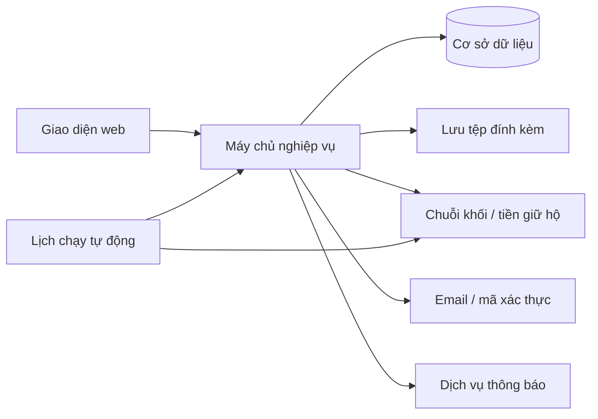
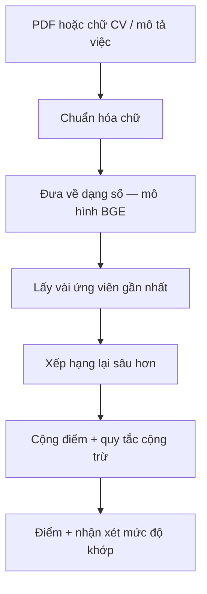
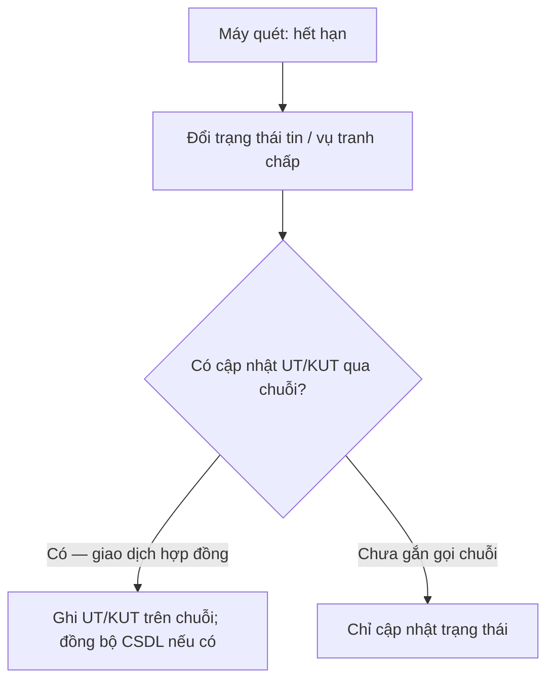

# Hệ thống tự động

**Phạm vi:** Tác vụ **không đồng bộ** theo từng cú bấm người — **bộ lập lịch** quét hạn tin / tranh chấp, **tương tác chuỗi khối**, **thông báo**. **Chấm điểm CV** là **suy luận theo yêu cầu** khi user mở màn; engine nằm ở **microservice** `scan_chamdiemCV` (FastAPI) — mục 3 và [cv-ai-scoring](cv-ai-scoring.md).

---

## 1. Lịch kiểm tra hạn công việc và tranh chấp

Chạy lặp (mỗi 30 giây) để trạng thái tin tuyển và vụ tranh chấp khớp với thời gian thực.

**Các bước luồng nghiệp vụ (máy quét định kỳ)**

1. Máy chủ tự động chạy theo chu kỳ (mỗi 30 giây), không cần người bấm.  
2. **Nhánh công việc:** so sánh thời gian hiện tại với hạn nhận hồ sơ, hạn ký hợp đồng, hạn nộp sản phẩm, hạn duyệt sản phẩm — nếu quá hạn thì đổi trạng thái tin / công việc cho đúng quy tắc.  
3. **Nhánh tranh chấp:** kiểm tra hạn nộp chứng cứ và hạn bỏ phiếu của trọng tài — nếu hết hạn thì áp quy tắc “tự xử lý” hoặc “hết hạn” (có thể kèm giao dịch hoàn tiền / kết thúc tranh chấp trên chuỗi).  
4. Ghi lịch sử thay đổi, gửi thông báo cho người liên quan; khi cần gọi chuỗi khối và lưu mã giao dịch.

Khi cần, máy chủ gọi **dịch vụ chuỗi khối** (hoàn tiền giữ hộ, ký kết thúc tranh chấp quá hạn, v.v.) rồi lưu **mã giao dịch** và lịch sử.

---

## 2. Luồng dữ liệu ẩn (người dùng không thấy trực tiếp)

**Các bước luồng nghiệp vụ**

1. Người dùng thao tác trên web → giao diện gọi máy chủ nghiệp vụ để đăng nhập, đăng tin, ứng tuyển, tải tệp.  
2. Máy chủ đọc/ghi **cơ sở dữ liệu**, lưu **tệp đính kèm**, gửi **email / mã xác thực**, phát **thông báo** trong app.  
3. Khi có **tiền giữ hộ** hoặc bước cần **chuỗi khối**, máy chủ (và đôi khi **bộ lập lịch**) tương tác với **tầng sổ cái phân tán** thay cho người dùng ký từng giao dịch vi mô.  
4. Lịch chạy tự động can thiệp bổ sung (hết hạn) như mục 1 — người dùng chỉ thấy kết quả: trạng thái đổi, tiền hoàn, thông báo.

---

## 3. Bộ máy chấm điểm CV (`scan_chamdiemCV`)

**Gắn vào luồng tuyển:** khi người nhận việc mở hộp thoại ứng tuyển hoặc người đăng việc bấm chấm điểm trên bảng ứng viên, **giao diện gọi máy chủ này** (FastAPI, cổng cấu hình ví dụ 8081). Nó đọc CV và mô tả việc, đưa ra **vector**, **lọc gần đúng**, **xếp hạng lại** và **điểm số** — bước **sàng lọc / gợi ý** trong cùng phiên tuyển dụng.

**Các bước luồng nghiệp vụ (bên trong bộ chấm điểm — khi giao diện gọi)**

1. Nhận chữ từ CV và mô tả việc (sau bước trích / tải lên).  
2. Chuẩn hóa chữ để so sánh công bằng.  
3. Đưa CV và việc về dạng số (vector) bằng mô hình ngôn ngữ.  
4. (Luồng xếp hạng nhiều người) Lọc nhanh các CV gần nghĩa với việc.  
5. Xếp hạng lại chi tiết hơn giữa từng cặp CV–việc.  
6. Cộng điểm, áp quy tắc cộng trừ (ngành nghề, v.v.) → ra điểm và nhận xét mức khớp.

**Liên kết luồng web và API:** tải CV, tạo mô tả việc, phân tích một cặp, xếp hạng nhiều CV — **`cv-ai-scoring.md`**.

---

## 4. Điểm uy tín (UT/KUT) và máy quét

**Máy quét hạn** (mục 1) có thể kích hoạt **giao dịch ký quỹ** hoặc nhánh **tranh chấp** trên **chuỗi khối Aptos**. Khi xử lý **quá hạn nộp bài / quá hạn duyệt / kết thúc tranh chấp**, **hợp đồng thông minh** có thể **cập nhật đồng thời** **UT/KUT trên chuỗi** theo luật đã triển khai — chi tiết điều kiện và bảng tham số: [blockchain.md](blockchain.md) mục 4. **Cơ sở dữ liệu nghiệp vụ** có thể **đồng bộ bản sao điểm** sau giao dịch tùy chính sách triển khai. Bộ quét **không** chỉ phục vụ chấm CV mà gắn với **luồng tiền và uy tín**.

**Các bước luồng nghiệp vụ**

1. **Bộ lập lịch** phát hiện **quá hạn** (nộp bài nghiệm thu, chứng cứ tranh chấp, phiếu trọng tài…).  
2. Áp **quy tắc nghiệp vụ** và có thể **phát giao dịch trên chuỗi** (xem [blockchain.md](blockchain.md)).  
3. Khi **tích hợp chuỗi khối** đang bật, **cập nhật điểm uy tín** **đi kèm** giao dịch ký quỹ hợp lệ; sau khi có **mã băm giao dịch**, backend có thể **đồng bộ CSDL**. Chi tiết theo vai: [poster.md](poster.md), [freelancer.md](freelancer.md), tranh chấp: [admin.md](admin.md); bảng tham số: [blockchain.md](blockchain.md) mục 4.

---
