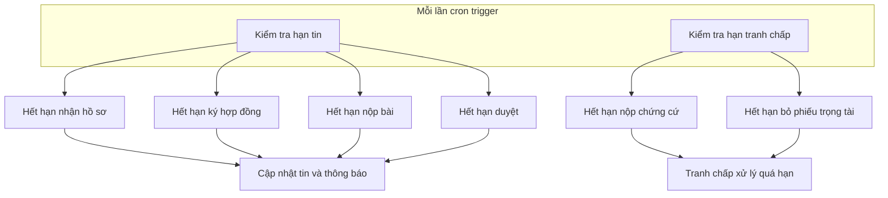
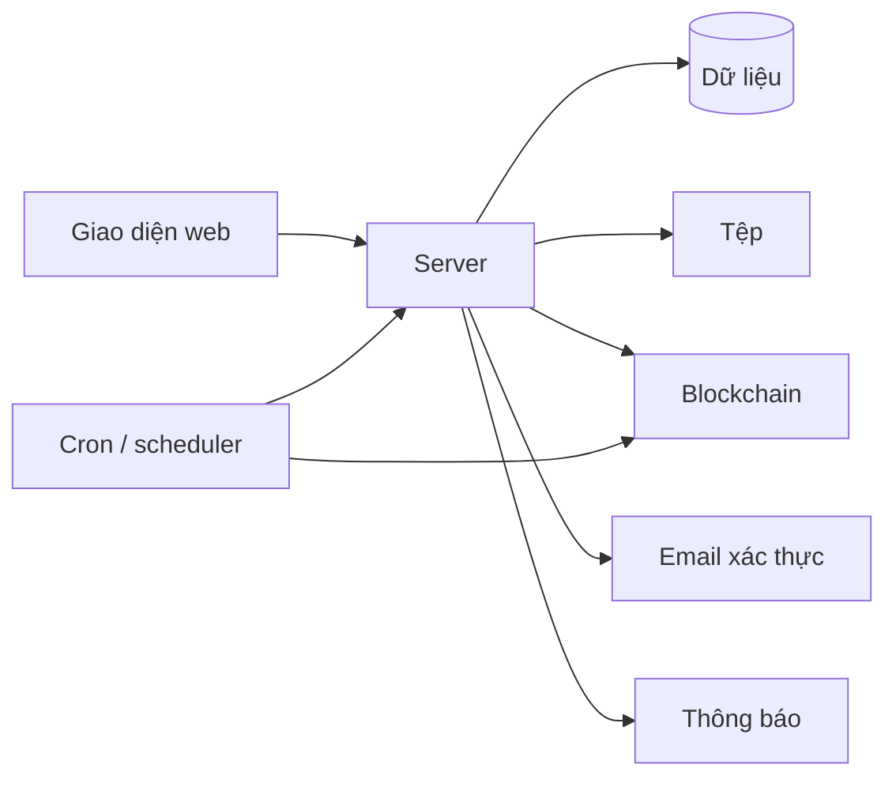
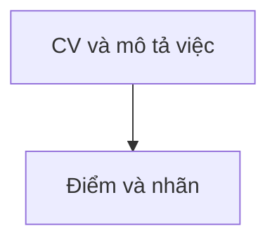
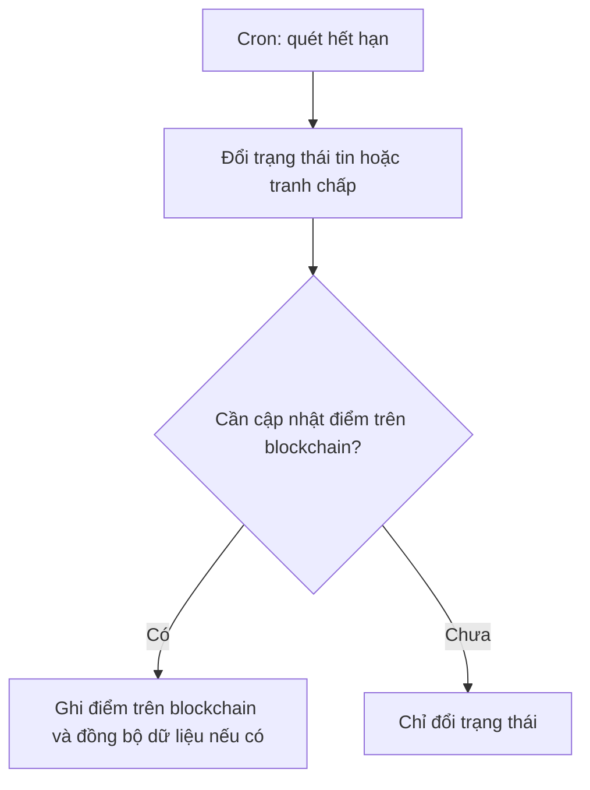

# Hệ thống

Phần **máy chạy nền** không cần người bấm từng bước: các [**cron jobs**](thuat-ngu.md#cron) quét hạn tin và tranh chấp, **gửi thông báo**, gọi [**blockchain**](thuat-ngu.md#blockchain) (gửi [**giao dịch**](thuat-ngu.md#transaction)) khi đến điều kiện. Tần suất do **cron expression** (hoặc scheduler tương đương, ví dụ Spring `@Scheduled(cron = "...")` — xem [cron](thuat-ngu.md#cron)) cấu hình ở tầng triển khai, không cố định trong tài liệu luồng. **Chấm điểm CV** là tính năng gọi khi người dùng mở màn hình; kỹ thuật nằm trong [cv-ai-scoring](cv-ai-scoring.md). Thuật ngữ: [bảng thuật ngữ](thuat-ngu.md).

---

## Bảng nhiệm vụ và phạm vi

| Nhiệm vụ | Phạm vi |
| -------- | ------- |
| **Cron jobs** quét **hạn** tin (nhận hồ sơ, ký, nộp, duyệt, …) | Toàn bộ **bản ghi tin / việc** có **mốc thời gian** trong cơ sở dữ liệu theo quy tắc đã triển khai; cập nhật trạng thái và **thông báo** tương ứng. |
| **Cron** quét **hạn tranh chấp** (chứng cứ, phiếu trọng tài) | Các **vụ** đang mở có **deadline** vòng; có thể **gán lại trọng tài** hoặc chốt bước khi đủ điều kiện. |
| **Gửi thông báo** (email / in-app, …) | Theo **sự kiện** hệ thống phát sinh (hết hạn, đổi trạng thái, gán trọng tài, …); không soạn nội dung tranh luận thay người. |
| **Gọi blockchain** (giao dịch qua ví vận hành khi cấu hình) | Khi **điều kiện nghiệp vụ** ứng với hợp đồng on-chain (giải ngân, hoàn, cập nhật điểm theo luật, …); **không** quyết định “ai đúng” trong tranh chấp — đó là luồng **trọng tài** + quy tắc. |
| **Gán ngẫu nhiên trọng tài** theo vòng | Chỉ trong **khuôn khổ tranh chấp** và **danh sách trọng tài** hợp lệ do nền tảng định nghĩa. |
| **Đồng bộ** bản sao điểm / trạng thái hiển thị | **Database** khớp với **giao dịch blockchain** đã xác thực khi có; chuẩn tiền/điểm theo tài liệu [blockchain](blockchain.md). |

**Ngoài phạm vi:** thay **người đăng việc** chấm CV chọn người, thay **trọng tài** đọc chứng cứ thay người, hay **tư vấn nội dung** hợp đồng — đều là việc của **người** trên giao diện.

---

## Quét hạn tin và tranh chấp

Mỗi lần một **cron job** chạy (theo **cron expression** đã cấu hình), job nền sẽ đối chiếu **thời gian hiện tại** với **hạn** trên tin và trong vụ tranh chấp.

1. So sánh thời gian hiện tại với các hạn trên tin.  
2. So với hạn trong vụ tranh chấp.  
3. Nếu quá hạn: đổi trạng thái đúng quy tắc, có thể **gửi giao dịch lên blockchain**, lưu **mã giao dịch**, gửi thông báo.

---

## Lớp phía sau giao diện

1. Người dùng thao tác trên web, **server** xử lý đăng nhập tin ứng tuyển và file.  
2. Server đọc ghi dữ liệu, gửi email và thông báo.  
3. Khi có tiền giữ hoặc bước cần **blockchain**, **API** (từ request) hoặc **cron job** thực hiện giao dịch thay cho thao tác vi mô từng lần.  
4. Người dùng thấy kết quả trạng thái đổi tiền chuyển thông báo.

---

## Chấm điểm CV trong luồng tuyển

Khi **người làm tự do** mở màn ứng tuyển hoặc **người đăng việc** chấm trên bảng ứng viên, giao diện gọi **bộ chấm điểm CV**. Bộ chấm điểm đọc CV và mô tả việc rồi trả về điểm theo quy trình trong [cv-ai-scoring](cv-ai-scoring.md).

---

## Điểm uy tín và quét hạn

Khi **cron job** quét phát hiện **quá hạn nộp**, **quá hạn duyệt**, hoặc **kết thúc tranh chấp**, **hợp đồng trên blockchain** có thể **đồng thời cập nhật điểm tin cậy và bất tin cậy** theo luật đã công bố. Bảng số liệu và điều kiện: [blockchain](blockchain.md), mục về điểm uy tín.

**Hệ thống** có thể đồng bộ bản điểm trong cơ sở dữ liệu sau khi có giao dịch hợp lệ.

Chi tiết theo vai: [người đăng việc](poster.md), [người làm tự do](freelancer.md), [trọng tài](trong-tai.md).

