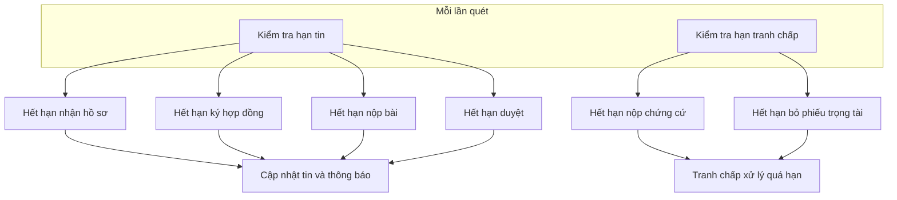
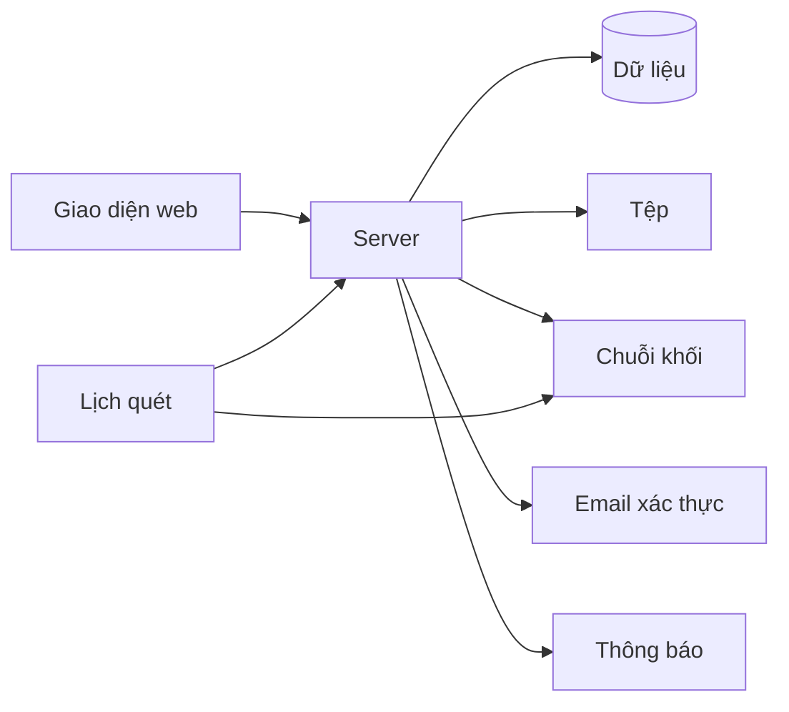
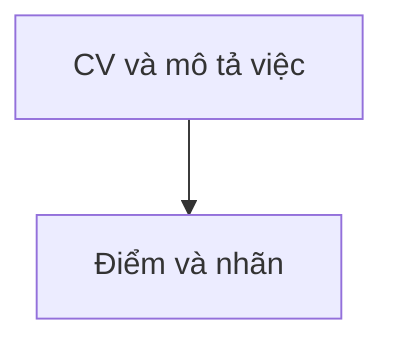
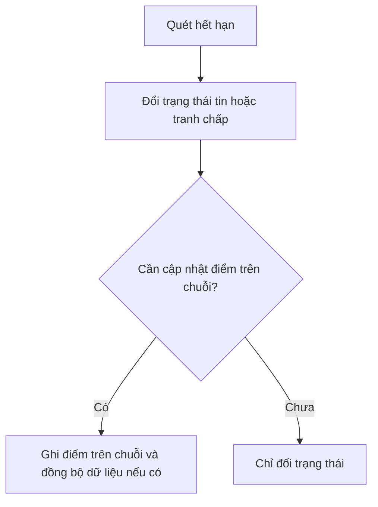

# Hệ thống

Phần **máy chạy nền** không cần người bấm từng bước: **quét hạn** tin và tranh chấp, **gửi thông báo**, **gọi chuỗi khối** khi đến điều kiện. **Chấm điểm CV** là tính năng gọi khi người dùng mở màn hình; kỹ thuật nằm trong [cv-ai-scoring](cv-ai-scoring.md).

---

## Quét hạn tin và tranh chấp

Máy chạy lặp theo chu kỳ cố định để so thời gian thực với hạn trong tin và trong vụ tranh chấp.

1. So sánh thời gian hiện tại với các hạn trên tin.  
2. So với hạn trong vụ tranh chấp.  
3. Nếu quá hạn: đổi trạng thái đúng quy tắc, có thể **gửi giao dịch lên chuỗi**, lưu **mã giao dịch**, gửi thông báo.

---

## Lớp phía sau giao diện

1. Người dùng thao tác trên web, **server** xử lý đăng nhập tin ứng tuyển và file.  
2. Server đọc ghi dữ liệu, gửi email và thông báo.  
3. Khi có tiền giữ hoặc bước cần **chuỗi khối**, server hoặc **lịch quét** thực hiện giao dịch thay cho thao tác vi mô từng lần.  
4. Người dùng thấy kết quả trạng thái đổi tiền chuyển thông báo.

---

## Chấm điểm CV trong luồng tuyển

Khi **người làm tự do** mở ứng tuyển hoặc **người đăng việc** chấm trên bảng ứng viên, giao diện gọi **dịch vụ chấm điểm** tách riêng. Dịch vụ đọc CV và mô tả việc rồi trả điểm theo pipeline trong [cv-ai-scoring](cv-ai-scoring.md).

---

## Điểm uy tín và quét hạn

Khi quét phát hiện **quá hạn nộp**, **quá hạn duyệt**, hoặc **kết thúc tranh chấp**, **hợp đồng trên chuỗi** có thể **đồng thời cập nhật điểm tin cậy và bất tin cậy** theo luật đã công bố. Bảng số liệu và điều kiện: [chuỗi khối](blockchain.md), mục về điểm uy tín.

**Hệ thống** có thể đồng bộ bản điểm trong cơ sở dữ liệu sau khi có giao dịch hợp lệ.

Chi tiết theo vai: [người đăng việc](poster.md), [người làm tự do](freelancer.md), [trọng tài](trong-tai.md).

