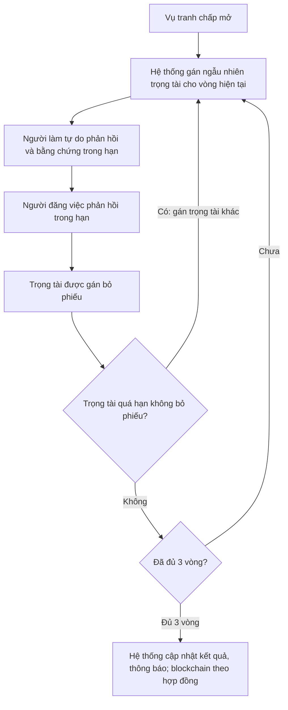
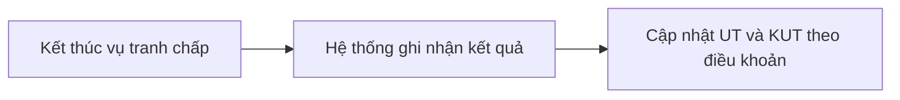

# Trọng tài chuyên môn

Khi **người đăng việc** và **người làm tự do** bất đồng sau khi bàn giao, cần **người trung lập** có quy trình rõ ràng. Vai **trọng tài chuyên môn** chỉ can thiệp **trong các vụ tranh chấp**.

Trọng tài **không** quản lý toàn bộ người dùng, **không** tự đóng tin hay tự xử lý hết hạn thay **hệ thống**. Việc nhắc hạn và chạy theo [**cron**](thuat-ngu.md#cron) (job nền) do tài liệu **hệ thống** mô tả. Thuật ngữ: [bảng thuật ngữ](thuat-ngu.md).

---

## Bảng nhiệm vụ và phạm vi

| Nhiệm vụ | Phạm vi |
| -------- | ------- |
| **Tiếp nhận** vụ được giao | Chỉ **vụ tranh chấp** mà **hệ thống** đã đưa vào danh sách cần xử lý **theo vòng** (trọng tài được **gán ngẫu nhiên** cho vòng đó). |
| **Bỏ phiếu** trong vòng | Chỉ **phiếu của vòng hiện tại** sau khi **người làm tự do** và **người đăng việc** đã **phản hồi trong hạn**; không xử lý thay cả vụ trong một lần tùy ý. |
| **Theo dõi hạn** (phản hồi nếu luồng yêu cầu) | Trong giới hạn **vụ / vòng được gán**; nếu **quá hạn bỏ phiếu**, **hệ thống** gán trọng tài khác — không tự giữ vụ vượt quy tắc. |
| Đọc tài liệu, bằng chứng hai bên | Chỉ vụ **được phân quyền xem** trong vòng đó; không truy cập tin nhắn / hồ sơ ngoài nghiệp vụ tranh chấp nếu không được thiết kế cho phép. |

**Ngoài phạm vi:** quản lý user toàn nền tảng, tự **đóng tin** / **đổi hạn tin**, chạy **cron** quét hết hạn, **cập nhật kết quả tổng hợp sau 3 vòng** (do **hệ thống**); **không nhập điểm uy tín tay** — điểm do luật hợp đồng / blockchain sau khi vụ kết thúc.

---

## Luồng tranh chấp: ba vòng cố định

Một vụ tranh chấp chạy **đủ ba vòng**. **Mỗi vòng** luôn theo thứ tự:

1. **Hệ thống** gán **ngẫu nhiên** một **trọng tài** cho vòng đó.  
2. **Người làm tự do** phản hồi và nộp **bằng chứng** trong hạn.  
3. **Người đăng việc** phản hồi trong hạn.  
4. **Trọng tài** được gán **bỏ phiếu** cho vòng đó.

Hết bước 4 của một vòng, nếu **chưa đủ ba vòng** thì **hệ thống** quay lại bước 1 với **trọng tài ngẫu nhiên mới** cho vòng kế tiếp.

Nếu **trọng tài đã gán quá thời gian** mà không hoàn thành bước bỏ phiếu, **hệ thống** **gán ngẫu nhiên trọng tài khác** và tiếp tục; chi tiết có lặp lại bước hai bên hay chỉ mở lại bước phiếu **tùy điều khoản triển khai**.

Sau **hết vòng thứ ba**, **hệ thống** **cập nhật kết quả tranh chấp** và **gửi thông báo**. **Hoàn tiền**, giải ngân tiền giữ và các giao dịch **ghi trên blockchain** đi kèm chỉ thực hiện **theo điều kiện hợp đồng**.

**Cách đọc**

- **A** xuất hiện **đầu mỗi vòng mới** và **lại sau khi thay trọng tài** vì hết hạn.  
- **B → C → D** là nội dung **một vòng**: **người làm tự do** trước, **người đăng việc** sau, rồi **phiếu trọng tài**.  
- **N**: chưa đủ ba vòng thì quay về **A** để mở **vòng kế** với trọng tài random mới; đủ ba vòng thì **E**.

Trên giao diện, trọng tài **chỉ thấy** **phiếu hoặc vụ được gán trong từng vòng**; không có màn hình chọn nhánh xử lý cho cả vụ theo mô hình một vòng như phiên bản trước.

---

## Điểm uy tín sau tranh chấp

Trọng tài **không nhập điểm tay**. Sau khi vụ kết thúc theo quy trình, **hệ thống** áp quy tắc trong điều khoản, ví dụ:

| Kết quả | Người thắng | Người thua |
| --- | --- | --- |
| Theo bảng mẫu | +5 UT | −10 UT, +20 KUT |

Các tình huống uy tín khác xem **người đăng việc** và **người làm tự do**. Hết hạn chứng cứ do **hệ thống** quét: xem **hệ thống** và [blockchain](blockchain.md).
