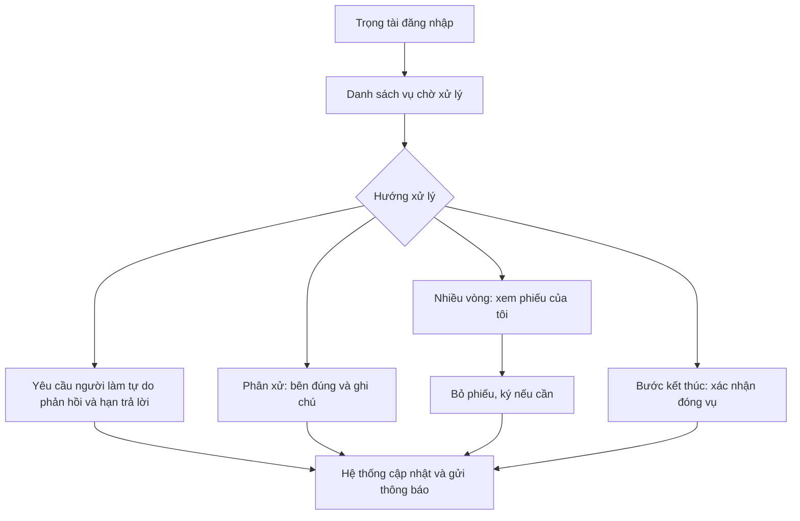
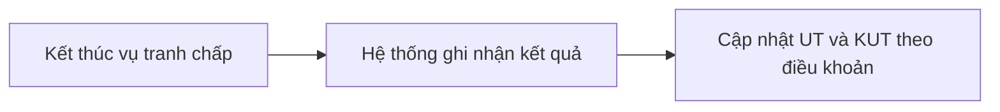

# Trọng tài chuyên môn

Khi **người đăng việc** và **người làm tự do** bất đồng sau khi bàn giao, cần **người trung lập** có quy trình rõ ràng. Vai **trọng tài chuyên môn** chỉ can thiệp **trong các vụ tranh chấp**.

Trọng tài **không** quản lý toàn bộ người dùng, **không** tự đóng tin hay tự xử lý hết hạn thay **hệ thống**. Việc nhắc hạn và chạy theo lịch do tài liệu **hệ thống** mô tả.

---

## Nhiệm vụ chính

| Việc | Mô tả |
| ---- | ----- |
| Tiếp nhận vụ | Vào danh sách vụ tranh chấp, đọc tin và chứng cứ hai bên |
| Điều phối | Yêu cầu **người làm tự do** trả lời hoặc bổ sung chứng cứ trong thời hạn |
| Phân xử | Ghi nhận bên được xử đúng và lý do, khi quy trình cho phép |
| Bỏ phiếu nhiều vòng | Xem phiếu đến lượt, bỏ phiếu, ký xác nhận nếu quy định có |
| Kết thúc vụ | Khi đủ điều kiện, làm bước xác nhận kết thúc để **chia tiền đang giữ** và **cập nhật uy tín** đúng điều khoản |

---

## Luồng xử lý tranh chấp

**Hai nhánh bên phải trên sơ đồ**

1. **Xem phiếu → bỏ phiếu → ký nếu cần:** dùng khi tranh chấp có **nhiều vòng**, nhiều người cùng tham gia quyết định. Trọng tài làm **trong lúc vụ chưa kết thúc**.

2. **Bước kết thúc:** dùng khi **đã có kết quả** và cần **một lần xác nhận cuối** để đóng vụ trên sổ công khai, chia tiền và cập nhật uy tín. Thường là **bước sau cùng**, có thể nối sau các vòng phiếu.

**Thứ tự nghiệp vụ**

1. Đăng nhập, mở danh sách vụ tranh chấp đang chờ.  
2. Đọc hồ sơ, tin liên quan, chứng cứ.  
3. Chọn: yêu cầu phản hồi, phân xử, tham gia phiếu, hoặc bước kết thúc khi đủ điều kiện.  
4. **Hệ thống** cập nhật trạng thái và thông báo các bên.

---

## Điểm uy tín sau tranh chấp

Trọng tài **không nhập điểm tay**. Sau khi vụ kết thúc theo quy trình, **hệ thống** áp quy tắc trong điều khoản, ví dụ:

| Kết quả | Người thắng | Người thua |
| --- | --- | --- |
| Theo bảng mẫu | +5 UT | −10 UT, +20 KUT |

Các tình huống uy tín khác xem **người đăng việc** và **người làm tự do**. Hết hạn chứng cứ do **hệ thống** quét: xem **hệ thống** và **chuỗi khối**.
